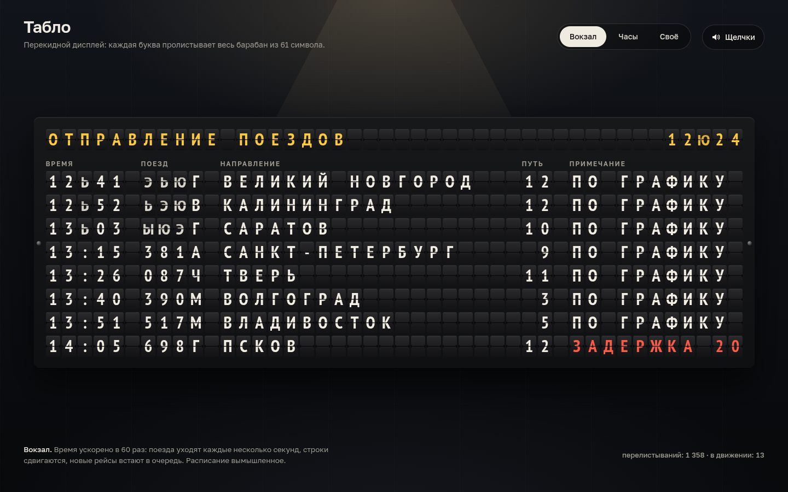

# 001 · Табло

> Вокзальное перекидное табло: каждая буква честно пролистывает весь барабан символов, лист падает с тенью, а щелчок синтезирован и разнесён по стерео.

## Как запустить
Двойной клик по `index.html`. Интернет не нужен: без него только шрифт станет системным. Щелчки включаются кнопкой «Щелчки».

## Что делать
- **Вокзал** — табло отправления. Время ускорено в 60 раз: поезда уходят каждые несколько секунд, строки сдвигаются, приходят новые рейсы, бывают задержки. Расписание вымышленное, города настоящие.
- **Часы** — перекидные часы с датой.
- **Своё** — напишите любой текст (латиница превратится в кириллицу) или выберите заготовку: табло соберёт сообщение, перелистывая каждую букву.

## Что внутри
- Каждая ячейка — модель механики: текущий лист, цель, длительность шага около 60 мс со случайным разбросом. Барабан крутится только в одну сторону, поэтому «Я» после «А» — это тридцать с лишним щелчков, как у настоящего табло.
- У цифр часов и минут свои барабаны из десяти листов, как у перекидных часов: 9 → 0 занимает один шаг.
- Рендер на Canvas: плитки символов кэшируются, падающая половина сжимается к оси с затенением, её тень ложится на нижнюю половину. Перерисовываются только движущиеся ячейки.
- Звук: один щелчок синтезирован формулой (шумовой удар, два резонанса и глухой «тук»), каждое срабатывание получает свою высоту, громкость и панораму по номеру колонки. Поэтому каскад звучит как настоящий шелест табло.

## Почему это про Opus 5.5
Здесь работа не с одним большим алгоритмом, а с десятком маленьких деталей механики и интерфейса — тех, что делают вещь убедительной.

## Ограничения
- Перспектива падающего листа упрощена: вертикальное сжатие без трапеции.
- На узком экране табло показывает три колонки вместо пяти: время, направление и путь. Статус поезда там передаётся цветом номера пути.
