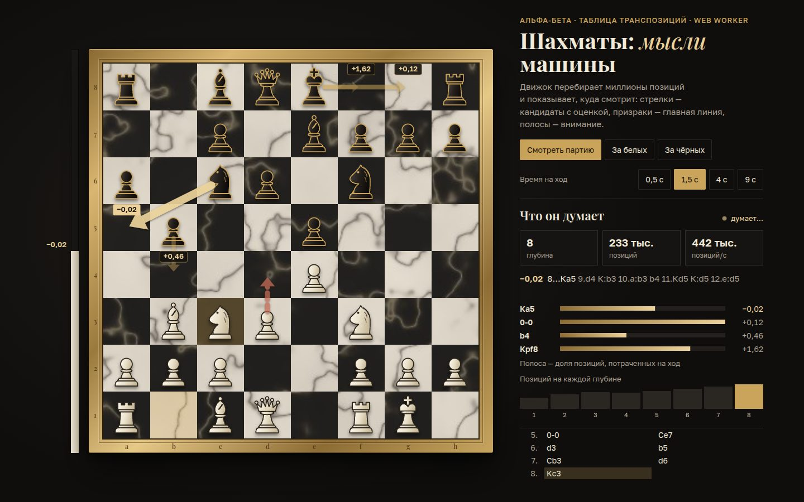

# 002 · Шахматы: мысли машины

> Полноценный шахматный движок, который показывает, о чём думает: кандидаты с оценками, главную линию призраками на доске и то, на какие ходы уходит его внимание.

## Как запустить
Двойной клик по `index.html`. Движок работает в Web Worker, собранном из Blob, поэтому сервер не нужен. Интернет нужен только для шрифтов.

## Что делать
- **«Смотреть партию»** (режим при открытии) — движок играет сам с собой из испанской партии, а вы смотрите, как он думает.
- **«За белых» / «За чёрных»** — клик по фигуре и по полю или перетаскивание. Превращение пешки — через выбор фигуры.
- **Время на ход** — 0,5 / 1,5 / 4 / 9 секунд: чем больше, тем глубже он видит.
- **«Вернуть ход»**, **«Перевернуть»**, **«Призраки»** (главная линия полупрозрачными фигурами), **«Новая партия»**.

## Что внутри
- **Правила полностью:** рокировки, взятие на проходе, превращение, мат, пат, троекратное повторение, правило 50 ходов, недостаточный материал. Генератор ходов на доске 0x88 проверен perft-тестами на пяти эталонных позициях, включая kiwipete.
- **Поиск:** итеративное углубление, альфа-бета с поиском по главной линии (PVS), форсированные варианты для взятий, таблица транспозиций на 2²⁰ записей с хешами Зобриста, отсечение нулевым ходом, сокращение поздних ходов, ходы-убийцы, эвристика истории, продление при шахе.
- **Оценка:** материал, позиционные таблицы, плавный переход от миттельшпиля к эндшпилю, пара слонов, сдвоенные, изолированные и проходные пешки, ладьи на открытых линиях, пешечный щит короля.
- **Визуализация мыслей:** для четырёх лучших ходов в корне оценки досчитываются точно, с полным окном — это стрелки с подписями. Красная пунктирная стрелка — ожидаемый ответ соперника. По каждому ходу считаются узлы — это полосы «внимания». Столбики показывают экспоненциальный рост перебора с глубиной.
- **Русская нотация:** Кр, Ф, Л, С, К, взятие через «:», рокировка «0-0».

## Почему это про Opus 5.5
Большая система с жёсткими инвариантами (make/unmake, хеши, таблица транспозиций), которую легко сломать одной ошибкой. Её корректность проверена perft-тестами, а не на глаз, — и поверх неё сделан понятный интерфейс «мыслей».

## Ограничения
- Сила примерно клубного уровня: у движка нет дебютной книги и эндшпильных таблиц.
- Оценки кандидатов точны только для четырёх лучших ходов корня. Остальные проверяются нулевым окном и в список не попадают.
- Поиск нельзя прервать посреди итерации: при смене режима воркер просто перезапускается.
