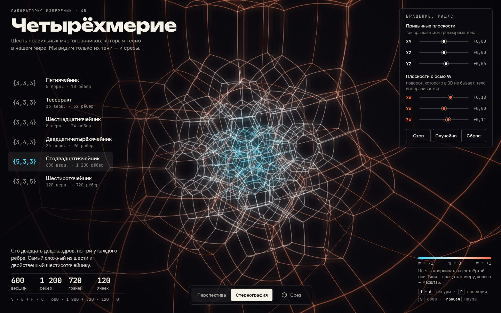

# 003 · Четырёхмерие

> Шесть правильных четырёхмерных многогранников — от пятиячейника до стодвадцатиячейника: вращение сразу в шести плоскостях, стереографическая проекция и срез трёхмерной гиперплоскостью.

## Как запустить
Двойной клик по `index.html`. Нужен браузер с WebGL2 (свежие Chrome, Safari, Firefox). Интернет не обязателен: без него шрифты заменятся системными.

## Что делать
- Выбрать фигуру в списке слева или клавишами `1`–`6`.
- Ползунки справа — скорости вращения в шести плоскостях. XY, XZ, YZ крутят тело как обычное трёхмерное; XW, YW, ZW поворачивают его через четвёртую ось, и тело «выворачивается». Двойной клик по ползунку обнуляет его. «Стоп», «Случайно», «Сброс» — для всех сразу.
- «Перспектива» и «Стереография» (клавиша `P`) — две разные тени четырёхмерного тела в нашем пространстве.
- «Срез» (клавиша `S`) — гиперплоскость w = const режет тело; ползунок двигает её, кнопка ▶ прогоняет её насквозь. Внизу подписано, что получилось «в нашем мире»: число вершин и граней, а для знакомых форм — название (куб, октаэдр, кубооктаэдр…).
- Тянуть мышью или пальцем — вращать камеру, колесо или щипок — масштаб, пробел — пауза. На телефоне ползунки вращения открываются кнопкой ↻.

## Что внутри
- Вершины заданы точными координатами на единичной 3-сфере: симплекс, (±1, ±1, ±1, ±1), (±1, 0, 0, 0), перестановки (±1, ±1, 0, 0), 120 единичных кватернионов бинарной группы икосаэдра для шестисотячейника. Стодвадцатиячейник строится как двойственный: его 600 вершин — центры 600 тетраэдров шестисотячейника. Рёбра — пары вершин на минимальном расстоянии; числа V, E, F, C сходятся с формулой Эйлера V − E + F − C = 0.
- Поворот — произведение вращений в шести координатных плоскостях; матрица периодически ортонормируется по Граму — Шмидту, чтобы ошибки округления не копились.
- Стереографическая проекция из полюса 3-сферы: рёбра рисуются дугами больших кругов (сферическая интерполяция), поэтому в проекции они честно становятся дугами окружностей.
- Срез: точки пересечения рёбер с гиперплоскостью, их выпуклая оболочка в 3D (инкрементный алгоритм), грани считаются по различным плоскостям.
- Рендер WebGL2: рёбра — инстансные ленты с гауссовым профилем, аддитивное смешение в HDR-буфере, свечение через уменьшение и раздельное размытие. Цвет — координата w: холодный голубой, белый, тёплый оранжевый.

## Почему это про Opus 5.5
Геометрия, которую нельзя увидеть напрямую: точные координаты шести тел, группа кватернионов, четырёхмерные повороты и выпуклые оболочки сечений — собранные в одну ясную и красивую картинку.

## Ограничения
- Срез показывается только в перспективной проекции: в стереографии рёбра нарисованы дугами на 3-сфере, а вершины сечения лежат на прямых рёбрах-хордах и на эти дуги не легли бы.
- Сечение пересчитывается на процессоре каждый кадр; для стодвадцатиячейника на слабом устройстве это заметная нагрузка.
- Каркас рисуется целиком, светящимися линиями без удаления невидимых: видно всё тело сразу, но в центре сложных фигур линии сливаются.
- Названия получают только самые узнаваемые сечения; остальные подписаны числом вершин и граней.
