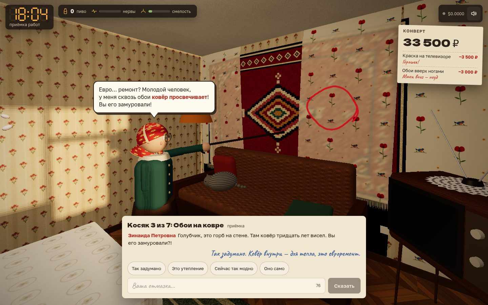

# 004 · Хрущёвка. Ремонт под ключ

> Шабашник за один день делает ремонт в хрущёвке 1974 года, пьёт чужое пиво и курит с соседом, а в шесть вечера бабушка-хозяйка принимает работу по точному списку косяков — и сама решает, сколько заплатить.

## Как запустить
Двойной клик по `index.html`. Нужен интернет: three.js грузится с CDN, реплики пишет DeepSeek через OpenRouter (ключ свой — BYOK: вход через OpenRouter или вставка ключа в окне при старте). Без ключа или без сети игра идёт в демо-режиме на заготовленных репликах, вверху висит метка «демо-режим — нейросеть не подключена». Без CDN вместо квартиры — сообщение, что нужен интернет.

## Что делать
- WASD — ходить, мышь — смотреть (клик захватывает мышь), Shift — быстрее.
- ЛКМ — работать инструментом: обои, плитка, кисть, шпатель, разводной ключ; кисть, шпатель и ключ нужно держать. 1–6 или колесо — инструменты, R — перевернуть рулон обоев, Tab — записка хозяйки.
- E — взять, открыть, выпить, закурить, снять трубку. Пиво — в ящике на кухне, перекур — у перил балкона, телефон — в прихожей. Позвонить хозяйке «всё готово» можно и раньше шести.
- На телефоне: джойстик слева, взгляд пальцем, кнопки «Работать» и E.
- В 18:00 приёмка: бабушка водит по квартире и тычет тростью в каждый косяк, а вы отбиваетесь свободным текстом. Длина отмазки зависит от смелости: трезвому хватает на пару слов, после пива — на целую речь.

## Что внутри
- Вся правда о ремонте хранится в JS и видна в 3D: каждая полоса обоев (наклон, щель, узор вверх ногами, поверх ковра — ковёр вздувается горбом и просвечивает сквозь бумагу), каждая плитка, каждая клякса. Капли краски летят по баллистике и прилипают к тому, во что попали: к телевизору, коту, шторам. Лужа от потопа растёт, пустые бутылки выстраиваются на подоконнике.
- `collectFlaws()` превращает сцену в точный список косяков с фактами: «2 полосы из 11 вверх ногами», «на телевизоре 7 пятен белой краски». Этот список бабушка получает в system-промпте. Скрытое (дыру под календарём) она находит с вероятностью.
- DeepSeek играет всех. Хозяйка звонит трижды за день, Михалыч травит байки, сосед снизу приходит из-за протечки. Реплики идут потоком и знают, что мастер делал и сколько выпил. Решения, которые меняют игру, — только через `AI.json` со схемой и проверкой в коде: вычет за косяк, злость и требования соседа, итоговая оплата, оценки и подарок. Финальный расчёт идёт с рассуждением модели. Первые реплики на приёмке готовятся параллельно, и у каждой свой риторический приём, чтобы бабушка не повторялась.
- Пиво — механика с последствиями: камера плывёт, руки кривеют, работа идёт быстрее, язык заплетается (ваши реплики искажаются до отправки), а смелость растёт. Шестая бутылка — отключка на полтора часа. Перекур снимает нервы и дрожь рук, но съедает время.
- Приёмка снята как кино. Ракурс для каждого косяка выбирается перебором точек с проверкой видимости: лицо бабушки и косяк в кадре, стены и мебель не заслоняют. Центр кадра смещён над окном диалога, между комнатами — склейки через затемнение.
- Всё процедурное. Текстуры рисуются в Canvas 2D: обои с маками, ковёр с медальоном, паркет «ёлочкой», календарь 1975 года. Звуки синтезируются на Web Audio. Запуск идёт по шагам, шейдеры компилируются асинхронно, так что страница не замирает.

## Почему это про Opus 5.5
Игра держится на связке трёх систем: 3D-сцены, точной модели «что реально сделано» и нейросетевых персонажей, которые судят по этим фактам. Такую связку нужно было спроектировать, отладить и довести до смешного.

## Ограничения
- Люди собраны из примитивов. Между дальними точками бабушка переходит через склейку, поиска пути нет.
- Физика краски упрощена: капли — точки на баллистической траектории.
- Время ускорено: девять часов работы проходят примерно за 15–25 минут игры.
- Нейросеть может ошибиться с цифрами, поэтому вычеты и оплату код ограничивает (оплата — от 0 до 44 000 ₽). Без нейросети реплики и решения берутся из заготовок.
- Метка `#live` в адресе — служебный режим для проверки живой нейросети под `_tools/shot`.
