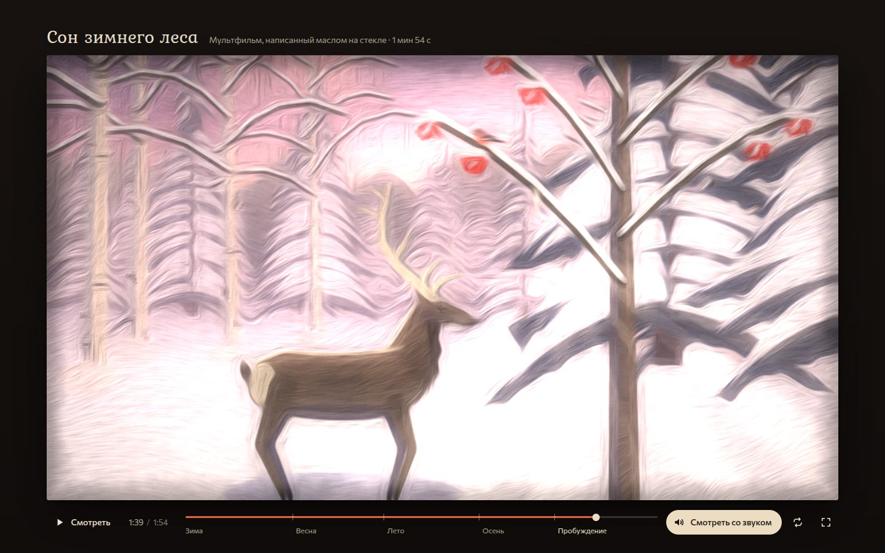

# 005 · Сон зимнего леса

> Мультфильм на 1 мин 54 с в технике живописи на стекле: метель укрывает лес, и ему снится целый год — а кадры перетекают друг в друга, как масляная краска под пальцем.

## Как запустить
Двойной клик по `index.html`. Нужен браузер с WebGL2 (свежие Chrome, Safari, Firefox). Без интернета всё работает, только заголовки набираются системной антиквой вместо Kurale, а интерфейс — системным гротеском вместо Commissioner. Без WebGL2 фильм идёт без живописного слоя — показывается подмалёвок.

## Что делать
- Фильм сразу идёт без звука. **«Смотреть со звуком»** перезапускает его с начала уже с музыкой и шумами; потом эта кнопка включает и выключает звук.
- **Пробел** или клик по кадру — пауза, **← →** — на 5 секунд, **F** или двойной клик — полный экран, **M** — выключить или включить звук.
- Шкала времени размечена сценами: клик по названию сцены — переход к её началу, перетаскивание — перемотка.
- Кнопка повтора зацикливает фильм.

## Сюжет
Зимние сумерки. Олень бредёт через метель к рябине, где сидит снегирь. Птица слетает к нему, олень ложится в снег, снежинка садится на ресницы — и лес засыпает. Во сне снег тает в ручей, из-под него поднимаются подснежники, а на рогах оленя распускаются листья и цветы; прилетает зарянка. Летом олень летит прыжками по лугу среди ласточек до заката и светлячков. Осенью листья на рогах золотеют и облетают, журавлиный клин уходит на юг, ветер закручивает листву — она белеет и становится снегом, стекло затягивает инеем. Иней тает от тёплого света: олень просыпается на рассвете, снегирь поёт на ветке, с сосульки падает первая капля — и там, куда она упала, из-под снега проклёвывается подснежник.

## Что внутри
- **Кадр — функция времени.** Семь планов, у каждого своя камера (перспектива с параллаксом слоёв), палитра, сезон и игра героев; ключевые кадры с easing. Перемотка в любую точку даёт тот же кадр, что и при просмотре.
- **Подмалёвок** рисуется на Canvas 2D: ели из свисающих лап со снежными подушками, берёзы с плакучими прутьями, рябина с ягодами, ручей, луг, частицы (снег, лепестки, листья, светлячки) — всё процедурно, без единой картинки.
- **Олень на скелете:** туловище, шея, голова, четыре ноги с двухзвенной обратной кинематикой (запястье вперёд, скакательный сустав назад), походки — шаг и галоп прыжками по таблице фаз со сплайнами. Ложится передом, встаёт задом, как настоящие олени; отряхивается; рога во сне дают почки, листья и цветы, осенью листья золотеют и облетают.
- **Живопись на WebGL2:** структурный тензор картинки → сглаженное поле направлений → мазки как интеграл вдоль линий тока (краска тянется вдоль форм, в пустых местах — по «свободному» полю завитков). Из шума вдоль тех же линий получается рельеф щетины и пальца; дальше — блик масла, свечение на просвет, иней на стекле, зерно, неровный край живописи.
- **Перетекания:** две сцены смешиваются «пальцем» — вихрем, полосами, по диагонали, из центра или снизу вверх. Краска старой сцены утаскивается вдоль поля, новая проступает и оседает, в зоне смешения цвета мешаются как пигменты.
- **Звук на Web Audio:** колыбельная тема в 3/4 проходит через все сезоны (ре минор — скрипка, фа мажор — флейта и пиццикато, ре мажор — струнные и арфа, си минор — виолончель, ре мажор на рассвете). Шаги по снегу и удары копыт вычисляются из фаз походки, птицы, капля, журавли, ветер и ручей стоят точно на кадрах.

## Почему это про Opus 5.5
Один автор-модель написал историю, поставил каждый кадр, собрал живописный шейдер и сочинил музыку — и всё это держится на одной оси времени, так что изображение и звук совпадают до кадра.

## Ограничения
- Олень всегда в профиль, это «плоская» анимация в перспективном мире; ракурсов три четверти нет.
- Живописный слой — фильтр по подмалёвку, а не симуляция краски: мазки не накапливаются от кадра к кадру, как у настоящей живописи на стекле, фактура стекла неподвижна.
- Звуки птиц и струнных синтезированы и узнаются по характеру, а не по точному тембру.
- На слабой видеокарте разрешение живописи автоматически снижается. Если кадр всё равно рисуется дольше 0,1 с, время фильма идёт медленнее реального, и длинные ноты могут немного разойтись с картинкой; на обычном ноутбуке этого не происходит.
- Подснежник, выросший из капли в финале, нарочно крупнее весенних — иначе на общем плане его не видно.
