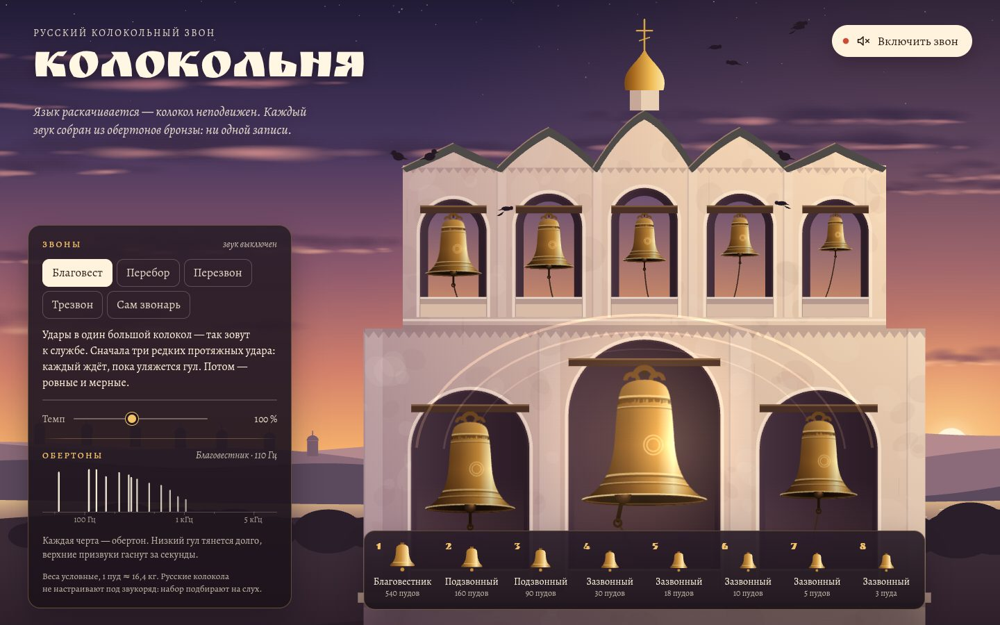

# 006 · Колокольня

> Русский колокольный звон в браузере: восемь колоколов из негармонических обертонов — благовест, перебор, перезвон и трезвон.

## Как запустить
Двойной клик по `index.html`. Звук включается кнопкой «Включить звон» или первым ударом по колоколу. Без интернета работает всё, только вместо шрифтов Ruslan Display и Alegreya подставятся системные.

## Что делать
- Выберите звон: **Благовест**, **Перебор**, **Перезвон** или **Трезвон** — звонница зазвонит сама. В режиме **Сам звонарь** играете вы.
- Клавиши `1`–`8` или щелчок по колоколу — удар. `Пробел` — большой колокол, как педаль у звонаря. С `Shift` удар мягче и темнее.
- Ползунок **Темп** ускоряет или замедляет звон.
- Панель **Обертоны** показывает спектр всех звучащих колоколов: видно, как верхние призвуки гаснут быстрее низкого гула.

## Что внутри
- Каждый колокол — сумма 13 затухающих обертонов: гул (0,5 основного тона), основной тон, малая терция (≈ 1,19), квинта, октава и верхние призвуки, нарочно «не в строй». Каждый обертон — пара близких частот, отсюда характерные биения.
- Время затухания у каждого обертона своё: гул большого колокола тянется десятки секунд, верхние призвуки гаснут за секунду. Мягкий удар темнее — высокие обертоны возбуждаются слабее.
- Звук синтезируется в фоновом потоке (Web Worker из Blob) рекуррентным резонатором, удар языка — короткий шумовой всплеск через полосовой фильтр. Реверберация — свёртка с синтезированной импульсной характеристикой длиной 5,2 с.
- Планировщик с упреждением ставит удары в очередь аудиоконтекста, а анимация знает о каждом ударе заранее: язык начинает замах до удара, бьёт в губу точно в момент звука и отскакивает как затухающий маятник. Колокол неподвижен — это язычный звон, как на русских звонницах.
- Сцена рисуется процедурно на Canvas 2D: закатное небо, два слоя плывущих облаков, дали с городком, река, белокаменная звонница и галки, которые взлетают от сильных ударов. Колокола видны чуть снизу — с тёмным зевом, языком внутри и верёвками к звонарю.

## Почему это про Opus 5.5
Нужно одновременно знать акустику колокола, устав церковного звона и цифровую обработку звука — и собрать всё это в живую иллюстрацию без единого сэмпла и картинки.

## Ограничения
- Это синтез, а не запись: тембр правдоподобен, но проще настоящей бронзы с её сотнями обертонов.
- Веса и частоты колоколов условные. Настоящие наборы подбирают на слух под конкретную звонницу.
- Узоры трезвона сочинены для демонстрации, это не расшифровка звона конкретного звонаря.
- Язык качается в плоскости экрана; настоящие верёвки, оттяжки и педаль устроены сложнее.
