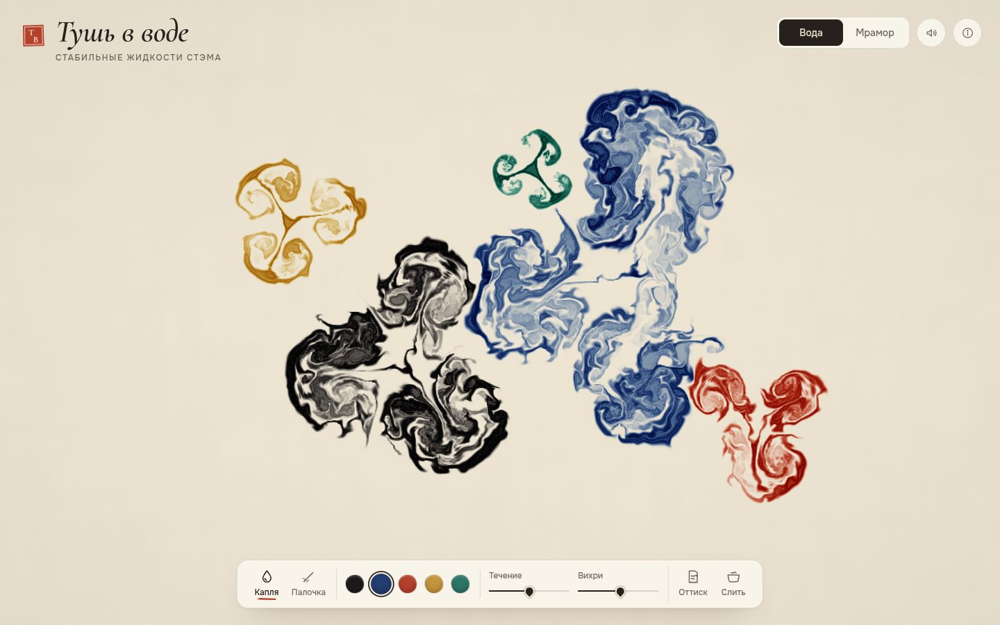

# 007 · Тушь в воде

> Капли туши закручиваются в воде по уравнениям Навье — Стокса, а во втором режиме из тех же капель рождается мраморная бумага — точная при любом увеличении.

## Как запустить
Двойной клик по `index.html`. Интернет нужен только для шрифтов (Cormorant Garamond, Onest); без него включатся системные.

## Что делать
- **Вода.** Клик — капля туши, удержание — тушь льётся струйкой; «Палочка» — мешать воду. Ползунки «Течение» и «Вихри» меняют характер воды. Клавиши 1–5 — цвет, пробел — пауза.
- **Мрамор.** «Капля» (клик; удержание растит каплю; ведение даёт брызги), «Шило», «Гребень» (зубья идут через всю ванну), «Вихрь» (нажать в центре и вести по кругу). «Узоры» — шесть классических техник: турецкие камни, гель-гель, павлин, суминагаси, завитки, шеврон. «Назад» (Z) отменяет последнее действие.
- **Оттиск** (P) — снимает лист на бумагу с рваной кромкой; лист можно скачать в PNG. «Слить» (C) — чистая вода.
- M — переключить режим.

## Что внутри
- Сеточная жидкость по Стэму («Stable Fluids», 1999) на WebGL2: полулагранжева адвекция, 24 итерации Якоби для давления, вычитание градиента, удержание завихрённости, медленное «течение» из curl-шума.
- Тушь переносится с поправкой МакКормака и ограничителем — кромки разводов остаются чёткими.
- Тушь хранится как оптическая плотность, цвет считается как бумага · e^(−плотность): краски смешиваются субтрактивно, как на настоящей бумаге.
- Мрамор — без сетки: каждая капля, гребень, вихрь и волна — обратимое преобразование плоскости (по работе Lu, Jaffer и др. «Mathematical Marbling», 2012). Шейдер прогоняет каждый пиксель по цепочке операций назад до капли, в которую тот попал, — с суперсэмплингом 4×.
- Пока операция анимируется, картинка собирается из кэша плюс одной живой операции; после — точная пересборка полосами за несколько кадров, без рывков. Оттиск пересчитывается точно в разрешении 2400 px.
- Пигментное зерно берётся в «родных» координатах капли, поэтому гребень вытягивает его в прожилки, как на настоящем мраморе.

## Почему это про Opus 5.5
Две разные численные модели в одном холсте, собранные с нуля и без библиотек: это то самое сочетание математики, GPU-программирования и визуального вкуса, в котором модель сильна.

## Ограничения
- Жидкость двумерная: без глубины, теплового конвекционного подъёма и настоящей диффузии пигмента.
- В «Мраморе» до 300 операций хранятся точно; дальше узор «запекается» в базовый слой, и при следующих операциях он пересэмплируется один раз.
- На слабой видеокарте (или программном рендере) разрешение снижается автоматически.
