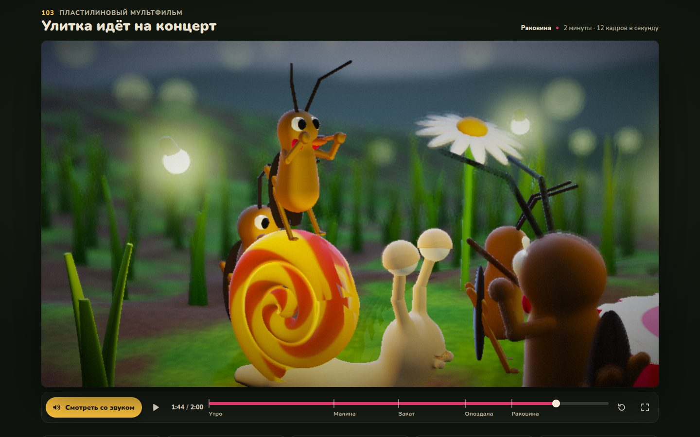

# 008 · Улитка идёт на концерт

> Пластилиновый мультфильм на две минуты: улитка спешит через сад на вечерний концерт сверчков и, конечно, опаздывает — но не совсем.

## Как запустить
Двойной клик по `index.html`. Интернет не обязателен: без него титры и интерфейс наберутся системным шрифтом вместо Nunito и Neucha. Нужен браузер с WebGL2 (свежие Chrome, Safari, Firefox); сцена тяжёлая, лучше смотреть на компьютере с нормальной видеокартой.

## Что делать
- Фильм сразу идёт без звука. Кнопка «Смотреть со звуком» запускает его с начала уже с музыкой и шумами.
- Пробел — пауза, ←/→ — ±5 с, F — во весь экран, M — звук.
- Шкала времени: щелчок или перетаскивание — перемотка, метки — пять сцен (Утро, Малина, Закат, Опоздала, Раковина); те же сцены — кнопками под кадром.

## Что внутри
- **Всё — поля расстояний.** Сад, лейка-сцена, улитка, четыре сверчка со скрипками, малина, мухомор, титры и афиша — рэймарчинг SDF в одном фрагментном шейдере. Мягкое объединение форм даёт «лепные» стыки, раковина — жгут пластилина двух цветов, свёрнутый спиралью. Трава и галька — повторение доменов с шагом луча по ячейкам.
- **Пластилин.** Отпечатки пальцев — кольцевой узор в нормалях, разбросанный по ячейкам пространства (гаснет с расстоянием раньше, чем кольца начнут рябить); комки — градиент объёмного шума; форма чуть «дышит» от кадра к кадру. Персонажи и камера живут на 12 кадрах в секунду, как в настоящем стоп-моушене.
- **Студийный свет и малая глубина резкости.** Ключевой, заполняющий и контровой свет, просвет сквозь листья, тело улитки и бумагу афиши, мягкие тени, затенение углов, светлячки как точечные источники, светящаяся от музыки раковина. Кружок нерезкости считается по глубине, размытие — в половинном разрешении. Шесть режимов света: рассвет, полдень, закат, сумерки, ночь, студия титров.
- **Фильм как функция времени.** 27 планов, каждый — функция своего локального времени: ключевые кадры с easing, пружины для захлёста, моргания, саккады взгляда, упреждение и сжатие-растяжение на прыжках и ударах. Кадр однозначно задан временем, поэтому перемотка работает в любую сторону.
- **Титры из пластилина.** Строки рисуются в Canvas 2D, точным евклидовым преобразованием превращаются в поле расстояний, и шейдер выдавливает буквы из пластилиновой плиты волной слева направо. Той же текстурой написана афиша на прутике.
- **Звук.** Партитура — 549 событий 46 видов на Web Audio: вальс, трели сверчков (тон с быстрой амплитудной модуляцией), фагот, туба, скрипки, шорохи, зевки, «боинги», эхо внутри раковины (свёртка с резонансами). Время картинки идёт по часам звуковой карты с поправкой на задержку вывода, поэтому звук не уплывает от действия.

## Почему это про Opus 5.5
Двухминутный фильм с сюжетом, актёрской игрой, светом и музыкой, где нет ни одной картинки, модели или сэмпла: каждую позу, форму и ноту нужно было придумать, записать формулой и свести с остальными в один связный замысел.

## Ограничения
- Сцена тяжёлая. Разрешение подстраивается по времени кадра (от 45 до 100 % экранного); на слабой встроенной графике фильм может идти рывками. Скорость на настоящих видеокартах я не замерял: на сервере без видеокарты (программный рендер) один кадр 952×536 рисуется минуты, поэтому обложка и проверочные кадры сняты долгим ожиданием.
- Физики нет: качение раковины по склону, прыжки и удары заданы ключевыми кадрами и пружинами.
- Травинки в одной ячейке одинаковые по форме, вблизи это заметно; коридоры без травы у крупных планов расчищены вручную.
- Звук синтетический: «скрипка» — две пилообразные волны с вибрато, до настоящей далеко.
