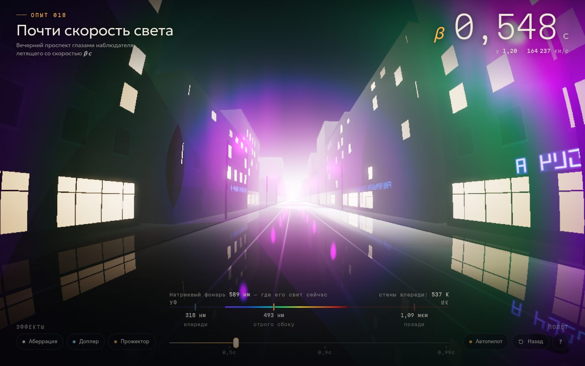

# 009 · Почти скорость света

> Вечерний проспект глазами наблюдателя, летящего со скоростью до 0,99c: город сжимается к точке движения, натриевые фонари перекрашиваются от красного до фиолетового, а на самых высоких скоростях стены начинают светиться собственным теплом.

## Как запустить
Двойной клик по `index.html`. Нужен браузер с WebGL 2 (Chrome, Safari, Firefox). Интернет нужен только для шрифтов — без него работают системные.

## Что делать
- **Ползунок, колесо мыши или ↑/↓** — скорость. Шкала равномерна по быстроте φ = artanh β, поэтому участок 0,9–0,99c не сжат в миллиметр.
- **Перетаскивание** — осмотреться. **«Назад» (B)** — развернуть взгляд: сзади мир тёмный и красный.
- **1, 2, 3** — выключить по отдельности аберрацию, эффект Доплера и прожекторный эффект, чтобы увидеть вклад каждого.
- **Автопилот (P)** плавно разгоняет до 0,985c и тормозит. Любое движение ползунка забирает управление.
- **«?»** — короткое объяснение того, что видно на экране.
- **Ссылка с параметрами** открывает нужный вид сразу: `index.html#b=0.95` — скорость 0,95c без автопилота, `#b=0.6&yaw=180` — взгляд назад, `#b=0.8&fx=101` — без эффекта Доплера.

## Что внутри
- **Трассировка лучей в шейдере.** Для каждого пикселя направление взгляда переводится из системы наблюдателя в систему улицы по формуле аберрации, дальше луч идёт по процедурному городу: кварталы, окна, витрины, неоновые вывески, фонари, мокрый асфальт с отражениями.
- **Спектральный Доплер.** Каждый источник света хранится как спектр: сумеречное небо, заря, натриевые лампы (с линиями 589, 819 и 1139 нм), неон, ртуть, окна на 2700 K. На старте страница считает таблицу «как выглядит этот спектр при множителе D» (сдвиг λ → λ/D, интенсивность ×D⁵ на единицу длины волны, свёртка с функциями цветового соответствия CIE 1931).
- **Тепло города.** Стены, асфальт и небо излучают как чёрные тела с температурой 260–300 K. Доплер превращает их в тела с температурой T·D, поэтому примерно с 0,8c город впереди виден по собственному теплу, а холодное небо остаётся темнее.
- **Звёзды** — отдельный проход: 5200 точек, которые сами переносятся аберрацией, меняют цвет и поток. Венера висит над зарёй.
- **HDR-конвейер:** буфер с плавающей точкой, авто-экспозиция по замеру яркости (как адаптация глаза), свечение ярких источников, кинематографическая тональная кривая ACES.
- **Честное время.** Показ замедлен в 10 миллионов раз: секунда на экране — 0,1 мкс полёта. Камера движется со скоростью β·30 м/с.

## Почему это про Opus 5.5
Здесь в одном шейдере сходятся специальная теория относительности, спектроскопия, фотометрия и рендеринг — междисциплинарная задача, где ошибка в любом знаке сразу видна глазом.

## Ограничения
- Спектры ламп и неба приближённые: набор линий и их силы подобраны на глаз, цвета поверхностей восстановлены из RGB тремя гладкими полосами.
- Сцена статична: машин и людей нет, иначе пришлось бы преобразовывать ещё и их скорости.
- Не учтены время запаздывания света для движущихся объектов и дифракция; тени от фонарей упрощены.
- Если видеокарта не умеет рендерить в буфер с плавающей точкой, включается упрощённый режим без свечения и звёзд.
