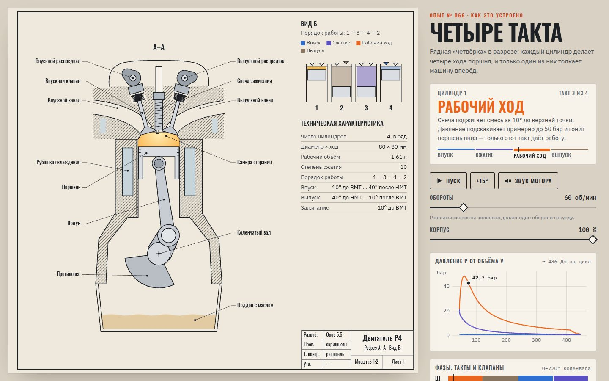

# 010 · Четыре такта

> Рядный четырёхцилиндровый двигатель на листе инженерного чертежа: разрез цилиндра, порядок работы 1–3–4–2, диаграмма P–V и синтезированный звук мотора.

## Как запустить
Двойной клик по `index.html`. Интернет нужен только для шрифтов.

## Что делать
- Смотрите такты цилиндра 1: полоса под названием такта — это весь цикл (720° коленвала), по ней можно щёлкать, чтобы перейти к нужному такту.
- **Пробел** — пауза, **→ / ←** — повернуть коленвал на 15° (с **Shift** — на 90°), кнопка «+15°» — то же мышью.
- «Обороты» — от 20 до 6500 об/мин. Выше 60 об/мин анимация замедляется (иначе глаз ничего не увидит), а звук идёт в реальном темпе.
- «Звук мотора» — процедурный звук: вспышки в цилиндрах через резонаторы выпуска.
- «Корпус» — прозрачность блока и головки.

## Что внутри
- Кинематика кривошипно-шатунного механизма: ход 80 мм, шатун 140 мм, степень сжатия 10.
- Фазы газораспределения: впуск 10° до ВМТ … 40° после НМТ, выпуск 40° до НМТ … 10° после ВМТ, зажигание за 10° до ВМТ. Профиль кулачков на чертеже совпадает с законом подъёма клапана.
- Модель давления: политропа сжатия (n = 1,32), сгорание по функции Вибе, свободный выпуск и выталкивание. Пик давления (~48 бар через 20° после ВМТ) и работа за цикл (∮P dV) считаются из этой модели, тексты берут числа прямо из неё.
- Чертёж по мотивам ЕСКД: рамка с полем для подшивки, основная надпись, разрез А–А со штриховкой, «Вид Б», таблица технических характеристик.
- Звук — AudioWorklet, созданный из Blob: вспышки каждые 180° коленвала через резонаторы, мягкое ограничение.

## Почему это про Opus 5.5
Инженерное объяснение, где рисунок, диаграммы и текст согласованы друг с другом: цифры в подписях не придуманы, а посчитаны той же моделью, что рисует P–V диаграмму.

## Ограничения
- Термодинамика упрощена: нет теплообмена со стенками, утечек и реального состава газа — это учебная модель, а не расчёт конкретного мотора.
- В разрезе показан один цилиндр; на «Виде Б» четыре цилиндра даны схематично.
