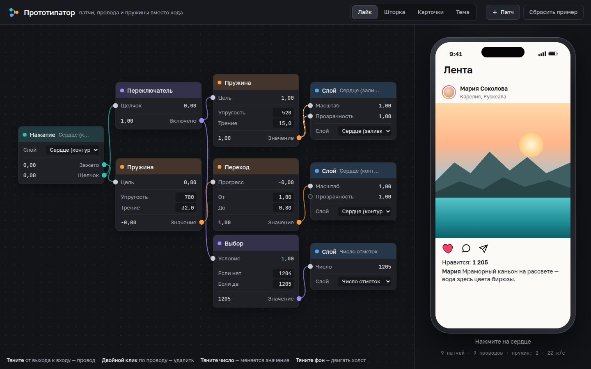

# 011 · Прототипатор

> Узловой редактор анимаций интерфейса по мотивам Origami Studio: соединяете «Нажатие → Пружина → Слой» — и макет телефона справа оживает.

## Как запустить
Двойной клик по `index.html`. Интернет не нужен (без него только шрифты станут системными).

## Что делать
- **Примеры сверху**: «Лайк» (сердце с отскоком и счётчиком), «Шторка» (перетаскивание с броском), «Карточки» (смахивание со штампами «Поеду» и «Мимо»), «Тема» (переключатель перекрашивает весь экран).
- **Трогайте экран телефона**: жмите на сердце, тяните шторку, смахивайте карточки. Пока экран никто не трогает, демонстрацию ведёт «призрачный палец».
- **Провода**: тяните от выхода (справа у патча) к входу (слева). Потяните занятый вход — провод вынется. Двойной щелчок по проводу удаляет его.
- **Числа** тяните мышью влево-вправо (с Shift — в десять раз быстрее) или щёлкните и впишите. Попробуйте у «Пружины» трение 5 вместо 15.
- **«Патч»** открывает палитру: нажатие, перетаскивание, переключатель, счётчик, выбор, притяжение, пружина, переход, шкала, умножение, слой. Холст двигается перетаскиванием фона и масштабируется колесом.

## Что внутри
- **Граф потоков данных** считается каждый кадр в топологическом порядке. Рёбра, которые замыкают цикл, читают значение с прошлого кадра. Так работает обратная связь «перетаскивание ↔ пружина»: палец подхватывает шторку с того места, где её оставила пружина.
- **Пружина** — упругость и трение, полунеявный метод Эйлера с шагом не больше 4 мс, поэтому даже жёсткие пружины устойчивы.
- **Притяжение**: пока палец держит, цель следует за ним; после броска цель — ближайшая точка к проекции «позиция + скорость × время броска».
- **Слой** принимает только нужные ему свойства: сдвиг, масштаб, поворот, прозрачность, смесь цвета, число. Незадействованные входы не трогают макет.
- **По проводам течёт сигнал**: пунктир бежит, пока значение меняется, а на каждом порте видно текущее число.

## Почему это про Opus 5.5
Тестеры Every собирали на Opus 5.5 именно такой инструмент прототипирования в духе Origami. Это сложный интерфейс с собственной моделью вычислений, физикой и прямым манипулированием.

## Ограничения
- Граф не сохраняется между сессиями, «Сбросить пример» возвращает исходный.
- Набор патчей минимальный: нет логических «и/или», задержек и звука.
- Мобильная версия работает, но редактировать граф удобнее мышью.
