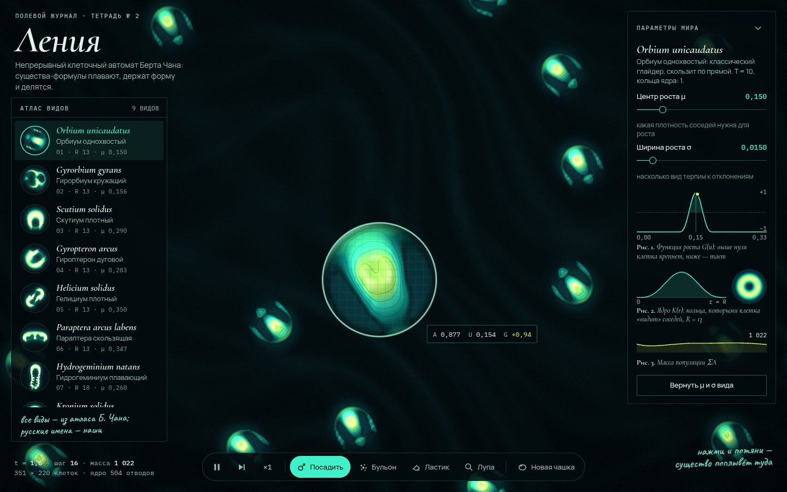

# 012 · Ления

> Непрерывный клеточный автомат Берта Чана на GPU: девять настоящих видов из его атласа плавают, делятся и сталкиваются.

## Как запустить
Двойной клик по `index.html`. Нужен браузер с WebGL2 (Chrome, Safari, Firefox). Интернет нужен только для шрифтов — без него всё работает на системных.

## Что делать
- **Посадить** (P): нажми и потяни — существо текущего вида поплывёт по стрелке. Простой клик — случайный курс.
- **Бульон** (B): кисть сыплет случайную «первичную жизнь». У гидрогеминиума из неё растут колонии, у орбиума она чаще гибнет.
- **Ластик** (E) и **Лупа** (L): лупа увеличивает в 3,4 раза, показывает сетку клеток и значения A, U, G, а точка на рис. 1 — где клетка сейчас на кривой роста.
- Атлас слева или клавиши 1–9 — новая чашка с выбранным видом; N — перемешать чашку.
- Ползунки μ и σ меняют законы мира на лету: существа меняют форму, гибнут или разрастаются. «Вернуть μ и σ вида» — откат.
- Пробел — пауза, → — один шаг, «×1 / ×2 / ×4» — скорость.

## Что внутри
- Модель перенесена точно по исходнику Lenia (`LeniaND.py`): полиномиальное ядро K(r) = (4r(1−r))⁴ с кольцами b, функция роста G(u) = 2·max(0, 1 − (u−μ)²/9σ²)⁴ − 1, шаг A ← clip(A + G/T).
- Девять видов — оригинальные клетки и параметры из `animals.json` репозитория Chakazul/Lenia. До переноса каждый вид прогнан в Node на 200–300 шагов: масса держится в пределах ±2 %. Той же симуляцией измерены курс и скорость каждого вида — поэтому существо плывёт туда, куда ты тянешь.
- Свёртка — прямая сумма по 500–950 отводам ядра во фрагментном шейдере WebGL2. Отводы лежат в uniform-буфере, состояние — во float-текстурах (ping-pong). Мир — тор, края склеены.
- Отрисовка: бикубическая B-сплайн выборка, объём по градиенту плотности, изолинии, ореол поля U, свечение в двух масштабах. Лупа заново рендерит мир в увеличении, а не растягивает картинку.
- Демо-лупа на старте сама следит за существом: каждые 150 мс читает окно 40×40 клеток и центрируется по массе.
- Масса популяции ΣA считается редукцией на GPU: блоки → сетка 32×32 → сумма на CPU.

## Почему это про Opus 5.5
Научная модель перенесена на GPU без упрощений, а каждый вид до переноса проверен численно. Здесь сходятся научная аккуратность и производительный графический код.

## Ограничения
- Латинские имена видов — Чана, русские — наши. Описания поведения опираются на наши замеры курса и скорости.
- После сдвига μ и σ существо почти всегда перестаёт быть «видом» — это эксперимент, а не ошибка.
- Виды с крупным ядром (R = 18) на слабых видеокартах идут медленнее; частота шагов снижается автоматически.
