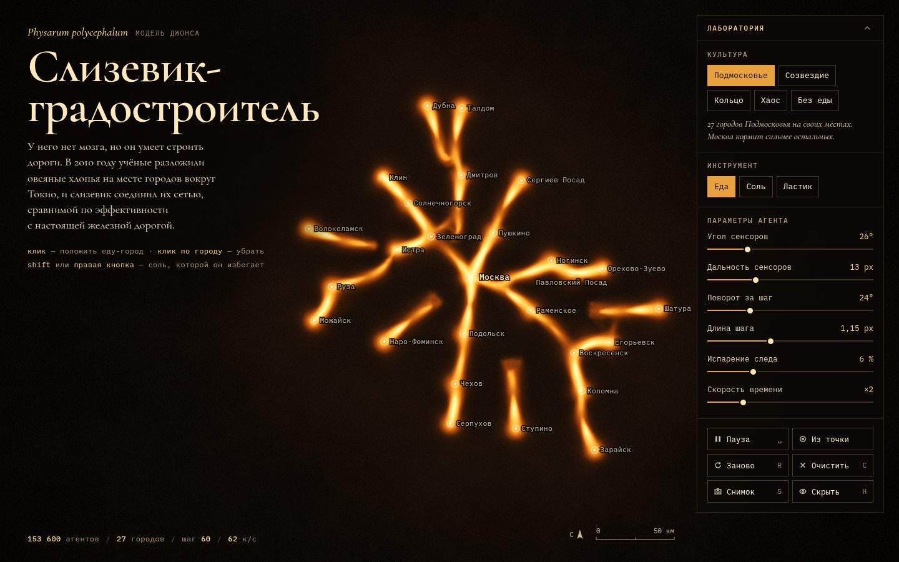

# 013 · Слизевик-градостроитель

> Сотни тысяч агентов *Physarum polycephalum* прокладывают сеть между городами Подмосковья — как слизевик в опыте 2010 года прокладывал её между городами вокруг Токио.

## Как запустить
Двойной клик по `index.html`. Нужен браузер с WebGL2 (свежие Chrome, Safari, Firefox). Интернет нужен только для шрифтов: без него страница работает на системных.

## Что делать
- Клик по пустому месту кладёт еду (город), клик по городу убирает его — сеть перестраивается.
- Shift+клик или правая кнопка сыплет соль: её агенты избегают. Можно водить кистью.
- «Культура» — пять стартовых карт: Подмосковье, Созвездие, Кольцо, Хаос, Без еды (клавиши 1–5).
- Ползунки задают угол и дальность сенсоров, поворот за шаг, длину шага, испарение следа и скорость времени.
- Клавиши: пробел — пауза, R — вырастить заново, C — убрать всё, S — снимок PNG, H — спрятать подписи.

## Что внутри
- **Модель Джеффа Джонса (2010).** У агента три сенсора впереди. Он поворачивает к самому сильному следу, делает шаг и оставляет свой след. След расплывается и испаряется. Сеть рождается из этих трёх правил.
- **Всё считается на GPU (WebGL2).** Позиции и направления агентов хранятся в float-текстуре. Шаг агентов — фрагментный шейдер. След откладывается точками с аддитивным смешиванием, размытие и испарение — отдельный проход.
- **Как города собирают сеть.** Города подпитывают след и дают дальнее поле «запаха» — сумму экспонент от расстояния, её тоже считает шейдер. Агенты, ушедшие слишком далеко от еды, изредка возвращаются к кормушке. Поэтому трубки концентрируются на дорогах между городами.
- **Посев из городов** — как в опыте, где слизевик сажали в точку «Токио».
- **Настоящая карта.** 27 городов стоят по реальным широтам и долготам, линейка масштаба честная. Подписи раскладываются жадным алгоритмом без наложений.
- **Адаптивное качество.** При программном рендере включается облегчённый режим. Если кадры в первые секунды тяжелее ~45 мс, уменьшаются число агентов и разрешение.

## Почему это про Opus 5.5
Эмерджентная GPU-симуляция, где производительность настроена так же тщательно, как картинка. Это ровно то, в чём Opus 5.5 силён: 39 из 40 успешных попыток в тесте на ускорение. При этом реальное (координаты городов, опыт 2010 года) честно отделено от модельного.

## Ограничения
- Это модель агентов, а не биология. Сеть не сравнивается с настоящими железными дорогами Подмосковья, и её не стоит так читать.
- Вместо рождения и гибели агентов из полной модели Джонса здесь упрощённый «возврат заблудившихся».
- Сеть зависит от случайного посева: «Заново» (R) выращивает другую.
