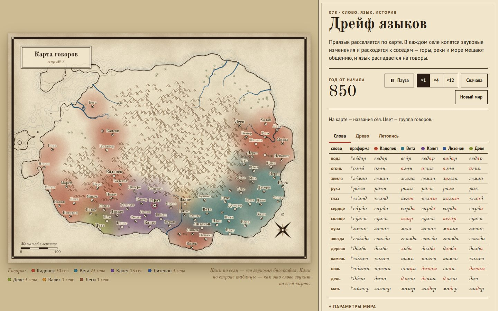

# 014 · Дрейф языков

> Праязык из двадцати слов расселяется по процедурной карте. В сёлах рождаются звуковые законы и расходятся к соседям, горы и реки мешают общению — и за полторы тысячи лет язык распадается на говоры с собственным древом и сравнительной таблицей.

## Как запустить
Двойной клик по `index.html`. Интернет нужен только для шрифтов.

## Что делать
- Время идёт само; **«Пауза»**, скорость **×1 / ×4 / ×12**, **«Сначала»** — тот же мир с нуля, **«Новый мир»** — новая карта.
- **Клик по селу** — его «звуковая биография»: от какой праформы произошло название и какие законы оно пережило.
- **Клик по строке таблицы** — карта превращается в диалектологический атлас: у каждого села подписано, как там звучит это слово, а легенда под картой считает варианты.
- **Клик по записи летописи** — красной пунктирной изоглоссой обводится область, куда дошёл этот закон; под картой — во скольких сёлах он принят.
- Легенда под картой в обычном режиме называет группы говоров и число сёл в каждой. В таблице столько говоров, сколько помещается по ширине (от трёх до пяти).
- В «Параметрах мира» — частота новшеств, интенсивность общения и то, насколько горы разделяют людей.

## Что внутри
- **Регулярность звуковых законов:** закон срабатывает сразу во всех словах села, где выполняется его условие. В каталоге двадцать один закон, знакомый по славянским и другим языкам: палатализация, аканье и иканье, полногласие, перестановка плавных, цеканье и дзеканье, оглушение на конце, протеза, «л → ў» и другие.
- **Волновая модель:** новшество расходится по дорогам между сёлами, вероятность зависит от расстояния, гор, рек и моря.
- **Расселение:** первые века выходцы из прародины основывают новые сёла, наследуя их речь. Названия сёл тоже проходят через звуковые законы — прародина «Гора́д» может, например, превратиться в «Град».
- **Классификация:** расстояние Левенштейна между словами → средняя связь → группы говоров и древо (UPGMA) с долей изменений относительно праязыка.
- **Карта** в духе старых атласов: пергамент, штрихованные горы, береговые линии воды, роза ветров, картуш.

## Почему это про Opus 5.5
Нужно одновременно знать историческую фонетику, построить агентную модель и показать результат так, как это сделали бы лингвисты: атлас, изоглоссы, древо и таблица соответствий.

## Ограничения
- Праязык выдуман, его формы стилизованы под знакомые звуки и ничего не реконструируют.
- Законы применяются как замены символов; ударение не смещается, морфологии нет.
- Заимствования моделируются грубо: новое слово распространяется так же, как звуковой закон.
