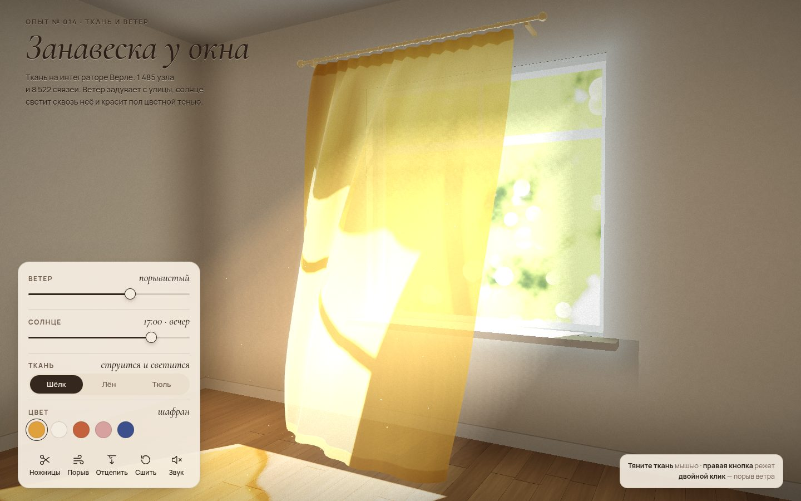

# 015 · Занавеска у окна

> Шёлковая занавеска на ветру у распахнутого окна: ткань на интеграторе Верле, солнце светит сквозь неё и красит пол цветной тенью.

## Как запустить
Двойной клик по `index.html`. Нужен браузер с WebGL2 (свежий Chrome, Safari или Firefox). Без интернета работает всё, только вместо фирменных шрифтов подставятся системные.

## Что делать
- **Тяните ткань** мышью или пальцем — узел следует за курсором. Если дёрнуть слишком сильно, ткань порвётся.
- **Правая кнопка мыши** или кнопка «Ножницы» — резать ткань.
- **Двойной клик** или пробел — порыв ветра.
- «Ветер» — от штиля до шквала. «Солнце» — время с 7:00 до 20:00: меняются высота, направление и цвет солнца.
- Шёлк, лён или тюль и пять цветов. «Отцепить» снимает занавеску с карниза, «Сшить» вешает её заново.
- «Звук» — синтезированный ветер, шелест листвы, хлопки ткани и изредка птицы.

## Что внутри
- **Ткань** — 33 × 45 узлов с основными, сдвиговыми и изгибными связями. Интегратор Верле, шаг 1/120 с, 6 итераций ограничений. Складки у карниза задают кольца, развешанные зигзагом.
- **Аэродинамика по треугольникам.** Сила пропорциональна площади × (v·n)|v·n|, где v — ветер относительно ткани. Сильнее всего дует в проёме, вглубь комнаты ветер слабеет; сверху — порывы и турбулентность.
- **Комната собрана не из полигонов** — её трассируют лучи во фрагментном шейдере: откосы, рама с фрамугой, подоконник, карниз с кольцами, паркет с отражением окна.
- **Свет из окна** считается по точной формуле фактора формы прямоугольного излучателя. Прямое солнце проверяется сквозь проём с учётом толщины стены и переплёта.
- **Цветные тени.** Из позиции солнца рисуется карта: смешивание перемножает пропускание всех слоёв ткани по RGB, а в альфе блендинг MIN хранит ближайшую глубину.
- **Световые столбы в дымке** — 14 шагов на пиксель в четверть разрешения, фазовая функция Хеньи — Гринштейна. Пылинки видны только внутри луча.

## Почему это про Opus 5.5
Физика ткани, оптика и GPU-рендер без единой библиотеки в одном файле. Модель держит все три слоя сразу и доводит картинку, проверяя себя по скриншотам.

## Ограничения
- Ткань не сталкивается сама с собой: складки иногда проходят друг сквозь друга.
- Переотражённый свет в комнате — приближение константой, а не расчёт.
- Прозрачные треугольники сортируются по центрам, поэтому на крутых перехлёстах возможны мелкие артефакты.
