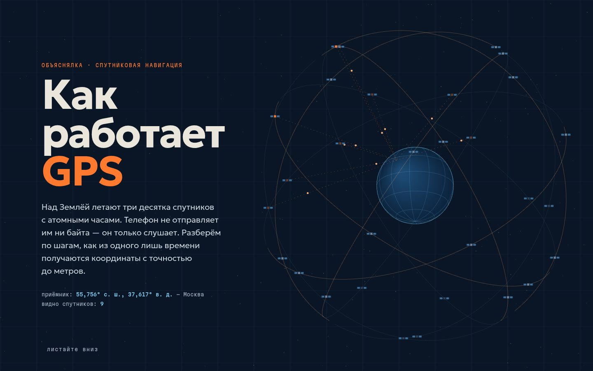

# 016 · Как работает GPS

> Интерактивная объяснялка в шести главах: как из одного лишь времени получаются координаты — и при чём тут Эйнштейн.

## Как запустить
Двойной клик по `index.html`. Всё рисуется на Canvas, интернет нужен только для шрифтов (Geologica и Martian Mono).

## Что делать
Листать вниз. В каждой главе есть живая схема:
1. **Расстояние — это время.** Сигнал летит от спутника к приёмнику. Ползунки — высота орбиты и ошибка часов (1 мкс = 300 м).
2. **Трилатерация.** 1, 2, 3 спутника; спутники можно перетаскивать — пересечение всегда там, где приёмник.
3. **Часы телефона врут.** Ползунок ошибки часов расталкивает окружности. Кнопка «Решить» находит положение вместе с ошибкой часов методом Гаусса — Ньютона.
4. **Геометрия.** Кольца неопределённости и эллипс ошибки из (HᵀH)⁻¹. Кнопки «Столпить» и «Разбросать» и живой HDOP.
5. **Относительность.** +45,9 мкс в сутки от гравитации, −7,2 мкс от скорости, итого +38,7 мкс. Ползунок «дней без поправки» уводит точку на навигаторе на километры.
6. **Небо над Москвой.** Полярная карта неба с моделью созвездия (6 плоскостей × 5 спутников, наклон 55°, период 11 ч 58 мин), видимые спутники и PDOP.

На первом экране Земля и созвездие в честном масштабе: орбита — 4,2 радиуса Земли.

## Что внутри
- Решатель положения с неизвестной ошибкой часов — метод Гаусса — Ньютона на трёх неизвестных (x, y, b).
- Эллипс ошибки — собственные значения ковариации (HᵀH)⁻¹σ²; PDOP — след верхнего блока 4×4-матрицы, обращённой методом Гаусса — Жордана.
- Созвездие — круговые орбиты в инерциальной системе; приёмник вращается с Землёй (ω = 7,292·10⁻⁵ рад/с), угол места и азимут считаются в локальной системе «восток — север — вверх».
- Каждая схема рисуется, только пока видна (IntersectionObserver), с учётом devicePixelRatio.

## Почему это про Opus 5.5
Ясное письмо, где главное — в начале, плюс математика, спрятанная в интерактив: сначала объяснение словами, потом объяснение руками.

## Ограничения
- Схемы глав 2–4 плоские и не в масштабе: спутники ближе, чтобы окружности помещались на экран. В главе 3 сдвиг от ошибки часов для наглядности увеличен в 10 раз.
- Созвездие — модель с равномерно расставленными спутниками, а не реальные эфемериды. Числа округлены.
