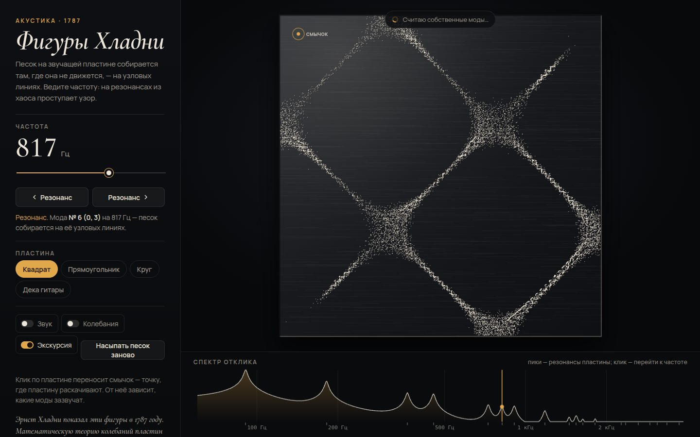

# 017 · Фигуры Хладни

> Песок на звучащей пластине собирается на узловых линиях. Ведите частоту — на резонансах из хаоса проступает узор.

## Как запустить
Двойной клик по `index.html`. Интернет нужен только для шрифтов.

## Что делать
- **Частота:** ползунок, стрелки ← → (с Shift — крупнее) и кнопки «Резонанс» (`PageUp` / `PageDown`) — прыжок к соседнему пику.
- **Спектр отклика** внизу: пики — резонансы пластины. Клик по спектру переводит частоту; вблизи пика курсор к нему прилипает.
- **Пластина:** квадрат, прямоугольник, круг, дека гитары с розеткой.
- **Клик по пластине** переносит смычок — точку возбуждения. От неё зависит, какие моды зазвучат и как сложатся вырожденные пары.
- **«Колебания»** — замедленная съёмка стоячей волны поверх песка. **«Звук»** — тон частоты и шорох песка. **«Экскурсия»** сама обходит резонансы.

## Что внутри
- **Моды квадрата и прямоугольника** — точные: `cos(nπx/a)·cos(mπy/b)`, край свободный.
- **Моды круга и деки гитары** считаются численно:
  - дискретный оператор Лапласа с условием Неймана на маске формы (72 × 72);
  - сдвиг с обращением: ленточное разложение Холецкого матрицы `L + εI`;
  - метод Ланцоша с полной переортогонализацией, стартующий из точки возбуждения;
  - неявный QL-алгоритм для трёхдиагональной матрицы.

  Решатель работает в Web Worker и проверен на круге: 14,6 против теоретических 14,7, 63,8 против 63,7.
- **Вынужденные колебания с затуханием** — разложение по модам: `u = Σ φₖ(x₀)·φₖ(x) / (ωₖ² − ω² + iωωₖ/Q)`. Спектр отклика — энергия этого решения по частотам.
- **Песок** — 15 000 песчинок. Они подпрыгивают тем сильнее, чем сильнее колеблется пластина под ними, и сползают по градиенту амплитуды. Поэтому собираются там, где пластина неподвижна.
- Отрисовка: накопление плотности в буфере, тон-кривая и сдвинутая тень. Пластина — процедурная воронёная сталь со шлифовкой и фаской.

## Почему это про Opus 5.5
Численные методы (сдвиг с обращением, Ланцош, QL), физика вынужденных колебаний и точная проверка по теории, сведённые в живой инструмент. Это та самая междисциплинарная работа, где модель сильна.

## Ограничения
- Пластина описана мембранным приближением со свободным краем (уравнение Гельмгольца), а не полным бигармоническим уравнением тонкой пластины. Узоры близки к классическим фигурам Хладни, но не идентичны настоящей стальной пластине.
- Частоты пересчитаны по закону пластины `f ∝ k²`, масштаб подобран так, чтобы первая мода квадрата звучала около 90 Гц.
- Пластина не закреплена в центре, как в классическом опыте.
