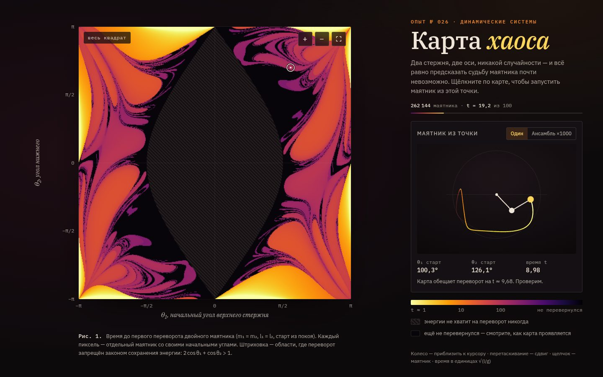

# 018 · Карта хаоса

> Миллион двойных маятников на видеокарте: каждый пиксель окрашен по времени до первого переворота, и из этого вырастает фрактал.

## Как запустить
Двойной клик по `index.html`. Нужен браузер с WebGL 2 (Chrome, Safari, Firefox). Без поддержки float-текстур карта строится на процессоре в пониженном разрешении. Интернет нужен только для шрифтов.

## Что делать
- Смотрите, как карта «проявляется»: сначала вспыхивают быстрые перевороты, потом медленные.
- Щелчок по карте — справа запускается маятник с этими начальными углами, и видно, совпадёт ли его переворот с цветом пикселя.
- «Ансамбль ×1000» — тысяча маятников, стартовые углы отличаются на стотысячные доли радиана; через несколько секунд они расходятся веером.
- Колесо — приблизить к курсору, перетаскивание — сдвиг, кнопки «+», «−» и «весь квадрат». Кнопка «+» приближает к выбранной точке.

## Что внутри
- Состояние каждого маятника (θ₁, θ₂, ω₁, ω₂) хранится во float-текстуре; каждый кадр шейдер делает десятки шагов Рунге — Кутты 4-го порядка. Время переворота пишется во вторую текстуру (MRT).
- На MacBook карта — 1024 × 1024, то есть 1 048 576 маятников одновременно; число шагов за кадр подстраивается под видеокарту.
- Штриховка — области, где переворот запрещён законом сохранения энергии: при старте из покоя это 2 cos θ₁ + cos θ₂ > 1.
- Цвет — логарифм времени переворота в палитре inferno (полиномиальное приближение палитры matplotlib).
- Маятник справа считается в 64-битной точности на процессоре; при долгом хаосе он может разойтись с картой (32 бита) — это и есть чувствительность к начальным условиям, про неё прямо сказано в подписи.

## Почему это про Opus 5.5
Динамическая система, численный метод и GPU-вычисления, упакованные в научную иллюстрацию: физика выведена верно (условие энергии проверено), шаг интегрирования подобран сравнением прогонов.

## Ограничения
- Массы и длины стержней равны, старт из покоя — это классическая постановка задачи; другие параметры не настраиваются.
- Время ограничено t = 100 (в единицах √(l/g)); что не перевернулось к этому моменту, остаётся тёмным.
- При сильном приближении упираемся в точность float32 (≈ 10⁻⁷ радиана).
