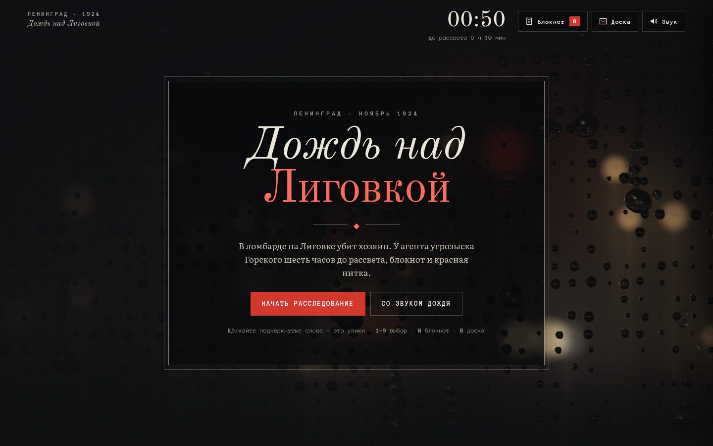

# 019 · Дождь над Лиговкой

> Интерактивный детектив: ноябрь 1924 года, ломбард на Лиговке, убит хозяин. У агента угрозыска шесть часов до рассвета, блокнот и красная нитка.

## Как запустить
Двойной клик по `index.html`. Интернет не нужен (без него шрифты станут системными). Звук дождя — кнопкой «Со звуком дождя» или «Звук» в углу.

## Что делать
- Читайте сцены и выбирайте действия (мышью или клавишами `1`–`9`). Каждое действие и каждая дорога по ночному городу стоят времени — часы в углу.
- **Подчёркнутые слова — улики.** Щелчок записывает их в блокнот (`N`).
- **Доска улик** (`B`): выберите две карточки. Если они связаны, красная нитка даст вывод. Выводы тоже можно связывать с уликами — так строятся цепочки.
- В угрозыске назовите фамилию. Финалов пять: «Правда», «Недоказанное», «Удобный виновный», «Чужая вина» и «Рассвет», если не успеть к семи утра.

## Что внутри
- 15 сцен, 18 улик, 10 выводов, 3 подозреваемых. Загадка решается логикой: время смерти, два ключа, пропавший гроссбух, ложное алиби. Обойти все места за ночь не получится — приходится выбирать.
- Текст появляется по словам, с неразрывными пробелами после коротких слов и «ёлочками».
- Фон — собственный шейдер WebGL2: ночная улица не в фокусе (фонари, отражения в лужах, трамвай), по стеклу стекают капли. Каждая капля — линза: сквозь неё улица видна резче и перевёрнутой, как в жизни. Изредка вспыхивает молния.
- Звук синтезирован: розовый шум дождя, стук капель, далёкий трамвайный звонок, гром после вспышки.
- Карта ночного города нарисована в SVG: Нева, Фонтанка, Обводный канал, Невский, Лиговка.

## Почему это про Opus 5.5
Письмо — одна из заявленных сильных сторон модели. Здесь нужно и то и другое: живая проза с интонацией 1920-х и детективная конструкция, где каждая улика честно ведёт к выводу и ни одна не противоречит другой.

## Ограничения
- Исторический фон стилизован: имена, заведения и расписание трамваев вымышлены. Реальны Лиговка, Обводный канал, Коломна, Никольский собор, «Кресты», переименование города в Ленинград (январь 1924 года).
- Прогресс не сохраняется: одна партия занимает 10–15 минут.
