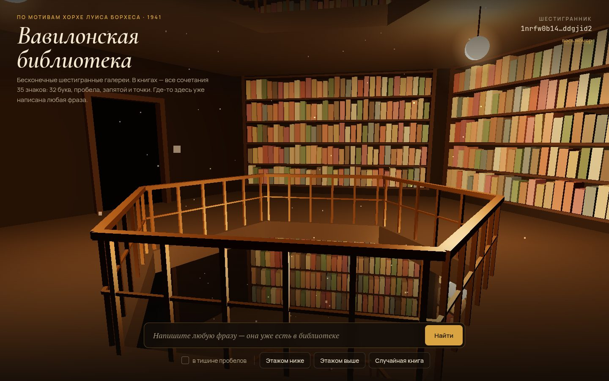

# 020 · Вавилонская библиотека

> Бесконечные шестигранные галереи по мотивам рассказа Борхеса. Каждая книга задана адресом, а поиск находит страницу, где уже написана любая ваша фраза.

## Как запустить
Двойной клик по `index.html`. Трёхмерные галереи подгружают three.js с CDN, поэтому нужен интернет. Без него работают поиск и чтение книг.

## Что делать
- Камера сама медленно обходит галерею вокруг шахты. Перетаскивание поворачивает взгляд.
- Наведите на книгу на своём этаже — увидите стену, полку и номер тома. Клик открывает книгу: 410 страниц по 40 строк в 80 знаков, листайте стрелками.
- **Поиск:** напишите любую фразу по-русски. Библиотека найдёт шестигранник, стену, полку, том и страницу, где она уже напечатана, перенесёт вас туда и подсветит фразу. Галочка «в тишине пробелов» ищет страницу, где кроме фразы только пробелы.
- **Этажом выше / ниже** — соседние шестигранники по шахте. **Случайная книга** — наугад.
- **Весь номер** показывает полный номер шестигранника — это число из трёх с лишним тысяч знаков.

## Что внутри
- **Алфавит** — 35 знаков: 32 буквы (без «ё»), пробел, запятая, точка. Страница — число `T < 35³²⁰⁰`.
- **Адрес** получается как `L = (A·T + C) mod 35³²⁰⁰`, где `A` взаимно просто с 35. Отображение обратимо: обратный множитель `A⁻¹` вычисляется подъёмом Гензеля (итерации Ньютона `x ← x·(2 − A·x)`). Поэтому любая страница однозначно имеет адрес, а любой адрес — страницу.
- `L` раскладывается на шестигранник, стену (4), полку (5), том (32) и страницу (410). Страница строится примерно за 1 мс, поиск фразы — примерно за 3 мс, обратный путь даёт ровно тот же текст (проверено).
- **Сцена** на three.js:
  - шестиугольные перекрытия с шахтой, перила, стеллажи, проходы в соседние галереи;
  - 7040 книг в одном InstancedMesh, цвета зависят от номера шестигранника;
  - по две лампы-«плода» на этаж, туман, пылинки;
  - одиннадцать этажей видны сквозь шахту.

## Почему это про Opus 5.5
Литература, превращённая в точную математику: обратимое отображение на числах из 16 000 бит, модульная арифметика и 3D-сцена. Всё это собрано в один работающий опыт.

## Ограничения
- Это оммаж, а не иллюстрация рассказа: цитат из Борхеса нет, все тексты свои.
- Буква «ё» приравнена к «е»; знаки вне алфавита при поиске отбрасываются.
- Отображение `A·T + C` перемешивает страницы, но это не криптография: закономерности при желании находятся.
- Соседние этажи — соседние номера шестигранников. В рассказе устройство библиотеки описано иначе.
