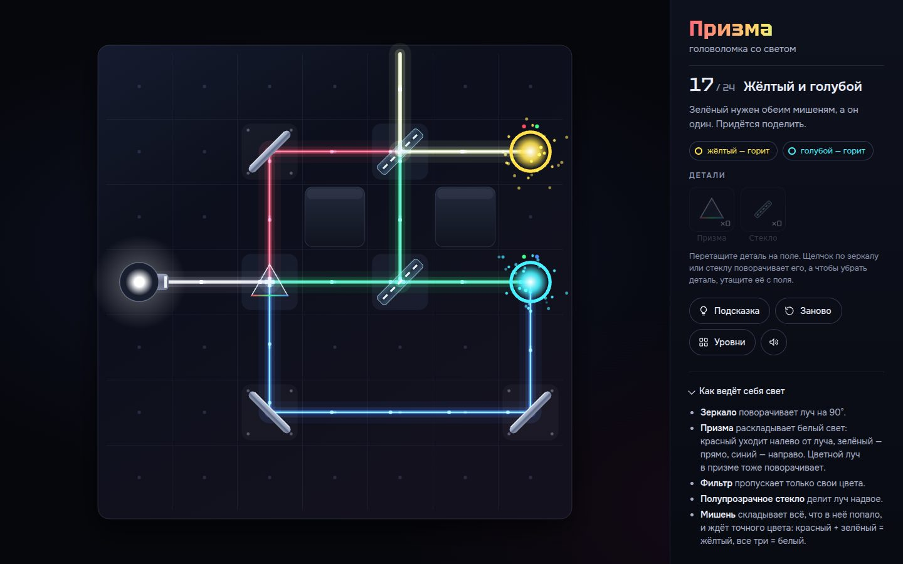

# 021 · Призма

> Головоломка со светом: зеркала, полупрозрачные стёкла, призмы и фильтры. 24 уровня, и решаемость каждого проверена решателем.

## Как запустить
Двойной клик по `index.html`. Интернет не обязателен: без него шрифты заменятся системными.

## Что делать
- Задача — зажечь все мишени точным цветом. Цвет, который нужен мишени, показан её кольцом и точками-составляющими над ним.
- Перетащите деталь из лотка на клетку. Можно и иначе: выбрать деталь в лотке, а потом нажать на клетку.
- Щелчок по зеркалу или стеклу на поле поворачивает его. Чтобы убрать деталь, утащите её с поля (или щёлкните правой кнопкой).
- «Подсказка» (`H`) показывает следующую верную деталь — с учётом того, что вы уже поставили. Если поставленное мешает, подсказка покажет, какую деталь повернуть или убрать.
- «Заново» (`R`), «Уровни» — выбор любого из 24, кнопка звука. После победы `Enter` — следующий уровень. Пройденные уровни запоминаются.

## Что внутри
- Свет дискретный: луч — это клетка, направление и цвет в виде трёх битов RGB. Смешение в мишени — побитовое ИЛИ (красный + зелёный = жёлтый), фильтр — побитовое И. Призма раскладывает луч по битам: красный поворачивает налево, зелёный идёт прямо, синий — направо; поэтому и цветной луч в призме поворачивает, а три цветных луча с трёх сторон выходят из неё одним белым.
- Трассировка идёт по очереди лучей; состояние «клетка + направление + цвет», встреченное второй раз, обрывает петлю.
- Решатель — перебор с отсечением: деталь имеет смысл ставить только на освещённую клетку (в темноте она ничего не меняет), одинаковые расстановки не повторяются.
- `node tools/verify.js` проверяет все уровни: без деталей уровень не решён, записанное решение работает, без любой одной детали решений нет (перебор доведён до конца), число решений — от одного до трёх.
- Уровни 1–17 составлены вручную, по одной новой идее на уровень: «Роза ветров», «Обратная радуга», «Опыт Ньютона» и другие. Уровни 18–24 найдены генератором (`tools/generate.js`) обратным построением: он ставит детали на освещённые клетки, ставит мишени туда, где упираются лучи, и отбрасывает всё, что решается проще задуманного или занимает только угол поля. Из прошедших отбор кандидатов уровни выбраны и названы вручную.
- Подсказка в браузере — тот же решатель: ваши детали считаются закреплёнными, и он ищет, как продолжить.
- Рисунок — Canvas 2D: каждый луч в четыре прохода с аддитивным смешением, бегущие искры, стекло и металл градиентами. Звук — Web Audio: колокольчик с негармоническими обертонами на каждую зажжённую мишень, аккорд на победу, реверберация от синтезированного отклика.

## Почему это про Opus 5.5
Дизайн уровней с доказуемой честностью: у каждой головоломки проверено, что она решается, что в ней нет лишних деталей и что решений немного, а подсказка не угадывает, а решает.

## Ограничения
- Физика условная: четыре направления, три основных цвета и их смеси. В настоящей призме все цвета отклоняются в одну сторону на разные углы. Здесь правило «красный налево, синий направо» — игровое.
- Зеркала и стёкла двусторонние.
- Уровни 18–24 не нарисованы с нуля, а отобраны из сгенерированных.
- У нескольких уровней по два-три решения — все они на одной идее.
- На самых сложных уровнях подсказка думает до нескольких десятых секунды.
