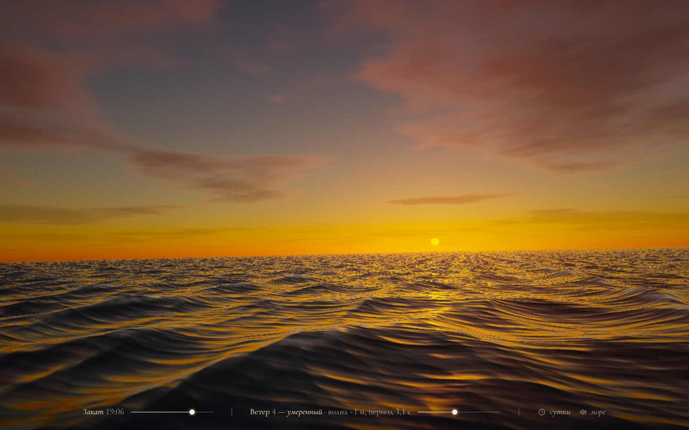

# 022 · Океан на закате

> Открытый океан до горизонта: волны по дисперсии глубокой воды, небо по рассеянию Рэлея и Ми, солнечная дорожка, облака, лунная ночь и шторм.

## Как запустить
Двойной клик по `index.html`. Нужен браузер с WebGL2 (Chrome, Safari, Firefox последних лет). Без интернета всё работает, только подписи набираются системной антиквой вместо Cormorant Garamond.

## Что делать
- **Время суток** — ползунок от 4:00 до 24:00: рассветные сумерки → утро → день → золотой час → закат → вечерняя заря → синий час → лунная ночь. Стрелки ← → двигают время на 15 минут.
- **Ветер** — шкала Бофорта от 0 (штиль, зеркальная гладь) до 9 (шторм, волна ~7 м, пена, тучи). Стрелки ↑ ↓.
- **Тяните мышью или пальцем** — осмотреться; двойной клик — вернуть взгляд к солнцу (ночью — к луне).
- **«Сутки»** или пробел — ускоренная смена суток; **«Море»** — синтезированный шум волн и ветра; **H** — спрятать интерфейс для чистого кадра.
- Попробуйте поймать **зелёный луч**: в момент, когда верхний край солнца касается горизонта, он на миг зеленеет — подпись это отметит.

## Что внутри
- **Волны** — сумма 30 «заострённых» волн `exp(sin x − 1)`: профиль с острыми гребнями и пологими впадинами, как у трохоиды Герстнера. Направления разбросаны вокруг ветра, частоты подчиняются дисперсии глубокой воды ω = √(gk), поэтому длинные волны бегут быстрее коротких. Высота и длина волны берутся из шкалы Бофорта и формулы Пирсона — Московица.
- **Уровень детализации по пикселю**: вдали отбрасываются октавы короче 3,5 пикселя, а вместо них подставляется их среднее. Поэтому на горизонте нет мерцающей ряби и нет «ступенек» между уровнями детализации.
- **Небо** — однократное рассеяние в атмосфере (модель Ниситы): Рэлей, Ми и поглощение озоном, с тенью Земли в сумерках. Оно считается в маленькую текстуру 256×96 только тогда, когда сдвигается солнце; цвет солнечного света у воды — пропускание той же атмосферы.
- **Вода** — френелевское отражение неба и облаков, блик GGX (из него и складывается солнечная или лунная дорожка), подповерхностное свечение гребней на просвет, пена по высоте и крутизне, полосы пены в шторм, дымка к горизонту.
- **Камера стоит в лодке**: высота глаза и качка берутся из того же поля волн, посчитанного на процессоре.
- **Экспозиция** меняется, как у фотографа: днём меньше, в сумерках и ночью больше. Тональное отображение ACES, зерно против полос.

## Почему это про Opus 5.5
Физика света и волн, атмосферная оптика и производительность шейдера в одном файле. Каждое решение (дисперсия, LOD по пикселю, текстура неба) выбрано так, чтобы сцена была и красивой, и честной.

## Ограничения
- Волны — не FFT-спектр Тессендорфа, а сумма направленных волн; обрушения гребней и брызг нет.
- Луна всегда полная (стоит напротив солнца), облака — один слой на высоте ~2 км, а не объёмные.
- Зелёный луч и сплющивание солнца у горизонта — художественная модель, а не расчёт рефракции.
- Сцена тяжёлая для GPU: разрешение автоматически подстраивается под частоту кадров.
