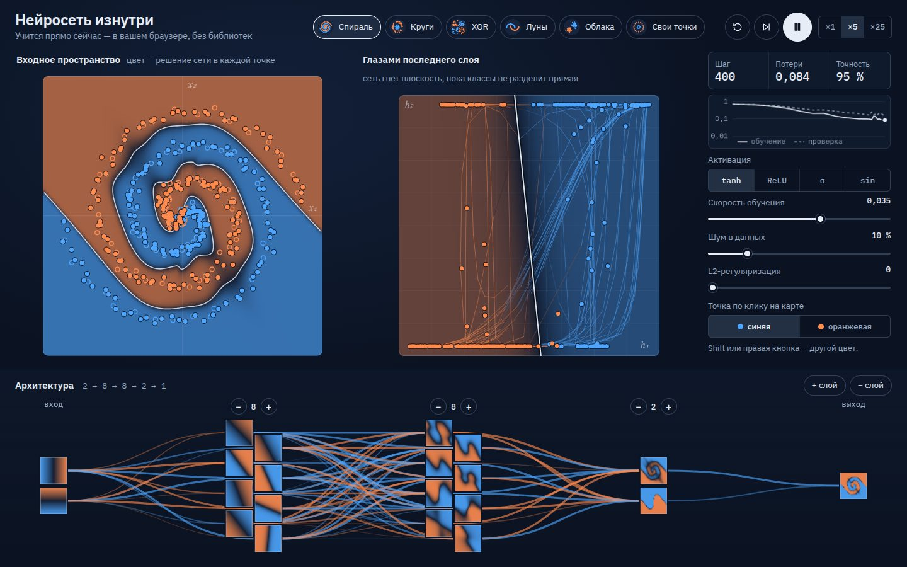

# 023 · Нейросеть изнутри

> Многослойный перцептрон учится прямо в браузере, а вы смотрите, как скрытый слой сгибает плоскость, пока две спирали не разделит прямая.

## Как запустить
Двойной клик по `index.html`. Интернет нужен только для шрифтов.

## Что делать
- **Данные** (вверху): спираль, круги, XOR, луны, облака или свои точки. Клик по левой карте добавляет точку цвета, выбранного справа в «Точка по клику на карте» (так можно и с телефона); Shift+клик или правая кнопка — точку другого цвета.
- **Пуск и пауза** (пробел), **шаг** (`S`), **новые веса** (`R`), скорость ×1 / ×5 / ×25 шагов за кадр.
- **Архитектура** (внизу): «−» и «+» над каждым скрытым слоем, «+ слой» и «− слой». Наведите на нейрон — подсветятся его связи и появится смещение.
- Справа — функция активации (tanh, ReLU, σ, sin), скорость обучения, шум и L2-регуляризация.
- Наведите курсор на левую карту: кольцо на правой панели покажет, куда эта точка попадает «в голове» сети.

## Что внутри
- Своя реализация: прямой проход, обратное распространение ошибки вручную по слоям, двоичная перекрёстная энтропия, оптимизатор Adam с поправкой смещения, L2-регуляризация. Без библиотек.
- **Слева** — вероятность класса в каждой точке плоскости и граница `p = 0,5`, найденная «марширующими квадратами».
- **Справа** — сетка входной плоскости, пропущенная через сеть до последнего скрытого слоя. Если слой двумерный, координаты показаны как есть и видна разделяющая прямая выходного нейрона. Если шире — проекция на две главные компоненты: степенной метод, знаки осей согласуются между кадрами.
- **Внизу** — карта активации каждого нейрона и веса как кривые: тёплые положительные, холодные отрицательные, толщина — модуль веса. Если нейронов в слое много, столбец раскладывается «ёлочкой», чтобы карты оставались крупными.
- В двумерном последнем слое фон правой панели — ответ выходного нейрона `σ(w₁h₁ + w₂h₂ + b)`: видно, что граница там действительно прямая.
- График потерь показывает всю историю обучения по шагам (при переполнении точки прореживаются через одну). Если кадр на слабом устройстве тяжёлый, следующий откладывается — страница не подвисает.
- При открытии сеть уже немного обучена, чтобы первый кадр показывал структуру. «Новые веса» начинают с нуля.

## Почему это про Opus 5.5
Модель объясняет устройство себе подобных: точная математика обучения и визуализация, которая делает её интуитивной.

## Ограничения
- Полный пакет данных на каждом шаге (300 точек). Для больших наборов понадобились бы мини-пакеты.
- Для ReLU карты нейронов нормированы по максимуму своего слоя (ноль — тёмный, максимум — тёплый), поэтому яркости разных слоёв сравнивать нельзя.
