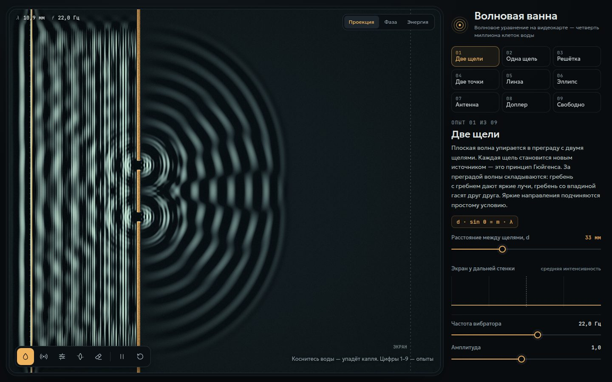

# 024 · Волновая ванна

> Лабораторная волновая ванна на видеокарте: двумерное волновое уравнение на четверти миллиона клеток и девять классических опытов.

## Как запустить
Двойной клик по `index.html`. Нужен браузер с WebGL2 (Chrome, Safari, Firefox последних лет). Интернет нужен только для шрифтов — без него страница откроется с системными.

## Что делать
- **Клик по воде** — упадёт капля; протяните мышь — цепочка капель.
- **Инструменты внизу:** источник (поставить или убрать вибратор), стена, мелководье (здесь волны медленнее), ластик, пауза, «успокоить воду».
- **Опыты 1–9** (кнопки справа или цифры на клавиатуре): две щели, одна щель, дифракционная решётка, два источника, линза из мелководья, эллиптическое зеркало, фазированная антенная решётка, эффект Доплера и свободная ванна.
- **Ползунок опыта** меняет главный параметр: расстояние между щелями, ширину щели, число щелей, скорость над отмелью, эксцентриситет, угол луча, скорость источника.
- **Вид** (M): «Проекция» — свет, прошедший сквозь рябь, как в физкабинете; «Фаза» — гребни тёплые, впадины холодные; «Энергия» — средняя интенсивность, в которой видны линии тишины.
- **Экран у дальней стенки** — график средней интенсивности: главный и боковые максимумы интерференции.

## Что внутри
- Волновое уравнение `u_tt = c²∇²u` решается явной разностной схемой на float-текстурах WebGL2 (ping-pong), число Куранта 0,5. За кадр — до 14 шагов.
- Поглощающий «пляж» у краёв: демпфирование нарастает квадратично, чтобы волны не отражались от стенок.
- Мягкие (прозрачные для волн) источники: точечные и линейный вибратор. Сила подобрана по функции Грина — плоская волна и точечный источник дают единичную амплитуду.
- Линза и отмели — карта скорости волны; стены — условие u = 0.
- «Проекция» считает освещённость дна как в настоящей ванне: яркость ∝ 1 / (1 + D·∇²u) с мягким ограничением, чтобы сильные волны не выжигали кадр.
- Плоская волна в опытах со щелями заранее «налита» до преграды по дискретному дисперсионному соотношению, поэтому картинка готова сразу.

## Почему это про Opus 5.5
Численная физика, которую нужно одновременно сделать правильной (устойчивая схема, согласованные амплитуды, поглощение на краях), быстрой (всё на GPU) и понятной — короткие пояснения с формулами к каждому опыту.

## Ограничения
- Масштаб условный: клетка — 0,5 мм, скорость волны — 24 см/с; настоящие волны на мелкой воде ещё и диспергируют, здесь скорость одна для всех частот.
- Перед преградой видна стоячая волна — это честное отражение, а не ошибка.
- Предпросмотр на слабой видеокарте автоматически уменьшает сетку вчетверо.
