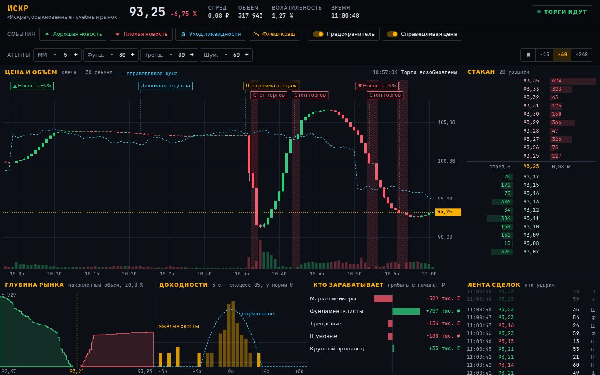

# 025 · Биржевой стакан

> Учебный рынок из 125 агентов: нажмите «Флеш-крэш» — и увидите, как программа продаж в тонком стакане обваливает цену, предохранитель останавливает торги, а фундаменталисты возвращают цену к справедливой.

## Как запустить
Двойной клик по `index.html`. Интернет нужен только для шрифтов (JetBrains Mono, IBM Plex Sans Condensed), без него подставятся системные. Инструмент «Искра» (ИСКР) вымышленный, все данные рождаются симуляцией.

## Что делать
- **События:** хорошая или плохая новость (справедливая цена ±5 %), уход ликвидности (маркетмейкеры на 80 секунд отзывают котировки), флеш-крэш — программа продаж 16 000 акций в опустевшем стакане. Клавиши: `↑`, `↓`, `L`, `C`.
- **Предохранитель:** если цена за 5 минут ушла больше чем на 6,5 %, торги встают на 40 секунд. После возобновления отсчёт идёт от цены открытия, поэтому повторная остановка случается только при новом рывке.
- **Справедливая цена** — голубой пунктир, «истина», которую в настоящем рынке не видит никто.
- **Агенты:** число маркетмейкеров, фундаменталистов, трендовых и шумовых трейдеров меняется на ходу (на десктопе).
- Скорость ×15 / ×60 / ×240 к реальному времени (×60 — минута рынка за секунду), пробел — пауза. Наведите мышь на график — появятся цены свечи.

## Что внутри
- `market.js` — книга заявок с приоритетом «цена, затем время», лимитные и рыночные заявки, отмена, срок жизни заявок.
- **Маркетмейкеры** держат лесенку котировок только «в стакан» (не снимают чужие заявки) и сдвигают её против накопленной позиции, но не дальше полуспреда. **Фундаменталисты** покупают ниже своей оценки справедливой цены и продают выше, чем больше перекос — тем чаще. **Трендовые** следуют за отклонением цены от своей скользящей средней. **Шумовые** ставят случайные заявки.
- **Программа продаж** бьёт по рынку порциями по 520 акций в секунду, но не ниже 85 % цены на старте — как алгоритм с ценовым пределом.
- Устойчивость проверена прогонами на десяти зёрнах случайности: в спокойном режиме остановок нет, а после серии крахов цена возвращается к справедливой, а не уходит в разнос.
- На графике флажки событий и штрихованные полосы остановок. Панель «Доходности» сравнивает распределение 5-секундных доходностей с нормальным в логарифмической шкале: эксцесс около 70–90 вместо 0, и в хвостах за 4σ лежат наблюдения, которых у нормального распределения почти не бывает.
- «Глубина рынка» сама подбирает окно по тому, где лежит 85 % заявок: ±0,2–0,5 % в спокойствии, ±0,3–0,7 % при уходе ликвидности и до ±2–3 % во время обвала. «Кто зарабатывает» — прибыль каждого класса агентов по рыночной оценке позиции.
- Предыстория на старте — торговый час с сюжетом: хорошая новость, уход ликвидности, флеш-крэш с остановками и плохая новость.

## Почему это про Opus 5.5
Финансовый анализ и агентное моделирование (GDPval): рабочий движок рынка, проверенный на устойчивость прогонами, и терминал, который честно показывает, как из простых стратегий рождаются обвалы и тяжёлые хвосты.

## Ограничения
- Модель учебная: агенты простые, комиссий нет, короткие продажи без ограничений, тик 0,01 ₽.
- В спокойном режиме размах 30-секундной свечи — около 0,05–0,1 %: лесенка маркетмейкеров гасит мелкие движения, поэтому штиль на графике почти плоский, а крупные движения случаются только по событиям.
- После остановки торги возобновляются без аукциона открытия, поэтому первая цена после паузы может скачком вернуться к стакану.
