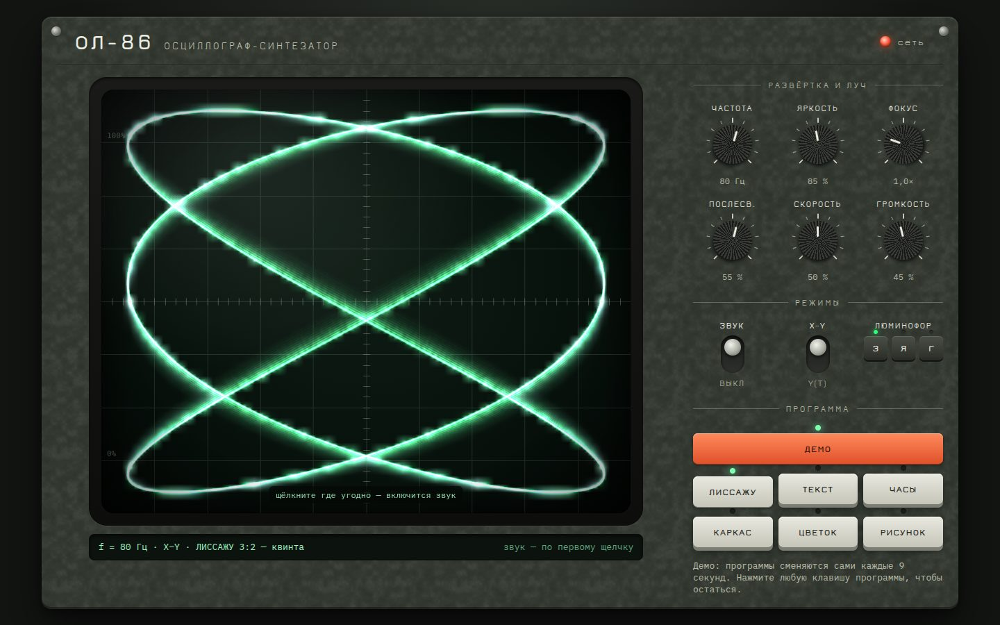

# 026 · Осциллограф ОЛ-86

> Векторная графика звуком: левый канал ведёт луч по горизонтали, правый — по вертикали. Всё, что видно на экране, можно услышать.

## Как запустить
Двойной клик по `index.html`. Звук включается после первого щелчка — так требует браузер. Интернет нужен только для шрифтов Jura и IBM Plex Mono.

## Что делать
- **Программы** (клавиши справа или цифры 0–6): Демо, Лиссажу, Текст, Часы, Каркас, Цветок, Рисунок.
- **Лиссажу**: восемь отношений частот с названиями интервалов — 3:2 звучит как квинта, 2:1 как октава, 5:4 как большая терция.
- **Текст**: впишите свою надпись — её нарисует однолинейный векторный шрифт с кириллицей.
- **Каркас**: куб, октаэдр, икосаэдр, четырёхмерный тессеракт, тор и глобус вращаются и звучат.
- **Рисунок**: рисуйте на экране мышью или пальцем — линия сразу превращается в звук.
- **Ручки** крутятся перетаскиванием вверх-вниз, колесом или стрелками; двойной щелчок возвращает исходное значение. Тумблеры: звук, режим X–Y или Y(t), три цвета люминофора.

## Что внутри
- Каждый кадр строится одна последовательность точек: по длине пути, с быстрыми «перелётами» между штрихами. Она уходит в AudioWorklet как стереосигнал (L = X, R = Y), и она же рисуется на экране. Если AudioWorklet недоступен, работает запасной ScriptProcessor.
- Яркость луча обратна его скорости, как у настоящего прибора: перелёты между буквами едва видны, медленные участки горят ярче.
- Люминофор — отдельный слой с послесвечением (частичное стирание каждый кадр), свечение — двумя уменьшенными копиями, как в оптике кинескопа.
- Свой однолинейный векторный шрифт на сетке 4×6: вся кириллица, латиница, цифры и знаки.
- Каркасы: рёбра собираются в цепочки, как в эйлеровом пути, чтобы луч меньше прыгал; тессеракт вращается в плоскостях XW и YZ.
- Интерфейс прибора целиком на CSS: молотковая эмаль корпуса генерируется шумом, ручки с накаткой — конический градиент.

## Почему это про Opus 5.5
Здесь один источник правды для двух миров — звука и изображения, — и цифровая обработка звука стыкуется с физикой кинескопа и типографикой. Такие задачи держатся только на аккуратной сквозной логике.

## Ограничения
Прибор вымышленный. Звук сознательно «сырой», как у настоящей осциллографической музыки: это жужжание, а не мелодия. Частота кадров экрана не совпадает с частотой звукового цикла, поэтому картинка — отображение того же сигнала, а не его точная оцифровка.
