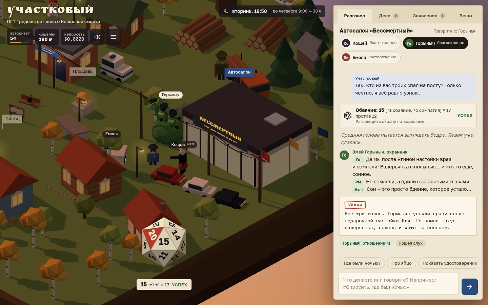

# 027 · Участковый

> Ролевая игра с нейросетью в изометрическом 3D: в ПГТ Тридевятое у Кощея украли смерть, а вы — новый участковый, и весь посёлок отвечает вам живым текстом.

## Как запустить
Двойной клик по `index.html`. Нужен интернет: трёхмерный посёлок грузит three.js с cdn.jsdelivr.net, а жители и мастер игры — это DeepSeek через OpenRouter. Ключ свой (BYOK): игра предложит войти через OpenRouter или вставить ключ.

Без ключа или без сети включается демо-режим: вверху красная метка, жители отвечают заготовками, кубик, улики и обвинение работают, дело можно раскрыть. Без CDN пропадает только 3D — играть можно в папке с делом.

## Что делать
- **Пишите что угодно** в поле внизу папки: вопросы, угрозы, комплименты, «лезу на крышу по водосточной трубе», «угощаю Горыныча пивом», «выпишу Кощею штраф за скрученный пробег». Enter — отправить.
- **Клик по подписи места** на карте — идти туда, время идёт. **Клик по жителю** или по его кружку в папке — начать разговор.
- **Кубик d20** бросается, когда исход неочевиден. Навык, сложность и модификаторы видны на кубике и в журнале.
- **«Дело»** — найденные улики, зацепки и слухи. Там же обвинение: подозреваемый и до трёх улик, нужны две настоящие. Ошибиться можно один раз.
- **«Заявления»** — побочные дела жителей, их придумывает мастер.
- **«Вещи»** — пиво, семечки, шоколадка, сметана для кота. Купить можно на почте с 8:00 до 21:00. Кнопка «Угостить» отдаёт вещь собеседнику.
- В 9:00 звонит полковник Полкан: ответьте, иначе авторитет упадёт. На площади можно поспать до утра, позвонить начальству и покормить кота.
- Колесо мыши и перетаскивание — масштаб и обзор. На телефоне — щипок и свайп, папка — шторка снизу.

## Что внутри
- **Мастер игры — DeepSeek со строгой схемой.** На каждый ход `AI.json` возвращает тип действия, нужен ли бросок (навык и сложность) и две ветки исхода — для успеха и провала. Код сам бросает d20 с модификаторами: отношение, пиво, темнота, фонарик, авторитет. Потом он выбирает ветку и проверяет каждое поле:
  - улику можно выдать только из списка доступных здесь и только при выполненном условии: свободно, доверие или успешный бросок;
  - если мастер хочет выдать улику, закрытую броском, но бросок не назначил, бросок назначает код;
  - отношение за ход меняется не больше чем на ±2, плюс единица за любимое угощение;
  - отдать можно только вещи из инвентаря; подарок из кнопки «Угостить» уходит, даже если мастер забыл это поле;
  - яйцо находится только обыском.

  Сломанный ответ заменяется разбором по ключевым словам.
- **Актёры с памятью.** После решения мастера персонаж отвечает потоком. В промпте его характер, тайна, версия ночи, отношение к участковому, последние реплики разговора, заметки о прошлых встречах и слухи посёлка. Заметный поступок становится слухом, который слышат другие жители. В проверке участковый угостил Горыныча пивом, и по посёлку пошло: «Новый участковый пришёл с пивом к Горынычу — мужик свой». У Горыныча три головы — Го, Ры и Ныч, — и они спорят в одной реплике.
- **Одна загадка на партию, четыре версии правды.** Виновный выбирается при старте. У каждой версии свой мотив, способ, тайник с яйцом, следы на месте преступления и показания, разложенные по жителям. Остальные жители прячут собственные грешки — это ложные следы. Правда хранится в JS и передаётся мастеру, но в «Дело» улика попадает, только когда её пропустил код.
- **Живой посёлок.** У каждого жителя расписание: Емеля развозит людей на печи, Яга по вечерам торгует каплями в бане, Леший ночью рубит заповедную рощу. Ночью виновный тайком возится у тайника, и на карте видно подозрительный огонёк. Смена дня и ночи меняет свет, окна, фонари и звёзды. Мастер может встряхнуть сцену: избушка поворачивается, Горыныч пыхает огнём, Водяной окатывает водой.
- **Заявления и финал.** Побочные заявления мастер придумывает с рассуждением (`think: true`) заранее, в фоне; закрывает их тоже мастер, а награду выдаёт код. После обвинения виновный признаётся своими словами, а секретарь района переписывает журнал участкового в протокол казённым языком. Всё сохраняется в браузере: дело, улики, память жителей и журнал.
- **3D без файлов.** Посёлок, жители и кубик собраны из примитивов three.js: изометрическая ортокамера, тени, слияние статичной геометрии: около 140 вызовов отрисовки на кадр. d20 — икосаэдр с атласом чисел: после броска он ложится к камере гранью с выпавшим числом.

## Почему это про Opus 5.5
Opus спроектировал игру, где нейросеть — мастер, актёры и секретарь, но не судья: весь учёт, кубик и доступ к правде держит код. Здесь же собраны 3D-посёлок, анимация и четыре сценария дела.

## Ограничения
- Мастер решает ход без рассуждения: так быстрее, с рассуждением ответ шёл бы заметно дольше. По замеру решение приходит за 1,5–5 с, потом реплика печатается потоком. Мастер иногда требует бросок там, где хватило бы разговора. Код страхует правила, но не вкус.
- Актёр может сболтнуть лишнее сверх того, что пропустил код. В «Дело» такая фраза не попадёт.
- Жители не ходят по посёлку пешком: они меняют место с коротким исчезновением. Пешком ходит только участковый, а Емеля ездит на печи.
- Персонажи низкополигональные, из черт лица — только глаза. Подписи над ними появляются, когда вы рядом.
- Партия — это три игровых дня. По замеру ход стоит около $0.0008. Отсюда оценка: партия в 60–100 ходов обойдётся примерно в 5–8 центов.
