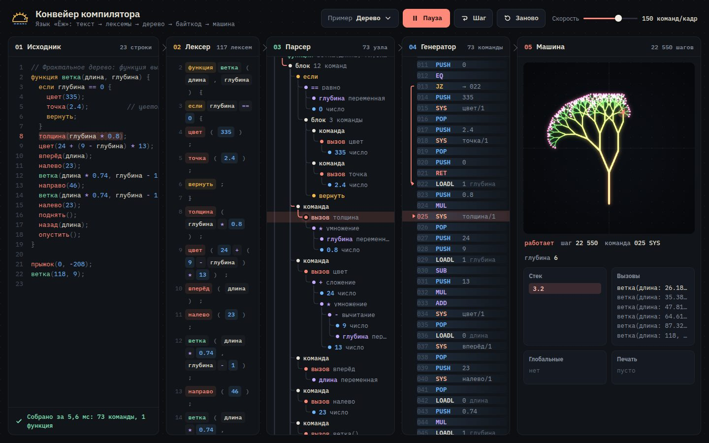

# 028 · Конвейер компилятора

> Игрушечный язык «Ёж» с русскими ключевыми словами проходит весь путь от текста до шага машины — и каждый этап видно насквозь.



## Как запустить
Двойной клик по `index.html`. Интернет нужен только для шрифтов IBM Plex; без него включатся системные.

## Что делать
- Выберите пример — «Дерево», «Подсолнух», «Снежинка Коха», «Спираль», «Розетка», «Дракон», «Фибоначчи» — или пишите свой код. Программа пересобирается и перезапускается на лету.
- Наведите курсор на лексему, узел дерева, команду байткода или прямо на текст: подсветятся связанные места во всех колонках. Клик по узлу или команде прокручивает исходник.
- «Пауза» / «Пуск» (Ctrl+Enter), «Шаг» (F10) — одна команда машины, «Заново». Ползунок задаёт, сколько команд машина выполняет за кадр: от одной за 20 кадров до 25 000.
- На телефоне этапы переключаются вкладками.

Мини-справка по языку:

```
пусть x = 10;            x = x + 1;
если x > 5 { … } иначе { … }
пока x < 100 { … }       повтори 36 { … }
функция имя(a, b) { вернуть a + b; }
и, или, не, истина, ложь, «строки», // комментарии
вперёд(d) назад(d) налево(угол) направо(угол) поднять() опустить()
цвет(0–360) толщина(w) точка(r) прыжок(x, y) курс(угол) домой()
печать(x) корень(x) синус(x) косинус(x) модуль(x) округлить(x) случайное(a, b)
```

## Что внутри
- **Лексер** на ручном автомате: числа, имена с кириллицей и «ё», строки в «ёлочках», операторы, комментарии. Ошибки — с позицией и понятным текстом.
- **Парсер**: рекурсивный спуск для команд и метод Пратта для выражений с приоритетами. Каждый узел знает свой отрезок исходника.
- **Генератор** превращает дерево в байткод для стековой машины: переходы для `если`/`пока`, скрытый счётчик для `повтори`, короткое замыкание для `и`/`или`, отдельные кадры с локальными переменными для функций. Проверяет необъявленные имена и число аргументов, подсказывает похожие названия (например, «вперед» → «вперёд»).
- **Машина** исполняет 26 команд с рекурсией до 600 уровней, считает профиль: полоска за каждой командой — сколько раз она выполнена. Стрелки слева — переходы, горящая — последний сработавший.
- **Черепаха** рисует светящимися линиями: чёткий слой плюс два размытых дают свечение.
- Всё связано: текущая команда подсвечивает свой узел, путь к корню дерева и место в исходнике.

## Почему это про Opus 5.5
Компилятор и виртуальная машина с нуля — классическая «длинная» инженерная задача, где десятки частей должны сойтись без швов. Это ровно то, что показывает Terminal-Bench 4.0.

## Ограничения
- Область видимости — функция целиком (как `var` в JavaScript): блоки не создают своих переменных.
- Функции объявляются только на верхнем уровне и не бывают значениями.
- Типов немного: числа, строки, логические. Нет массивов.
- Машина останавливается после 8 млн шагов — защита от бесконечных циклов.
