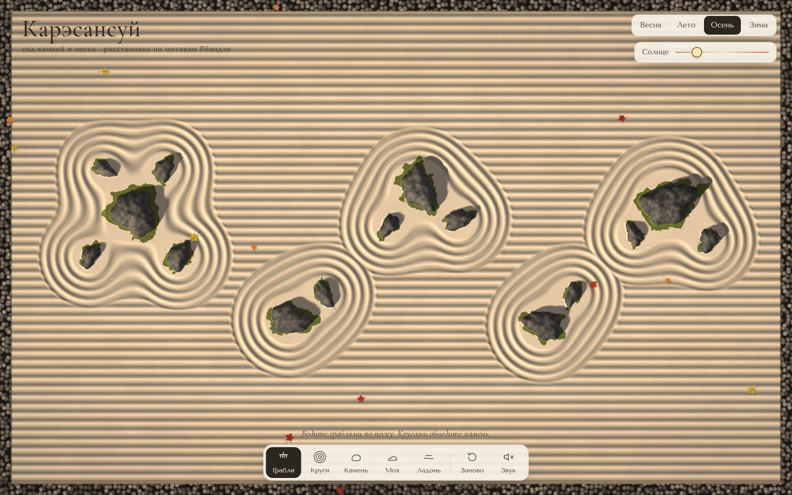

# 029 · Карэсансуй

> Японский сад камней и песка: пятнадцать камней в группах 5-2-3-2-3 по мотивам Рёандзи, борозды, тени, мох и листья.

## Как запустить
Двойной клик по `index.html`. Интернет нужен только для шрифтов. Звук — кнопкой «Звук».

## Что делать
- **Грабли:** ведите по песку — пять зубьев оставляют параллельные борозды вдоль вашего движения. Опавшие листья сгребаются.
- **Круги:** клик рядом с камнем — вокруг него расходятся концентрические борозды; клик на пустом песке — круги вокруг точки.
- **Камень:** клик — поставить новый камень (или убрать существующий).
- **Мох** и **ладонь** (разровнять песок) — кистью.
- Справа вверху — время года (весна с лепестками сакуры, лето, осень с клёнами, зима со снегом) и положение солнца: от длинных утренних теней к полудню и вечеру.
- «Заново» — вернуть исходную композицию.

## Что внутри
- Песок — карта высот 2×2 CSS-пикселя на клетку; грабли перезаписывают профиль «косинус поперёк движения», поэтому борозды повторяют изгибы руки.
- Шейдер WebGL2 восстанавливает нормали, считает тени трассировкой по карте высот к солнцу, затенение во впадинах, искорки кварца на гребнях, лишайник и мох на камнях, снег на склонах.
- Кайма из гальки по краю — ячейки Вороного прямо в шейдере.
- Сцена перерисовывается только при изменениях, поэтому неподвижный сад почти не нагружает компьютер.
- Звук синтезирован: ветер из коричневого шума, шорох граблей зависит от скорости, бамбуковый «сисиодоси» стучит раз в 11–17 секунд.

## Почему это про Opus 5.5
Спокойная, «тихая» вещь, где всё решают детали: физически осмысленный свет, мягкое поведение инструментов и звук, который не мешает.

## Ограничения
- Расстановка камней — по мотивам Рёандзи, а не точная копия.
- Листья лежат поверх песка и не вдавливаются в борозды.
