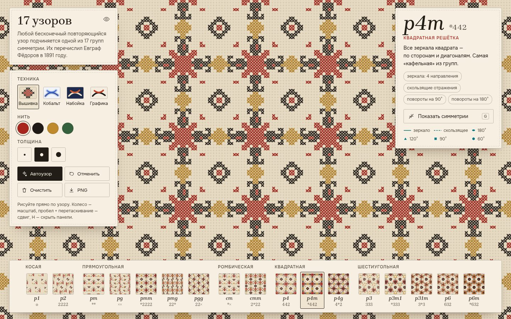

# 030 · 17 узоров

> Нарисуйте мотив — и он мгновенно размножится по одной из 17 групп симметрии плоскости: вышивкой крестом, кобальтом, набойкой или тушью.

## Как запустить
Двойной клик по `index.html`. Интернет нужен только для шрифтов.

## Что делать
- **Рисуйте прямо по узору.** Каждый штрих тут же повторяется всеми зеркалами, поворотами и скользящими отражениями выбранной группы.
- **Таблица внизу** — все 17 групп по пяти типам решёток. Миниатюры живые: показывают *ваш* мотив в каждой группе. Смена группы идёт круговой «волной» от нажатой миниатюры, а схема симметрий на пару секунд вспыхивает поверх узора.
- **Показать симметрии** (`G`) — зеркала (сплошные), скользящие отражения (пунктир), центры поворота 60°, 90°, 120°, 180° в обозначениях как в кристаллографии.
- **Техника:** вышивка крестом по канве-«аиде», кобальт по глазури с кракелюром, набойка по индиго, графика тушью (клавиши `1`–`4`).
- **Автоузор** сочиняет новый мотив вместо текущего, с поправкой на группу: чем больше в ней симметрий, тем скромнее мотив. **Отменить** (`Ctrl+Z`) возвращает прежний мотив, даже после «Очистить»; **PNG** сохраняет картинку.
- Колесо — масштаб, пробел + перетаскивание — сдвиг, стрелки ←/→ — соседняя группа, `H` — спрятать панели и оставить только узор.
- На телефоне: один палец рисует, два — масштаб и сдвиг; инструменты открываются круглой кнопкой в нижней шторке.

## Что внутри
- Каждая группа задана операциями в дробных координатах решётки, как в Международных кристаллографических таблицах. Декартовы операции получаются как `A = L·M·L⁻¹`.
- Мотив размножается один раз в прямоугольный период (для косой и шестиугольной решёток подобран период из нескольких ячеек), а затем плитка заливает экран как паттерн. Поэтому рисование работает в реальном времени даже для p6m с её 12 операциями.
- Зеркала, скользящие отражения и центры поворота **не вписаны вручную** — они выводятся из самих операций: центр поворота — решение `(I − A)·c = t`, ось отражения — собственный вектор, а «зеркало или скольжение» определяется остатком переноса вдоль оси по модулю решётки.
- Вышивка: узор растеризуется в маску по сетке канвы (5×5 пикселей на клетку). Стежок ставится, если нить покрывает не меньше 30 % клетки, а цвет берётся по самому плотному пикселю и сводится к ближайшей нити. Доля считается по всей клетке, поэтому рисунок не зависит от сглаживания конкретного браузера. Крестик — спрайт с тенью и скруткой нити.
- Короткие описания групп и орбифолдные обозначения Конвея.

## Почему это про Opus 5.5
Строгая математика (теория групп, линейная алгебра решёток) превращена в живой ремесленный инструмент — с аккуратной русской типографикой и вниманием к фактуре.

## Ограничения
- Стежок ставится по доле покрытия клетки, поэтому самые тонкие штрихи в режиме вышивки могут прерываться, а на косых линиях видна «лесенка», как в настоящей вышивке.
- Решётки фиксированной формы: форму ячейки в косой и прямоугольной группах не настроить.
- Историческая справка: 17 групп перечислил Е. С. Фёдоров (1891), позже независимо — Д. Пойа (1924).
