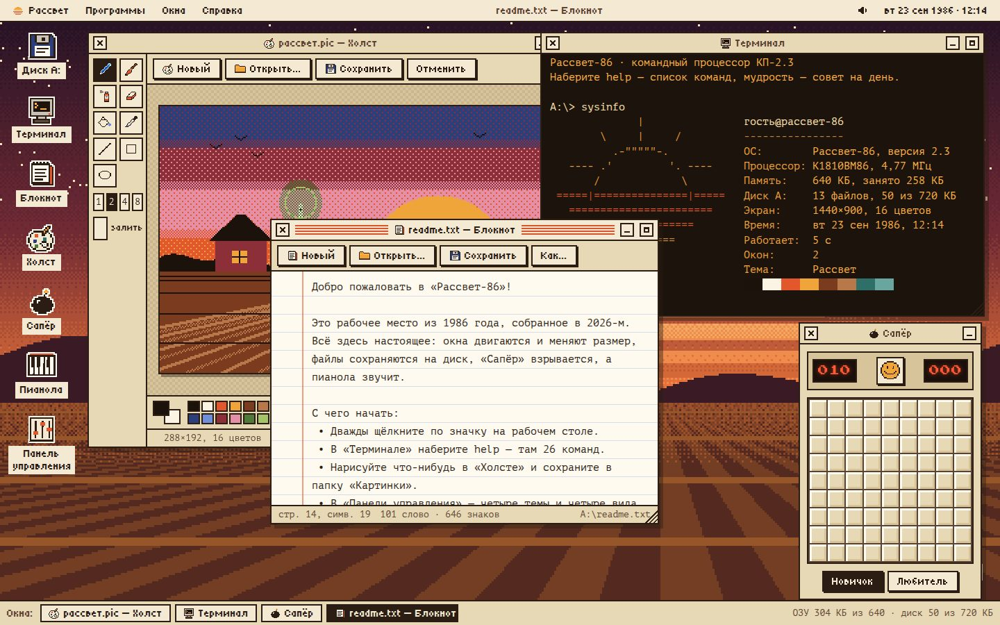

# 031 · Рассвет-86

> Операционная система, которой не было: 1986 год, 640 КБ памяти, янтарный терминал — и всё по-настоящему работает.

## Как запустить
Двойной клик по `index.html`. Интернет нужен только для пиксельных шрифтов (Tiny5, PT Mono, Press Start 2P); без него включаются системные моноширинные.

## Что делать
- **Двойной щелчок** по значку на рабочем столе открывает программу (на телефоне — одно касание).
- Окна тащатся за заголовок, меняют размер за правый нижний угол, сворачиваются в лоток внизу и разворачиваются двойным щелчком по заголовку.
- **Терминал**: `help` — 26 команд в духе DOS и Unix: `dir`, `cd`, `type`, `echo текст > файл.txt`, `tree`, `calc`, `кот`, `мудрость`, `sysinfo`, `theme полночь`. Tab дополняет имена, стрелки листают историю.
- **Блокнот** и **Холст** открывают и сохраняют файлы на «диск А:»; **Диск** — файловый менеджер с корзиной и переименованием.
- **Сапёр** (два уровня, флажки правой кнопкой или долгим касанием), **Пианола** (клавиатура Z…M и Q…U, четыре формы волны, эхо, своя мелодия).
- **Панель управления**: четыре темы, четверо обоев, звуки, эффект кинескопа, сброс диска.
- Правый щелчок по рабочему столу открывает меню; часы в правом углу показывают календарь — на дворе всегда 1986-й.

## Что внутри
- Оконный менеджер: фокус и z-порядок, перетаскивание и изменение размера через pointer capture, сворачивание в лоток с «зум-рамками» в духе ранних Mac, раскладка для телефона.
- Файловая система — дерево в `localStorage` с путями вида `А:\Документы`, регистронезависимыми именами, копированием, переносом и защитой от переноса папки внутрь себя.
- Терминал с разбором кавычек, перенаправлением `>` и `>>`, автодополнением, историей и калькулятором на рекурсивном спуске.
- Холст на своём растровом движке: карандаш, кисть, распылитель, заливка, линии и фигуры, шесть узоров в духе MacPaint, отмена, 16 цветов.
- Обои рисуются процедурно с упорядоченным дизерингом Байера и зависят от темы; значки — пиксельные битмапы, собранные в коде.
- Звуки интерфейса и пианола синтезированы в Web Audio; тексты по умолчанию (письмо в 2026 год, стихи, мудрости) написаны моделью.

## Почему это про Opus 5.5
Это длинная агентная задача в чистом виде: десятки взаимосвязанных частей — оконный менеджер, диск, восемь программ, — которые должны работать вместе и не ломать друг друга.

## Ограничения
Это витрина, а не эмулятор реального железа: «процессор» и «память» — декорации. Файлы хранятся только в этом браузере, объём `localStorage` обычно около 5 МБ. Картинки сохраняются в PNG внутри диска, поэтому занимают больше «килобайт», чем в 1986 году.
