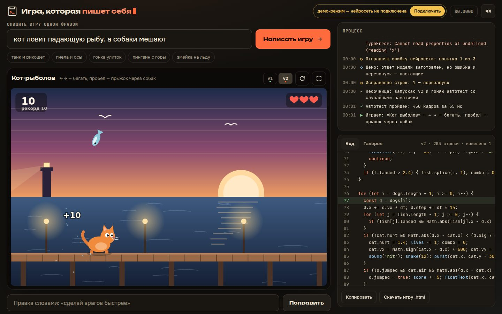

# 032 · Игра, которая пишет себя

> Опишите игру одной фразой — нейросеть придумает её, напишет, запустит в песочнице, сама починит ошибки и поменяет игру по словам.

## Как запустить
Двойной клик по `index.html`. Для генерации нужны интернет и ключ OpenRouter: ключ свой (BYOK): страница предложит войти через OpenRouter или вставить ключ. Без ключа или без сети включается демо-режим: четыре игры, написанные под тот же движок, и показ цикла самопочинки на настоящей ошибке. Новые игры и правки словами в демо-режиме недоступны — их пишет только нейросеть.

## Что делать
- Впишите фразу, например «змейка, но на льду», и нажмите «Написать игру». План появится через 20–50 с, код потечёт сразу за ним, игра запустится примерно через минуту-полторы.
- Внизу — правка словами: «сделай врагов быстрее», «добавь босса», «пусть будет ночь». Модель присылает только изменённые куски, поэтому правка занимает около 10 секунд.
- В игре: стрелки или WASD, пробел, мышь; на телефоне — экранные кнопки. После проигрыша любая клавиша начинает заново.
- Справа — живой лог и код с подсветкой: изменённые строки подсвечены зелёным, строка с ошибкой — красным. Версии v1, v2… над экраном: клик возвращает к любой. Код можно скопировать или скачать игру одним `.html`-файлом.
- Каждая игра, прожившая 6 секунд без ошибок, сама попадает в галерею с миниатюрой и фразой.

## Что внутри
- **Своё API под модель.** `init()`, `update(dt)`, `draw(ctx)`; ввод `key`, `tap`, `input.dx/dy`, `pointer`; `score`, `lives`, `gameOver`, `win`; `sound`, `burst`, `shake`, `floatText`. Счёт, жизни, частицы и экраны конца рисует движок, поэтому модель пишет только правила и картинку — меньше мест, где можно ошибиться.
- **Песочница.** `<iframe sandbox="allow-scripts">` без `allow-same-origin`, документ через `srcdoc` с CSP `default-src 'none'`: код игры не видит страницу, ключ и сеть. Наружу — только `postMessage`.
- **Автотест до показа.** Полсекунды без нажатий, затем шесть секунд игры со случайными клавишами и кликами — за 0,1–0,5 с на маленьком программном холсте. Ловит исключения, пустой экран, конец партии сразу после старта и бесконечные циклы (счётчик в теле каждого цикла).
- **Самопочинка.** Ошибка с номером строки и кусочком кода уходит модели. Та отвечает блоками SEARCH/REPLACE, а если они не находят место — присылает код целиком. Не больше трёх попыток, каждый шаг виден в логе.
- **Страховки движка.** Код игры живёт в своей области видимости: `let top` или `let location` не ломают загрузку. Отрицательный радиус не роняет игру. `setTransform` работает в логических координатах 960×600. Счёт и жизни читаются, даже если модель объявила свои переменные с такими именами.
- **Рассуждение там, где оно окупается.** План игры и поиск ошибки идут с `think: true` — ответ там маленький. Код пишется без рассуждения, потоком (почему — в замерах ниже).

## Выбор модели и режима (замеры 23.09.2026)
Сначала каждая модель писала игру целиком одним запросом с `think: true`, фразы «кот ловит падающую рыбу, а собаки мешают», «змейка, но на льду», «танк в лабиринте стреляет рикошетом».

| Режим | Запусков | Рабочий код | Время | Цена одной игры |
|---|---|---|---|---|
| V4.1 Flash, вся игра с рассуждением | 7 | 1 | 83–198 с, два таймаута | ≈ $0,005 |
| V4 Pro, вся игра с рассуждением | 6 | 2 | 24–236 с, один таймаут | $0,018–0,038 |
| V4 Pro, без рассуждения | 1 | 1 | 43 с | $0,011 |
| V4.1 Flash, без рассуждения | 1 | 1 | 60 с | $0,002 |

Причина провалов одна: рассуждение скрыто от нас и съедает общий бюджет токенов. Код обрывался на 274–353-й строке или не начинался вовсе. Поэтому рассуждение переехало туда, где ответ короткий:

- **план игры** с `think: true`: Pro — 19–60 с, план полный и с изюминкой; Flash — 12–62 с, в одном из двух планов пропали правила и изюминка;
- **поиск ошибки** с `think: true`: ответ — несколько строк правок;
- **код** — без рассуждения, потоком.

Работает на **DeepSeek V4.1 Flash**, это решение Станислава: Flash быстрее и в шесть раз дешевле. В том же конвейере он написал «Улиток под дождём» за 66 с и $0,0036, картинка сопоставима с Pro. По нашим замерам разница в качестве между моделями меньше разброса DeepSeek от запуска к запуску. Строки про V4 Pro в таблице выше — история замеров, в игре Pro больше не используется.

Живые прогоны через интерфейс:
- «Невидимый лабиринт» (Pro): план 38 с, код 28 с. Первая версия упала с `SyntaxError` и была починена с рассуждением за 57 с. Правка «сделай врагов быстрее…» — 9 с, три блока.
- «Сладкий побег» (Pro, пчела и осы): 86 с, автотест с первого раза.
- «Пингвин-слалом» (Pro): 171 с, из них план — 133 с. После этого прогона рассуждение над планом ограничено 50 секундами. Автотест с первого раза.
- «Улитки под дождём» (Flash): 66 с, автотест с первого раза.

Четыре игры, одна правка и одна починка стоили $0,074.

## Почему это про Opus 5.5
Главное здесь — не картинка, а инженерия вокруг чужой модели. Маленькое API, спроектированное так, чтобы DeepSeek ошибался реже. Песочница, в которой ошибки становятся данными. Автотест, который находит «тихие» поломки вроде мгновенного проигрыша. И решение, где рассуждение модели окупается, принятое по замерам, а не по интуиции.

## Ограничения
- Новая игра — примерно минута-полторы, иногда до трёх минут: время рассуждения DeepSeek сильно гуляет.
- Качество игр неровное. Автотест ловит падения, пустой экран и мгновенный проигрыш, но не скучную механику или неудобное управление.
- Защита от бесконечных циклов работает только для циклов с фигурными скобками.
- Звук в игре включается после первого клика или нажатия внутри игры — так браузер обращается с iframe.
- Демо-режим не пишет новых игр: он подбирает заготовку по ключевым словам фразы.
- Галерея живёт в `localStorage` этого браузера, до 24 игр.
