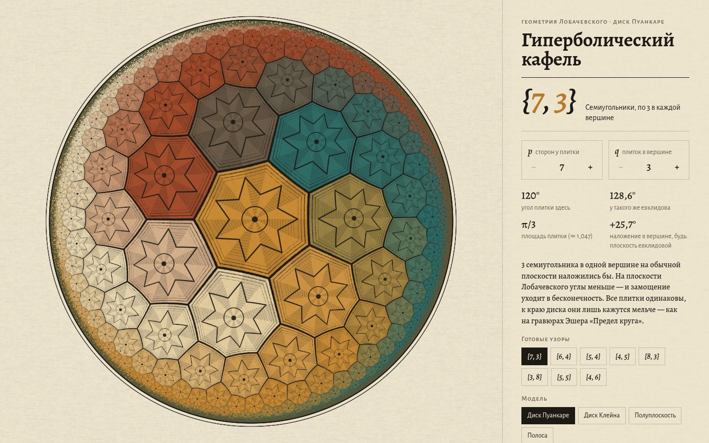

# 033 · Гиперболический кафель

> Замощения {p, q} плоскости Лобачевского в диске Пуанкаре, отпечатанные как гравюра, — по ним можно бесконечно идти.

## Как запустить
Двойной клик по `index.html`. Нужен WebGL2. Интернет нужен только для шрифтов Alegreya: без него текст наберётся системной антиквой.

## Что делать
- **Тянуть мышью** — идти по плоскости. Это настоящий гиперболический сдвиг (автоморфизм диска), с инерцией.
- **Клик по любой плитке** — она по геодезической приплывает в центр. Видно, что маленькие плитки у края такие же, как центральная.
- **Колесо** — поворот, **стрелки** — шаг.
- Степперы *p* и *q* и готовые узоры меняют замощение. Недопустимые (не гиперболические) сочетания отключены.
- Модели: диск Пуанкаре, диск Клейна, верхняя полуплоскость, полоса.
- Четыре «оттиска»: Гравюра, Гжель, Медь, Ночь. Розетки, штриховку и треугольную сетку можно выключить.
- «Оттиск PNG» сохраняет картинку. Если ничего не трогать, начинается медленная прогулка по плоскости.

## Что внутри
- Фундаментальный треугольник с углами π/p, π/q, π/2. Его ребро — окружность, ортогональная краю диска. Её радиус и центр выводятся из cosh r = cos(π/q) / sin(π/p).
- Фрагментный шейдер сворачивает каждый пиксель в этот треугольник: поворотами, отражением и инверсией в окружности. Число отражений даёт раскраску граней. Обратный путь (записанные операции в обратном порядке) даёт центр плитки — от него зависит цвет.
- Толщина линий задана в гиперболических единицах, поэтому к краю они честно сужаются. Сглаживание идёт через `fwidth`, а плитки мельче пикселя сводятся к среднему тону.
- Перетаскивание собирается из автоморфизмов диска z → (az + b)/(b̄z + ā). Полёт к плитке — сдвиг вдоль геодезической с плавностью.
- Справа — факты о текущем замощении: угол плитки (360°/q), угол такого же евклидова многоугольника, площадь плитки по формуле Гаусса — Бонне ((p − 2)π − 2πp/q), величина «наложения» на обычной плоскости.

## Почему это про Opus 5.5
Неевклидова геометрия, доведённая до красивого и интерактивного результата: вывод формул, численно устойчивый шейдер и печатная эстетика в одном файле.

## Ограничения
- У самого края плитки мельче пикселя: там показан средний тон, а не бесконечная детализация.
- Раскраска «поток» зависит от положения центра плитки и не является правильной раскраской в строгом смысле: соседние плитки могут совпасть по цвету.
