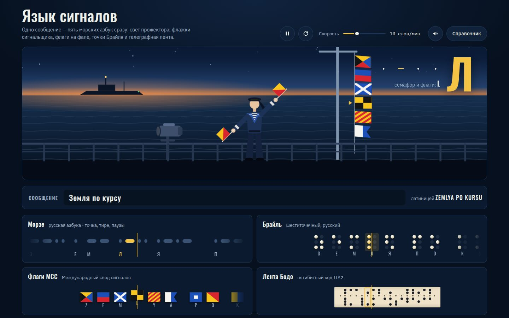

# 034 · Язык сигналов

> Одно сообщение передаётся пятью морскими азбуками сразу: прожектор мигает морзянкой, сигнальщик машет флажками, на фале поднимаются флаги МСС, бегут точки Брайля и перфолента телеграфа.

## Как запустить
Двойной клик по `index.html`. Интернет не нужен (без него только шрифты станут системными).

## Что делать
- **Впишите сообщение** — передача начнётся заново. По умолчанию: «Земля по курсу».
- **Пробел** или кнопка — пауза, ползунок — скорость в словах в минуту, динамик — звук морзянки (680 Гц, мягкие фронты без щелчков).
- **Справочник** — полные таблицы: русская азбука Морзе, семафор, флаги МСС, русский Брайль и код ITA2.
- В конце передачи судно на горизонте отвечает прожектором «·−·» — буква R, по радиопроцедуре «принял».

## Что внутри
- **Одни часы на всех.** Время идёт в единицах Морзе: точка — 1, тире — 3, пауза внутри знака — 1, между знаками — 3, между словами — 7. Длина единицы — 1200 / (слов в минуту) мс, стандарт PARIS.
- **Морзе** — русская азбука (А — ·−, Ч — −−−·, Ш — −−−−, Щ — −−·−, Ю — ··−−, Я — ·−·−). Ъ и Ь передаются одним знаком −··−, как сегодня и принято.
- **Флажный семафор** — международный, вид со стороны наблюдателя. Буквы построены «кругами»: A–G, H–N, O–S и так далее. Если обе позиции с одной стороны, рука сигнальщика перекидывается через корпус.
- **Флаги МСС** нарисованы по геометрии эталонных SVG Викисклада. Например, у «O» жёлтый треугольник у древка снизу, у «Y» — десять полос «/».
- **Брайль** — русский шеститочечный: точки 1–2–3 в левом столбце, 4–5–6 в правом, цифры через знак ⠼.
- **Лента ITA2**: пять дорожек, мелкая ведущая перфорация между второй и третьей, переключение регистров «буквы/цифры».

## Почему это про Opus 5.5
Главное здесь — точность: пять разных систем кодирования, которые должны совпасть до последней точки, а спорные места сверены с первоисточниками. Opus 5.5 силён именно в аккуратной работе со знаниями и в проверке фактов.

## Ограничения
- Семафор, флаги и лента передают кириллицу транслитерацией: у русского флота свои таблицы, их здесь нет.
- Знаки препинания в Морзе даны по международной таблице МСЭ.
- В семафоре для «D» (один флажок вверх, другой вниз) выбрана одна из рук; для такой позиции это условность рисунка.
