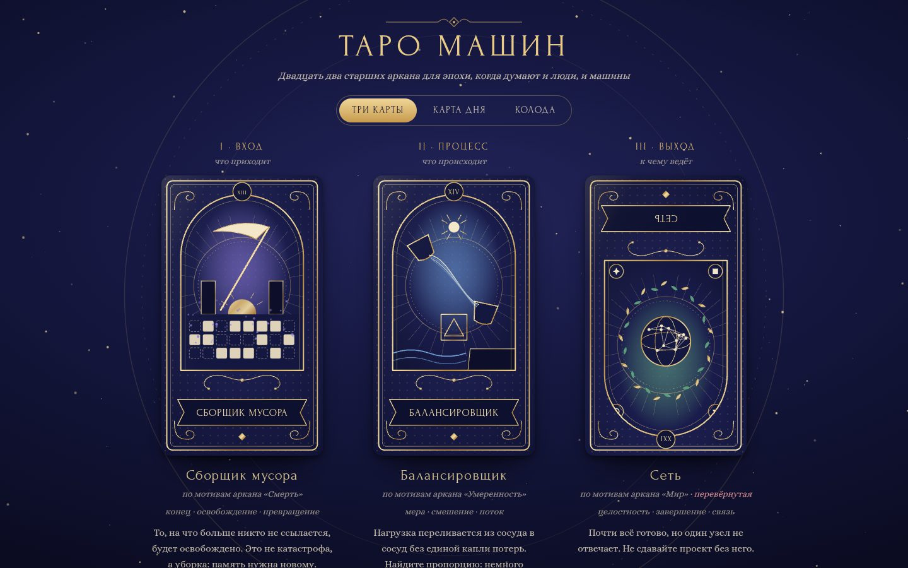

# 035 · Таро машин

> Двадцать два старших аркана, переосмысленных для эпохи машин: «Маг» стал «Компилятором», «Смерть» — «Сборщиком мусора», «Луна» — «Галлюцинацией».

## Как запустить
Двойной клик по `index.html`. Интернет нужен только для шрифтов Forum и Alice.

## Что делать
- **Три карты** — расклад «Вход · Процесс · Выход». Карты сдаются и переворачиваются сами; кнопка «Перетасовать и вытянуть» тасует колоду заново. Примерно каждая четвёртая карта выпадает перевёрнутой — у неё своё толкование.
- **Карта дня** — одна карта на сегодня, одинаковая весь день.
- **Колода** — все 22 аркана; клик по карте открывает полное толкование: прямое, перевёрнутое и что изображено. Стрелки ← → листают колоду.
- Наведите мышь на карту — она наклоняется, по золоту пробегает блик.

## Что внутри
- Каждая карта — процедурный SVG: рамка в духе модерна с завитками, арочное окно с ореолом, лента с названием и римская цифра. Эмблема собрана из общего словаря мотивов: лучи, звёзды, шестерни, сети, волны, лемниската, курсор, блоки памяти.
- 22 толкования — по три части: ключевые слова, прямое значение, перевёрнутое. Все тексты написаны для этой колоды, ни одного заимствованного.
- Перетасовка — алгоритм Фишера — Йетса на `crypto.getRandomValues`. Карта дня выбирается детерминированно по дате.
- Переворот — CSS 3D с `backface-visibility`; перевёрнутая карта действительно показывается вверх ногами.
- На фоне — золотая пыль на Canvas; она замирает, если в системе включено «уменьшение движения».

## Почему это про Opus 5.5
Здесь две силы модели работают вместе: письмо (22 коротких, точных и не банальных толкования на хорошем русском) и визуальный вкус (22 иллюстрации кодом, в едином стиле, без единой картинки).

## Ограничения
- Это игра с символами, а не гадание: толкования — метафоры о работе с системами и о себе.
- Иллюстрации нарочно символичны: вместо фигур людей — предметы и знаки.
