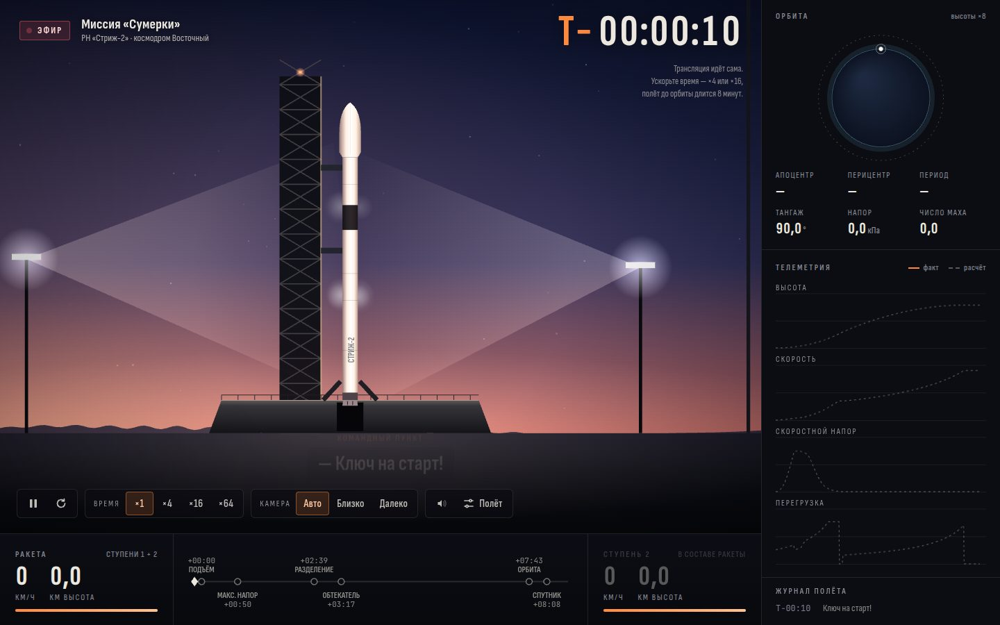

# 036 · На орбиту

> Двухступенчатая ракета от «Ключ на старт!» до отделения спутника — как прямая трансляция старта, с честной физикой полёта.

## Как запустить
Двойной клик по `index.html`. Трансляция начинается сама: отсчёт, зажигание, подъём. Интернет нужен только для шрифтов — без него всё работает на системных.

## Что делать
- **×4, ×16, ×64** — ускорить время: до орбиты около восьми минут полёта.
- **Камера: Авто / Близко / Далеко.** В режиме «Авто» камера сама подъезжает к событиям: разделению ступеней, сбросу обтекателя, отделению спутника.
- **Полёт** — параметры: космодром (Восточный, Байконур, Плесецк, Куру), время старта, масса полезной нагрузки, высота орбиты, манёвр по тангажу, предел скоростного напора.
- **Ручной режим:** тангаж — `←` / `→`, тяга — `↑` / `↓`, `X` — выключить двигатель второй ступени. Держите нос по вектору скорости, иначе при высоком напоре ракету разорвёт.
- `P` — пауза, `R` — новый пуск, `C` — смена камеры.
- Запуск в сумерках даёт эффект «медузы»: выше ~35 км выхлоп выходит из тени Земли и светится на тёмном небе.

## Что внутри
- **Атмосфера** — стандартная атмосфера 1976 года: температура, давление и плотность по слоям до 86 км. Сопротивление с трансзвуковым пиком по числу Маха. Тяга первой ступени растёт с высотой: давление за срезом сопла падает.
- **Интегратор** — метод Рунге — Кутты 4-го порядка в инерциальной системе с центром в Земле, с учётом вращения Земли. Прибавка скорости зависит от широты космодрома: от 211 м/с в Плесецке до 463 м/с в Куру.
- **Первая ступень** летит по гравитационному развороту: вертикальный подъём, «пинок» по тангажу, затем нос по вектору скорости. Дросселирование держит скоростной напор и перегрузку в пределах.
- **Вторая ступень** наводится по закону линейного тангенса `tg θ = A + B·t` (как в классическом наведении PEG). Коэффициенты подбираются методом пристрелки и Ньютона, чтобы к набору круговой скорости выйти на целевую высоту с нулевой вертикальной скоростью. Обычный результат — орбита 217 × 220 км.
- **Бюджет Δv** считается честно: гравитационные потери, потери на управление и на сопротивление интегрируются по ходу полёта. В сумме они сходятся с затраченной характеристической скоростью.
- Графики показывают «расчётную» траекторию (прогон автопилота при загрузке) и фактическую. Схема орбиты — оскулирующий эллипс по вектору состояния.

## Почему это про Opus 5.5
Здесь сошлись инженерная физика, численные методы, наведение с обратной связью и насыщенный интерфейс трансляции. Это междисциплинарная длинная задача, которую нужно довести до работающей системы, а не до красивой картинки.

## Ограничения
- Ракета «Стриж-2» условная: массы и тяги близки к современным носителям среднего класса, но это не конкретная ракета.
- Задача плоская: полёт строго на восток, наклонение равно широте космодрома.
- Выше 86 км плотность экстраполирована изотермой. Нагрев, упругость корпуса и отклонение двигателей не моделируются.
- «Медуза», небо и огни городов — художественная визуализация по физическим признакам (освещённость Солнцем по высоте и дальности), а не расчёт рассеяния света.
