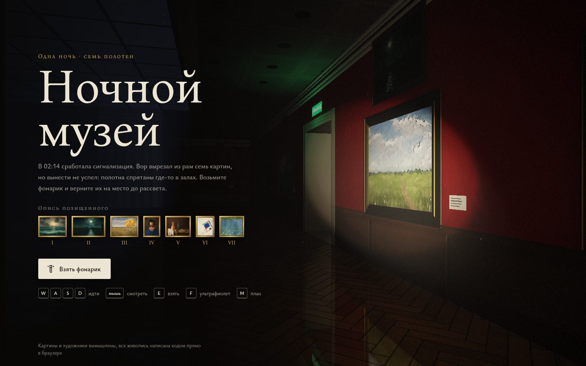

# 037 · Ночной музей

> Рейкастер в духе Wolfenstein 3D: ночь, фонарик и семь картин, вырезанных из рам. Их нужно найти и вернуть на место до рассвета.

## Как запустить
Двойной клик по `index.html`. Интернет нужен только для шрифтов Google, без него включаются системные.

## Что делать
- **WASD** или стрелки — идти, **Shift** — быстрее, **мышь** — смотреть (клик по сцене захватывает курсор, **Esc** — пауза).
- **E** или клик — взять найденный холст, а у пустой рамы — вернуть его на место. Над возвращённой картиной зажигается лампа.
- **F** или правая кнопка — ультрафиолет: подошвы вора испачканы реставрационным лаком, и его следы светятся на полу. Лампа греется, заряд на кнопке.
- **M** — план этажа. Пустые рамы отмечаются красным, как только вы их увидели.
- Задержите луч на любой картине — появится музейная этикетка: автор, название, год, техника.
- На телефоне: джойстик слева, взгляд — перетаскиванием по сцене, кнопки «Взять» и «УФ».
- После финала можно начать «Новую ночь»: другие картины и другие тайники.

## Что внутри
- **DDA-рейкастинг по столбцам на CPU**, как в Wolfenstein 3D. Для каждого столбца экрана считаются стена, её грань, до двух картин на грани и до восьми слоёв предметов: спрайты, холсты на мольбертах, перемычки дверей. Всё это уходит в «столбцовую» текстуру.
- **Попиксельный шейдер WebGL2** по этим данным: фонарь с рисунком пятна и инерцией, лампы над возвращёнными картинами, зелёные «ВЫХОДЫ». Паркет «ёлочкой», мраморные шашки и кессонный потолок процедурные. Отражения в полу считаются точно: тот же столбец с зеркальной высотой луча.
- **Запечённый лунный свет**: трассировка от каждого текселя пола к луне через окна с переплётами и форточками, плюс рассеянный свет стеклянного фонаря. Та же карта даёт объёмные лучи и пыль в них.
- **Живопись кодом**: десять жанров — пейзаж, зима, марина, лунная ночь, портрет, натюрморт, цветы, импрессионизм, супрематизм, цветовое поле. Сцена считается на сетке и кладётся подмалёвком, поверх идут мазки трёх размеров по направлению формы. Мелкие мазки ложатся выборкой по важности туда, где нужна деталь. Потом лак, подпись и потемнение под фальцем. Скользящий свет фонаря вытягивает рельеф мазков и плетение холста.
- **Уровень**: 11 залов с анфиладами, шпалерная развеска в Большом зале, 7 тайников на ночь из 14 возможных. След вора прокладывается A*-поиском и рисуется флуоресцентными отпечатками.
- **Звук на Web Audio без сэмплов**: шаги зависят от пола, эхо — от зала. Напольные часы тикают и бьют каждый час, есть шорох холста, аккорд лампы и первые птицы на рассвете.

## Почему это про Opus 5.5
Игровой движок, генератор живописи, освещение и уровень собраны с нуля в одном проекте без библиотек, а визуал проверен по скриншотам.

## Ограничения
- Все художники и картины вымышлены. Этикетки и инвентарные номера иллюстративные.
- Спрайты повёрнуты к камере, как в Wolfenstein. Холсты и мольберты — плоские объекты с ориентацией.
- Лунный свет на стены не падает, только на пол и в воздух. Фонарь не отбрасывает теней.
- Лица на портретах намеренно эскизные: генератор не строит анатомию.
- Картин около 130, их текстуры дописываются в фоне за первые секунды: ближние раньше дальних.
