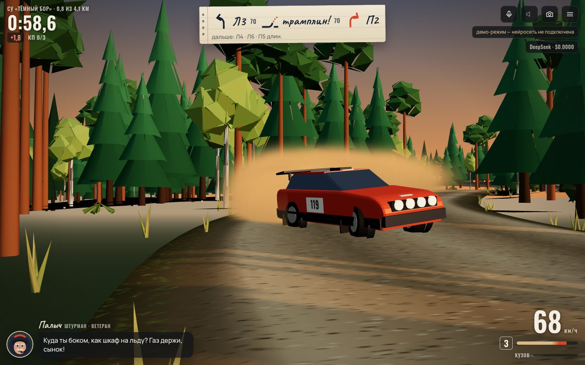

# 038 · Штурман

> 3D-ралли по лесному гравийному спецучастку, где стенограмму читает движок по геометрии трассы, а штурман — живой персонаж на нейросети: видит вашу телеметрию и ворчит, паникует или язвит в ответ.

## Как запустить
Двойной клик по `index.html`. Нужен интернет: three.js грузится с CDN, а штурман разговаривает через DeepSeek (OpenRouter). Без ключа или без сети игра работает в демо-режиме: штурман говорит заготовленными репликами по тем же событиям.

## Что делать
- Выберите штурмана — ворчливый ветеран Палыч, нервный новичок Лёва или холодная чемпионка Вера — и нажмите «На старт».
- **WASD** или стрелки — руль, газ, тормоз и задний ход; **Пробел** — ручник (заброс в поворот); **R** — вернуться на дорогу (+5 с штрафа); **C** — камера; **V** — голос штурмана; **M** — звук; **Esc** — меню.
- На телефоне: слева — аналоговый руль (ведите пальцем), справа — газ, тормоз, ручник. Застряли в лесу — появится кнопка «На дорогу».
- Проедьте 4,1 км через три контрольные точки быстрее графика. На финише штурман разберёт заезд и поставит оценку с прозвищем.

## Что внутри
- **Трасса** строится из сценария поворотов с переходными кривыми, рельеф — сглаженный шум плюс трамплины и гребни; вокруг — 13 тысяч деревьев инстансами по кускам трассы, зрители у трамплинов, ворота старта, КП и финиша.
- **Стенограмма читается из геометрии**, а не из сценария: движок сглаживает кривизну оси, находит повороты, по минимальному радиусу ставит «один»–«шесть» или «шпилька», по форме — «затяг», «открывается», «длинный», по камням у апекса — «не резать», по второй разности высоты — «трамплин» и «гребень». Порции читаются вперёд по скорости: «лево четыре, сто, в правый три не резать».
- **Физика** аркадная: нос поворачивает к кинематической угловой скорости, но не быстрее запаса сцепления, скорость догоняет курс с ограниченным боковым ускорением, ручник и газ в заносе «держат» угол, выравнивающий момент не даёт закрутиться. Честная вертикаль: машина отрывается на кромке трамплина и жёстко садится, если не сбросить газ.
- **Штурман на DeepSeek** получает события (удар, занос, срез вопреки «не резать», прыжок, перелёт в поворот, КП против графика, серия чистых поворотов) и каждые ~10 с сводку телеметрии; в промпте — характер, хронология заезда «где что было», свои прошлые реплики и итоги прошлых заездов из памяти браузера. Ответ идёт потоком прямо в облачко, на резкие события — мгновенный возглас, пока модель думает.
- **Голос** — `speechSynthesis` ru-RU: стенограмма всегда в приоритете, реплика штурмана ждёт «окна» до следующей порции, а если окна нет — остаётся текстом. Разбор финиша — потоком, оценка и прозвище — строгим JSON с проверкой.
- **График** — прогон автопилота по той же физике при загрузке (+4 %); живая разница видна в углу и уходит штурману.

## Почему это про Opus 5.5
Одна модель собрала из примитивов целую игру: трассу с рельефом, физику заносов, движок стенограммы по геометрии и режиссуру живого персонажа, который получает правду о заезде и отвечает с характером, не мешая стенограмме.

## Ограничения
- Физика аркадная: нет отдельных колёс, подвеска и повреждения — визуальные и упрощённые; деревья — круглые препятствия.
- Голос зависит от браузера: если русского голоса нет (часто на Linux), стенограмма и реплики идут только текстом.
- Нейросеть отвечает за 1–2 с, поэтому реплика на удар приходит с небольшой задержкой — её закрывает мгновенный возглас.
- Память о прошлых заездах хранится только в этом браузере; спецучасток один и тот же.
