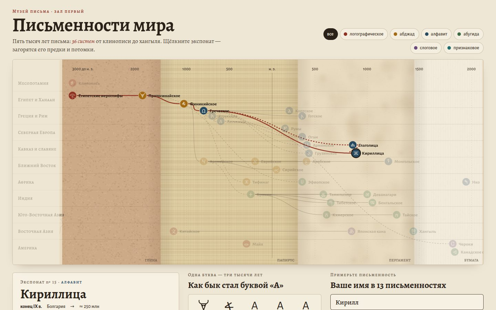

# 039 · Письменности мира

> Музейный зал о пяти тысячах лет письма: 36 систем на родословном древе, витрины с настоящими знаками, эволюция букв и ваше имя в 13 письменностях.

## Как запустить
Двойной клик по `index.html`. Нужен интернет: знаки древних и азиатских письменностей берутся из шрифтов Noto (Google Fonts). Без сети схема и тексты работают, но редкие знаки браузер покажет системными шрифтами или пустыми квадратами.

## Что делать
- Щёлкнуть любой экспонат на древе. Загорится линия его предков и потомков, а в карточке появятся образцы знаков, даты, направление письма и главный факт.
- Фильтры вверху выделяют тип письма: логографическое, абджад (только согласные), алфавит, абугида, слоговое, признаковое.
- Блок «Как бык стал буквой А» показывает путь четырёх букв: рисунок протосинайского письма → финикийская буква → греческая → латиница и кириллица. Щелчок по строке подсвечивает этот путь на древе.
- В поле имени введите любое имя кириллицей или латиницей — оно появится в 13 письменностях.

## Что внутри
- Древо идёт по дорожкам регионов на кусочно-линейной шкале времени (древность сжата). Пунктир отмечает влияние или гипотезу, сплошная линия — прямое происхождение.
- Фон схемы и витрин меняет фактуру по эпохам: глина, папирус, пергамент, бумага. Всё нарисовано процедурно на Canvas.
- Транслитерация имени следует правилам каждой системы:
  - в финикийском, иврите и арабском пишутся только согласные с «матерями чтения»; учтены конечные формы букв иврита;
  - в деванагари согласные без гласной сливаются через вираму (स्त);
  - в хангыле буквы собираются в слоги-блоки по формуле Юникода, с корейскими правилами для «л» и конечных согласных (Станислав → 스타니슬라프);
  - в катакане работают слоги, удвоения и маленькие ャュョ (スタニスラフ);
  - кириллические имена на латинице — по стандарту ICAO, как в загранпаспорте.
- Образцы знаков — настоящие символы Юникода. Для майя закодированы только цифры, и карточка честно об этом говорит.

## Почему это про Opus 5.5
Многоязычие и точность: данные о 36 письменностях, их связи и правила передачи имён в 13 системах — это работа, где ошибку сразу заметит носитель.

## Ограничения
- Даты округлены до первых известных надписей; у многих письменностей происхождение спорно.
- Транслитерация приблизительная: в каждом языке есть устоявшиеся написания конкретных имён, которые не выводятся из правил.
- Протосинайского письма нет в Юникоде, поэтому его знаки нарисованы как пиктограммы.
