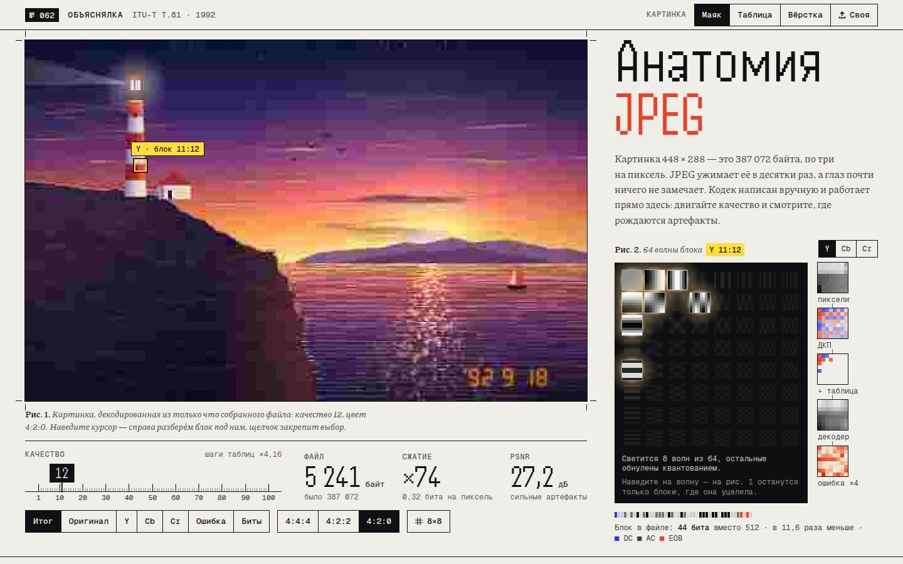

# 040 · Анатомия JPEG

> Путь картинки через JPEG — YCbCr, прореживание цвета, ДКП 8×8, квантование, зигзаг, коды Хаффмана — на кодеке, который написан вручную и собирает настоящий файл прямо в браузере.

## Как запустить
Двойной клик по `index.html`. Интернет нужен только для шрифтов (Handjet, Piazzolla, Geist Mono); без него страница работает на системных шрифтах.

## Что делать
- **Ползунок качества** под картинкой (и плавающий пульт ниже по странице): картинка перекодируется на каждое движение, размер файла, степень сжатия и PSNR пересчитываются вживую.
- **Наведите на картинку** — справа разбирается блок 8×8 под курсором: световой короб с 64 волнами ДКП (светятся пережившие квантование), полоса «пиксели → ДКП → ÷ таблица → декодер → ошибка» и биты этого блока в файле. Щелчок закрепляет блок, стрелки его двигают.
- **Наведите на волну** в световом коробе — на картинке останутся только блоки, где эта частота уцелела.
- **Режимы:** итог, оригинал, каналы Y, Cb, Cr после декодера, карта ошибки, карта «сколько бит стоит каждый блок», сетка 8×8, схемы 4:4:4 / 4:2:2 / 4:2:0.
- **Картинки:** «Маяк», «Таблица», «Вёрстка» (все нарисованы кодом) или своя — кнопкой, перетаскиванием или вставкой из буфера. Для своего JPEG по таблице квантования оценивается, с каким качеством его сохранили.
- **Восемь глав** ниже: каналы YCbCr с живой формулой, размытие цвета против размытия яркости, сборка блока из волн, квантование как уравнение, зигзаг с бегунком, таблицы Хаффмана (типовые или свои), весь файл по байту на клетку с шестнадцатеричным дампом и скачиванием `.jpg`, галерея артефактов.

## Что внутри
- Кодер baseline JPEG по ITU-T T.81: RGB → YCbCr (JFIF), прореживание усреднением, ДКП 8×8 через матрицу косинусов, таблицы квантования из приложения K с масштабом качества IJG, зигзаг, серии нулей (ZRL, EOB), DPCM для DC, коды Хаффмана — типовые из приложения K или оптимальные по процедуре K.2, заполнение `FF 00`, упаковка JFIF с маркерами SOI/APP0/COM/DQT/SOF0/DHT/SOS/EOI.
- Декодер читает собранный файл байт за байтом: разбор маркеров, коды Хаффмана с таблицей предпросмотра на 9 бит, деквантование, обратное ДКП с пропуском нулевых строк, «треугольное» растяжение цвета и целочисленное YCbCr → RGB как в libjpeg. Картинка на рис. 1 всегда декодирована из только что собранного файла.
- Проверка честности: файл открывается декодером браузера (`createImageBitmap`), расхождение с нашим декодером — единицы уровней из 255, PSNR около 60–70 дБ. В разработке кодек сверялся с mozjpeg (через libvips): его файлы читает наш декодер, наши — его, расхождение не больше 3 уровней.
- Размер файла со вторым вариантом таблиц Хаффмана считается точным пробным кодированием, кривая «размер от качества» — фоновыми проходами по кадрам.
- Встроенные картинки процедурные (шум значений, градиенты, семисегментная дата «’92») — холст остаётся «чистым» в `file://`; своя картинка читается через `createImageBitmap` и тоже не портит холст.

## Почему это про Opus 5.5
Алгоритм реализован целиком и без библиотек, а объяснение построено вокруг него: каждая цифра на странице посчитана тем же кодом, который собирает скачиваемый файл.

## Ограничения
- Рабочий размер — до 448 × 288: так кодек и декодер успевают за ползунком. Своя картинка уменьшается до этого размера.
- Только baseline: нет прогрессивного режима, арифметического кодирования, маркеров перезапуска и 12-битной точности. Своя картинка анализируется только по заголовкам; сжимается она нашим кодером заново.
- ДКП в плавающей точке, поэтому с декодером браузера возможны расхождения на 1–3 уровня. Цветовые каналы на схемах показаны при постоянной яркости и усилены в 1,6 раза — это подписано.
- Шкала качества 1–100 — соглашение IJG, а не часть стандарта; другие программы масштабируют таблицы по-своему.
