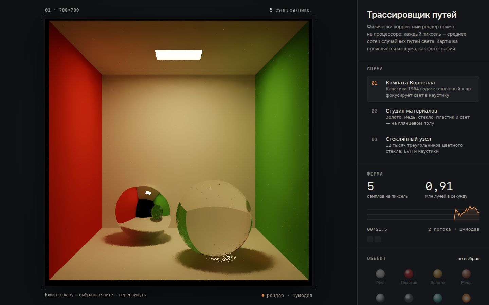

# 041 · Трассировщик путей

> Физически корректный рендер прямо на процессоре: каждый пиксель — среднее сотен случайных путей света, и картинка проявляется из шума, как фотография в проявителе.

## Как запустить
Двойной клик по `index.html`. Интернет не нужен (без него только шрифты станут системными). Рендер займёт все ядра процессора — это нормально, так работает рендер-ферма.

## Что делать
- **Выберите сцену**: комната Корнелла (1984) со стеклянным и зеркальным шаром, студия материалов на глянцевом полу, стеклянный узел из 12 тысяч треугольников.
- **Тяните шар** — он поедет по полу, пока вы тянете, идёт быстрый предпросмотр в трети разрешения.
- **Тяните фон** (в студии и у узла) — вращайте камеру. **Клик по предмету** в студии наводит фокус — работает глубина резкости.
- **Материал выбранного шара**: мел, пластик, золото, медь, зеркало, стекло, цветное стекло, свечение. Ползунки — шероховатость и коэффициент преломления (вода 1,33, стекло 1,5, алмаз 2,42).
- **Шумодав** можно выключить и посмотреть на честный шум. PNG сохраняет текущий кадр.
- Клавиши: `Пробел` — пауза, `D` — шумодав, `1`–`3` — сцены.

## Что внутри
- **Трассировка путей** с выборкой по значимости: косинусная для матовых поверхностей, распределение GGX для металлов и лака, точные формулы Френеля для стекла, поглощение по закону Бугера — Ламберта внутри цветного стекла, «русская рулетка» для длинных путей.
- **Прямой свет с MIS** (multiple importance sampling, степенная эвристика): каждый отскок пробует попасть в источник напрямую и объединяет это с обычным отскоком без двойного счёта. Каустики под стеклянным шаром возникают сами — из путей «пол → стекло → лампа».
- **BVH с разбиением по SAH** (12 корзин), обход «ближний потомок первым». Шары хранятся отдельно, поэтому их можно двигать без перестройки дерева.
- **Ферма из Web Worker**: строка y принадлежит потоку y mod N, воркеры создаются из Blob и присылают суммы яркости. Число потоков — по числу ядер.
- **Шумодав à-trous** (Даммертц и др., 2010) в отдельном потоке: нормали, альбедо и глубина первой не-зеркальной поверхности сквозь стекло и зеркала, подавление одиночных «светлячков». По мере роста числа сэмплов картинка всё больше опирается на честный результат.
- Тональная компрессия ACES и гамма sRGB.

## Почему это про Opus 5.5
Это длинная системная задача без библиотек: геометрия, теория вероятностей, параллелизм и интерфейс, которые должны сойтись без единой ошибки. Ровно тот класс работ, где Opus 5.5 лидирует в Terminal-Bench (66,4 %).

## Ограничения
- Шероховатого стекла нет, стекло только гладкое; дисперсии (радуги в стекле) тоже нет.
- «Светлячки» мягко ограничены по яркости: для превью это красивее, но немного занижает самые яркие каустики.
- Шумодав при малом числе сэмплов слегка размывает мелкие детали; с ростом числа сэмплов его вклад убывает.
