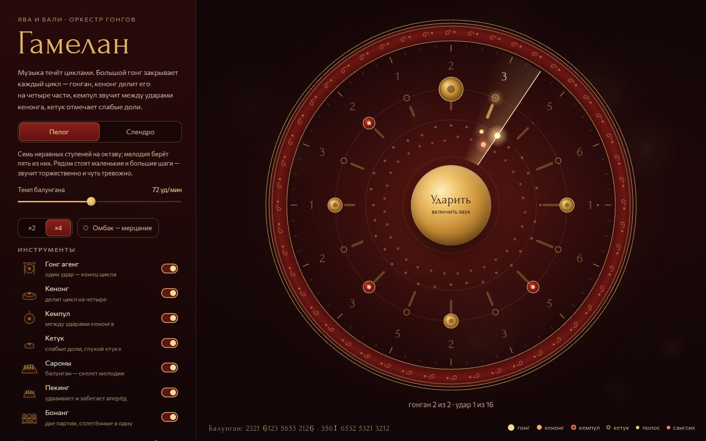

# 042 · Гамелан

> Оркестр гонгов и металлофонов с Явы и Бали: музыка течёт циклами, а две партии переплетаются в одну быструю линию.

## Как запустить
Двойной клик по `index.html`. Звук включается кнопкой-гонгом в центре круга (браузеры не дают играть звук без жеста).

## Что делать
- **Ударить** в центральный гонг — оркестр вступает с удара большого гонга, как в настоящем исполнении. Повторный клик — пауза, пробел — то же.
- **Пелог / Слендро** — одна и та же мелодия в двух строях: семь неравных ступеней против пяти почти равных.
- **Темп балунгана**, плотность переплетения ×2 / ×4.
- **Омбак** — балийская настройка парами: инструменты расстроены на несколько герц, и звук мерцает.
- **Инструменты** слева можно выключать по одному, чтобы услышать слой отдельно. Иконка вспыхивает в момент удара.

## Что внутри
- Круг — один гонган из 16 ударов. Гонг наверху закрывает цикл, кенонг делит на четыре части, кемпул звучит между ударами кенонга, кетук отмечает слабые доли.
- Цифры по краю — балунган (скелет мелодии) в цифровой записи кепатихан: точка снаружи — выше на октаву, внутри — ниже. Радиальные планки — высота тона.
- Два внутренних кольца — партии переплетения (на Бали — котекан: «полос» и «сангсих»). Точки чередуются, а вместе дают непрерывную линию; радиус точки — высота ноты.
- Весь звук синтезирован: металлофоны — сумма негармонических обертонов (1 : 2,76 : 5,4, как у свободного бруска), гонги — медленно биющиеся пары частот, реверберация — сгенерированная импульсная характеристика.
- Точный планировщик Web Audio с упреждением; картинка синхронизирована с аудиочасами.

## Почему это про Opus 5.5
Знание чужой музыкальной традиции, превращённое в работающий инструмент: теория (колотомия, строи, переплетение), акустика и аккуратный звуковой движок.

## Ограничения
- Мелодия оригинальная, в манере лансарана; колотомическая схема упрощена.
- Строи — типичные варианты: у каждого настоящего гамелана своя настройка.
- Омбак пришёл из балийской практики, на Яве инструменты парами не расстраивают.
