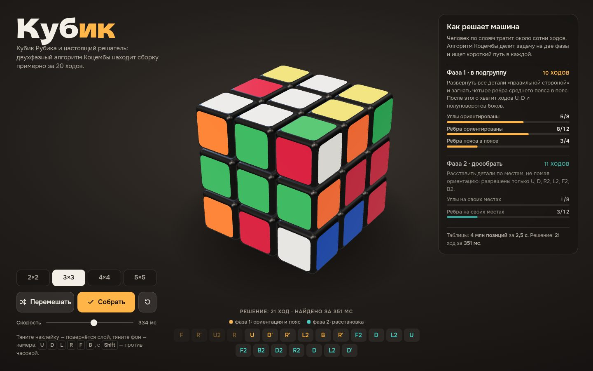

# 043 · Кубик

> Глянцевый кубик Рубика в студийном свете и настоящий решатель: двухфазный алгоритм Коцембы собирает 3×3 примерно за 20 ходов и по ходу объясняет, что делает.

## Как запустить
Двойной клик по `index.html`. Нужен интернет: трёхмерная сцена работает на three.js с CDN. Без сети страница честно скажет, что не может загрузить сцену.

## Что делать
- Кубик открывается перемешанным, и машина сразу его собирает. Дальше цикл «перемешать → собрать» идёт сам, пока вы не вмешаетесь.
- Потянуть наклейку — повернётся слой в сторону движения, в том числе средний и внутренние слои у 4×4 и 5×5. Потянуть фон — вращать камеру, колесо — приближать.
- Клавиши `U D L R F B` поворачивают внешние грани по часовой стрелке, с `Shift` — против. Пробел — «Собрать».
- «Перемешать» делает 20 случайных ходов. «Собрать» запускает решатель: лента показывает ходы фазы 1 (янтарные) и фазы 2 (бирюзовые), а панель справа заполняет полоски прогресса после каждого хода. Любое действие прерывает текущий план: доигрывается только начатый поворот.
- Размеры 2×2, 3×3, 4×4 и 5×5. Честный решатель есть только для 3×3; для остальных «Собрать» откатывает историю ходов, и панель прямо об этом пишет.

## Что внутри
- Решатель — классический двухфазный алгоритм Коцембы:
  - кубиковая модель (перестановки и ориентации 8 углов и 12 рёбер);
  - координаты: закрутка углов, переворот рёбер, положение рёбер пояса, перестановки;
  - таблицы переходов;
  - четыре таблицы отсечений на 4 млн позиций, которые строятся обходом в ширину в Web Worker за 1–3 секунды;
  - поиск IDA* сначала в фазе 1, затем в фазе 2. Найдя решение, алгоритм ещё 0,35 с ищет покороче.
- Проверка: на 60 случайных перемешиваниях по 25 ходов решение в среднем 20–21 ход (от 17 до 23), ошибок 0. В браузере проверены сборка после «Перемешать», после прерванного перемешивания и после поворотов средних слоёв.
- Состояние кубика не хранится отдельно: перед решением оно читается прямо из 3D-сцены — по мировым нормалям и позициям 54 наклеек. Какой цвет какой грани, решают центры, поэтому кубик собирается и после поворотов средних слоёв, которые сдвигают центры. Невозможные состояния отсекаются проверкой чётности до поиска.
- Внутренние слои записываются в нотации SiGN: «2R» — второй слой от грани R, «3R» — третий.
- Повороты — анимация группы кубиков вокруг опорной точки. После каждого хода позиции и повороты «защёлкиваются» на сетку, чтобы не копилась ошибка округления.
- Свет: студийное окружение RoomEnvironment, ключевой и контровой источники, мягкие тени и контактная тень под кубиком. Камера сама вписывает кубик любого размера в свободную от панелей часть экрана.

## Почему это про Opus 5.5
Настоящая алгоритмическая задача (теория групп, поиск с эвристикой, таблицы отсечений), собранная в понятный интерфейс, где машина объясняет, как думает.

## Ограничения
- Решатель ищет короткое решение за ограниченное время. Это «около 20 ходов», а не гарантированный минимум: оптимальной сборке любого состояния хватает 20 ходов.
- Для 2×2, 4×4 и 5×5 нет решателя, только откат истории.
- Поворот слоя начинается, когда палец сдвинулся на 12 px. Жесты — только в один слой, поворот всего кубика жестом не сделан.
