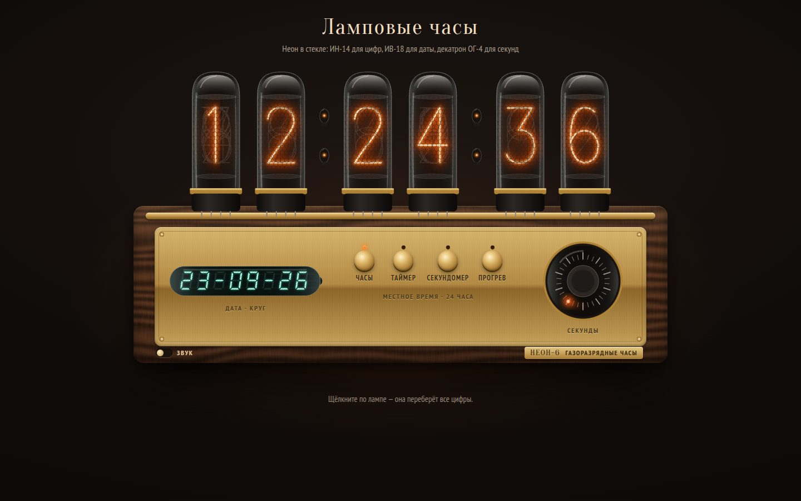

# 044 · Ламповые часы

> Часы на газоразрядных индикаторах: оранжевый неон горит в глубине стеклянных колб, дату показывает вакуумно-люминесцентная панель, а секунды бегут по кругу декатрона.

## Как запустить
Двойной клик по `index.html`. Интернет нужен только для шрифтов Oranienbaum и PT Sans Narrow.

## Что делать
- **Часы** — местное время в 24-часовом формате, дата на панели, секунды на декатроне.
- **Таймер** — «+1 мин» и «+10 с» набирают время (по умолчанию 5 минут), «Пуск» и «Пауза», «Сброс». По окончании лампы мигают, а при включённом звуке трижды звенит сигнал.
- **Секундомер** — минуты, секунды и сотые прямо на лампах; «Круг» показывает время последнего круга на панели.
- **Прогрев** — лампы перебирают все катоды. Настоящие часы делают это, чтобы редко горящие цифры не «отравлялись». Здесь прогрев сам запускается в начале каждого часа.
- **Клик по лампе** — она переберёт цифры, как игровой автомат.
- **Тумблер «звук»** — щелчок реле каждую секунду и сигнал таймера.

## Что внутри
- Лампа устроена как настоящий ИН-14: десять катодов-цифр стоят стопкой одна за другой, горит одна. Цифры, стоящие перед горящей, ложатся на свечение тёмными проволочками. Поверх — шестиугольная сетка анода.
- Свечение собрано из трёх слоёв SVG: широкий размытый ореол, средний слой и яркая сердцевина. Сверху — лёгкое мерцание, внутри колбы — оранжевый «туман».
- Сверху колбы — серебристый налёт геттера, по стеклу — блики.
- Панель в духе ИВ-18: восемь семисегментных знаков с погасшими сегментами, сеткой и нитями накала.
- Декатрон: 30 положений тлеющего разряда с «хвостом»; в режиме секундомера разряд делает оборот за секунду.
- Текстура ореха для корпуса генерируется на Canvas из шума один раз при загрузке.

## Почему это про Opus 5.5
Объект, который хочется потрогать, собран целиком из кода: физически осмысленные детали (порядок катодов, геттер, отравление катодов) плюс аккуратный интерфейс трёх режимов.

## Ограничения
- Цифры нарисованы в духе ИН-14, это не точная копия заводских катодов.
- Время берётся из системных часов компьютера.
