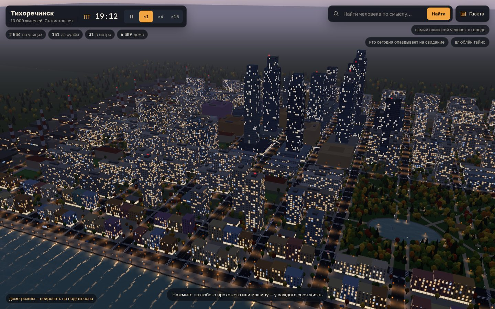

# 045 · Город, где у каждого своя жизнь

> Тихоречинск: 10 000 жителей и 1 032 машины живут по своим расписаниям, а нейросеть по смоделированным фактам рассказывает жизнь любого прохожего.

## Как запустить
Двойной клик по `index.html`. Нужен интернет: three.js грузится с CDN jsDelivr, а биографии, разговоры, поиск и газету пишет DeepSeek через OpenRouter (ключ свой — BYOK: вход через OpenRouter или ввод в окне). Без ключа город работает в демо-режиме: биографии, ответы и газета собираются из заготовок по тем же фактам. Без интернета показывается сообщение, что не загрузилась трёхмерная сцена.

## Что делать
- **Смотреть на город.** Колесо — приближение, левая кнопка — сдвиг, правая — поворот; на телефоне — пальцы. Скорость времени: пауза, ×1 (игровая минута за секунду), ×4, ×15 (сутки за полторы минуты); пробел — пауза, клавиши 1–3 — скорость.
- **Нажать на любого прохожего или едущую машину.** Камера полетит к человеку и будет следовать за ним, его окно дома подсветится, а в карточке появятся жизнь (DeepSeek пишет потоком), факты, распорядок дня на шкале и связи. Имя из связей — перелёт к этому человеку.
- **Заговорить.** Житель отвечает от первого лица и знает, где он сейчас, куда идёт и насколько опаздывает.
- **Искать по смыслу**: «самый одинокий человек в городе», «кто сегодня опаздывает на свидание», «тайно влюблён», «кто больше всех ходил пешком».
- **Газета «Тихоречинский вестник».** Вечерний выпуск доступен сразу, утренний выходит в 07:00 по игровому времени. Заметки основаны на реальных событиях модели, имена кликабельны.

## Что внутри
- **Город.** 14 × 10 кварталов, пять районов (центр с башнями, спальные районы, промзона с трубами, парк с прудом, старая набережная), 376 зданий, 320 заведений с названиями и адресами, 8 станций метро, 6 337 деревьев в осенних красках, 1 240 фонарей, светофоры на перекрёстках с проспектами.
- **Люди.** 10 000 жителей хранятся в типизированных массивах: семья и квартира, профессия и место работы, смена, характер, увлечение, мысль дня, тайна, мечта, питомец и до трёх связей (супруги, дети, друзья, коллеги, начальник, бывшие, тайная любовь). Каждое утро у каждого жителя складывается свой распорядок: дорога с учётом времени в пути, работа или школа, обед, магазин, свидание, бар, спортзал, прогулка, гости, сон. События идут через «колесо времени» по минутам, пешеходы ходят по графу тротуаров (Дейкстра с кэшем), ждут зелёного на переходах и толпятся у турникетов метро.
- **Машины.** 1 032 машины: 810 личных и 222 служебных (такси, автобусы по кольцевым маршрутам, фургоны доставки). За каждой стоит житель. Модель следования IDM, полосы, повороты по дугам, правило «не выезжай на занятый перекрёсток», парковка у тротуара, а у офисов — подземные паркинги; пробки фиксируются для газеты.
- **Свет.** Солнце считается для широты 55° в день равноденствия; небо и туман проходят ключевые кадры «ночь → синий час → золотой час → день». Окна в шейдере зажигаются по данным: доля жильцов, которые дома и не спят, и доля сотрудников на месте. Фонари, фары, стоп-сигналы и световые конусы на асфальте, отражения огней в реке.
- **Отрисовка.** Жители — инстансы фигурок с походкой в вершинном шейдере, вдали — светящиеся точки; машины — инстансы с фарами. На MacBook Air M4 в Chrome при DPR 2 (2880 × 1800) проверено: стабильные 60 кадров в секунду и в обзоре, и при слежении, и на скорости ×15 с 3 700 людьми на улицах.
- **Нейросеть.** Код собирает карточку фактов (семья, работа, распорядок, что с человеком прямо сейчас, события дня), DeepSeek пишет по ней биографию потоком (кэш в памяти и `localStorage`) и отвечает в разговоре. В поиске код ранжирует всех 10 000 по признакам, а DeepSeek через `AI.json` выбирает одного из 12 кандидатов и объясняет выбор; непонятный запрос нейросеть сначала переводит в веса признаков. Газету DeepSeek пишет по списку реальных событий. Счётчик потраченного — внизу слева.

## Почему это про Opus 5.5
Целый город — генерация, симуляция 10 000 распорядков, дорожное движение, свет и интерфейс — собран в браузерной странице без сборки и держит 60 кадров. Нейросеть здесь не придумывает мир, а рассказывает правду модели: у каждой фигурки на экране есть дом, работа, связи и свой день.

## Ограничения
- Время условное: при ×1 игровая минута идёт за секунду, а пешеходы идут со скоростью около 4,6 м/с на экране, поэтому дорога в игровом времени длиннее настоящей (на работу — час-полтора). Распорядки это учитывают: будильник и выход из дома считаются от времени в пути, опаздывают около 8 % работающих, медианное опоздание — 16 минут.
- Светофоры стоят только там, где есть проспект; на тихих перекрёстках улиц машины и пешеходы друг другу не уступают.
- Метро подземное и не рисуется: люди исчезают у входа и появляются у нужной станции через время поездки. Автобусы ездят по маршрутам, но пассажиров не возят.
- Интерьеров нет: окна зажигаются по доле людей дома, а окно выбранного жителя вычисляется условно по номеру квартиры.
- Внутри перекрёстка машины не проверяют столкновения друг с другом, поворачивающие не уступают пешеходам.
- Факты о людях сгенерированы процедурно из словарей, все имена, заведения и улицы вымышлены. Нейросеть иногда путает детали карточки или склоняет имена по-своему.
- В демо-режиме биографии, ответы и газета собираются из заготовок, поэтому они проще и однообразнее.
