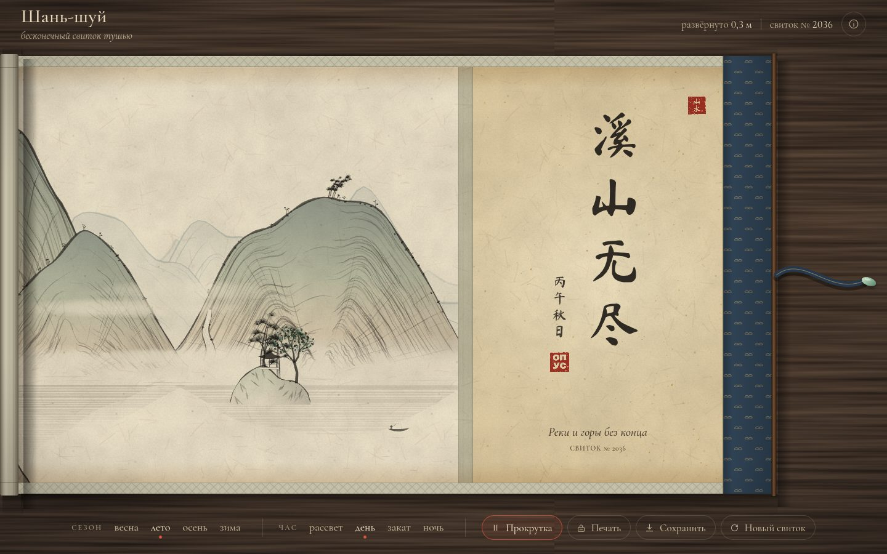

# 046 · Шань-шуй

> Бесконечный свиток китайской пейзажной живописи тушью: горы, сосны, водопады, мосты и лодки рождаются алгоритмом в тот момент, когда вы разворачиваете свиток.

## Как запустить
Двойной клик по `index.html`. Интернет нужен только для шрифтов: без него каллиграфия и подписи наберутся системными гарнитурами, всё остальное работает.

## Что делать
- **Колесо мыши, перетаскивание или ← →** — разворачивать свиток. Как настоящий китайский свиток, его читают справа налево: слева разворачивается новое, справа сворачивается увиденное.
- **Пробел** — автопрокрутка: свиток медленно разворачивается сам.
- **Сезон** — весна (цветение), лето (сине-зелёный стиль), осень (клёны), зима (снег оставлен нетронутой бумагой).
- **Час** — рассвет, день, закат, ночь: небо, солнце или луна и свет в комнате.
- **Печать** (клавиша S) — кликнуть по свитку и поставить красную печать с сегодняшней датой; печати запоминаются для этого номера свитка.
- **Сохранить** — видимый фрагмент в PNG. **Новый свиток** — другой номер, другой пейзаж. Номер хранится в адресе (`#4172`), им можно поделиться.
- Столбцы иероглифов в небе — стихи поэтов эпохи Тан: наведите курсор, появится перевод.

## Что внутри
- Свиток разбит на фрагменты по 480 единиц. Каждый фрагмент рисуется один раз в отдельный холст с запасом по краям и кэшируется — прокрутка стоит одной копии картинки на кадр.
- Весь мир детерминирован: номер свитка и координата однозначно задают сцену. Поэтому гора, разрезанная границей фрагментов, дорисовывается соседом пиксель в пиксель.
- Ритм свитка задают «сцены» по 1500 единиц: горный массив, карстовые пики над рекой, озеро, деревня, ущелье с водопадом. Одна и та же сцена дважды подряд не встречается.
- Горы строятся из вложенных «колец», как в shan-shui-inf: по ним идут штрихи-морщины (цунь), по склону — длинные штрихи, по гребню — мшистые точки. Кисть — многоугольник переменной ширины с шумом.
- Водопад ставится только туда, где за ним действительно есть склон: высота гребня вычисляется той же формулой, что рисует гору.
- Бумажное зерно, шёлковое паспарту, парча обёртки, рулоны по краям, завязка с нефритовой застёжкой — всё процедурное, без единого файла изображения.

## Почему это про Opus 5.5
Визуальные и интерактивные проекты — одна из подтверждённых сильных сторон модели. Здесь это сочетание вкуса (композиция, тон, «воздух») и инженерии: детерминированная генерация без швов, кэш и отложенная отрисовка. Переводы стихов тоже сделаны моделью.

## Ограничения
- Это стилизация, а не реконструкция конкретной школы: сине-зелёный стиль, «мокрая» тушь и деревенские сцены смешаны свободно.
- Туман и дымка — градиенты цвета бумаги, а не физика растекания туши.
- Первый показ немного задерживается, пока грузится каллиграфический шрифт (он подгружается только нужными знаками).
- Вдохновлено проектом shan-shui-inf Линдонга Хуана; код написан заново.
