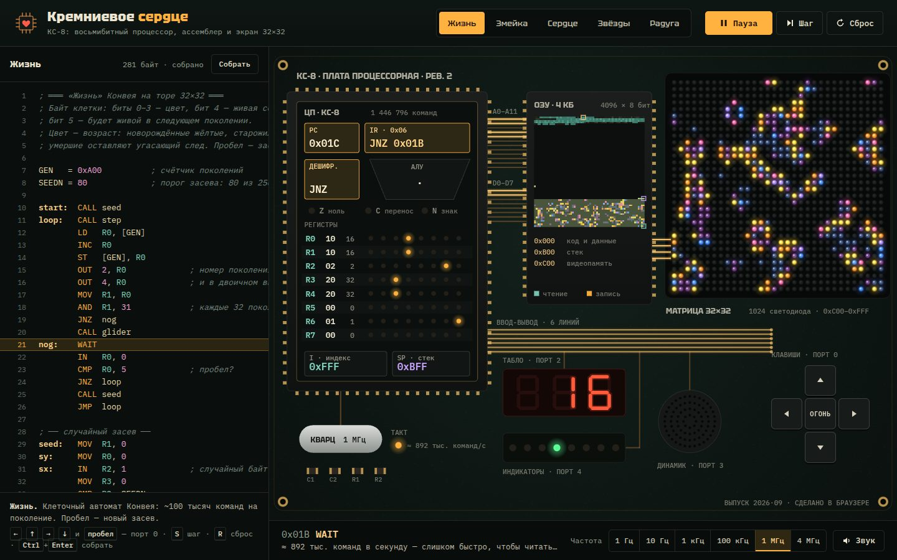

# 047 · Кремниевое сердце

> КС-8 — восьмибитный процессор, придуманный с нуля: своя система команд, ассемблер, 4 КБ памяти и светодиодная матрица 32×32. Шины адреса и данных светятся побитно на каждом такте.

## Как запустить
Двойной клик по `index.html`. Интернет не нужен (без него только шрифты станут системными).

## Что делать
- Вкладки сверху — пять программ, написанных на ассемблере КС-8: «Жизнь», «Змейка», «Сердце», «Звёзды», «Радуга».
- «Частота» внизу — от 1 Гц до 4 МГц. На 1–10 Гц каждая команда проигрывается по фазам: выборка → дешифрация → исполнение, по шинам бегут импульсы, а внизу написано, что делает команда.
- Стрелки и пробел (или крестовина на плате) — порт 0: ими управляется змейка и корабль в «Звёздах», пробел засевает «Жизнь» заново.
- Код можно править прямо в редакторе: `Ctrl`+`Enter` собирает и запускает. Ошибки подсвечиваются в строке.
- `S` — одна команда, `R` — сброс. Слева от кода — «профайлер»: полоска показывает, какие строки горячие.

## Что внутри
- **Архитектура**: 8 регистров R0–R7, индексный регистр I, стек, флаги Z/C/N; 44 команды (`MOV`, `LD`/`ST`, `ADD`…`CMP`, `SHL`/`SHR`, `CALL`/`RET`, `PUSH`/`POP`, `IN`/`OUT`, `VID` — адрес пикселя по координатам, `WAIT` — синхронизация с кадром). Память: 0x000–0xAFF код и данные, 0xB00–0xBFF стек, 0xC00–0xFFF видеопамять.
- **Ассемблер** в два прохода: метки, константы `ИМЯ = значение`, `.db`, `.org`, выражения с `+`/`−`, понятные ошибки на русском.
- **Эмулятор** исполняет до 4 млн команд в секунду; дисплей тикает ровно 60 раз в секунду, `WAIT` ждёт кадр — поэтому игры идут с правильной скоростью при любой частоте.
- **Плата** рисуется на Canvas: биты текущего адреса и данных на отдельных дорожках шины, карта всех 4096 байт памяти со вспышками чтения и записи, регистры с побитовыми светодиодами, табло (порт 2), линейка индикаторов (порт 4), динамик (порт 3, прямоугольная волна через Web Audio).
- **Программы**: «Жизнь» — тор 32×32, цвет клетки показывает возраст, около 100 тысяч команд на поколение; «Змейка» — кольцевой буфер сегментов, запрет разворота, ускорение; «Сердце» — битовые маски и искры; «Звёзды» — параллакс в три слоя; «Радуга» — кольца по таблице квадратов (умножения у КС-8 нет).

## Почему это про Opus 5.5
Это длинная агентная задача, в которой Opus 5.5 сильнее всего (Terminal-Bench 4.0 — 66,4 %). Нужно спроектировать систему команд, написать ассемблер и эмулятор, а потом пять программ на языке, которого час назад не существовало, — и отладить их все прогоном в Node до первого запуска в браузере.

## Ограничения
- Это модель уровня команд, а не вентилей: фазы «выборка — дешифрация — исполнение» показаны для наглядности, настоящих микротактов нет.
- На высоких частотах шина показывает последнее обращение за кадр, а карта памяти — затухающие следы обращений.
- Звук — одна прямоугольная волна без огибающих, как у пищалки на плате.

## Шпаргалка по командам
| Команда | Что делает |
|---|---|
| `MOV r, x` | r ← регистр или число |
| `LD r, [адрес]` / `ST [адрес], r` | чтение и запись памяти |
| `LDI адрес`, `ADDI r`, `INCI` | индексный регистр I |
| `LD r, [I]` / `ST [I], r` | память по адресу из I |
| `VID x, y` | I ← адрес пикселя (x, y) в видеопамяти |
| `ADD SUB AND OR XOR CMP r, x` | арифметика и логика, меняют флаги |
| `INC DEC SHL SHR r` | ±1 и сдвиги (выпавший бит — в C) |
| `JMP JZ JNZ JC JNC JN JNN адрес` | переходы; `JC` после `CMP` — «меньше» |
| `CALL`/`RET`, `PUSH`/`POP r`, `PUSHI`/`POPI` | подпрограммы и стек |
| `IN r, порт` / `OUT порт, r` | порты: 0 клавиши, 1 случайное, 2 кадр / табло, 3 звук, 4 индикаторы |
| `WAIT`, `HLT`, `NOP` | ждать кадр, стоп, пусто |
