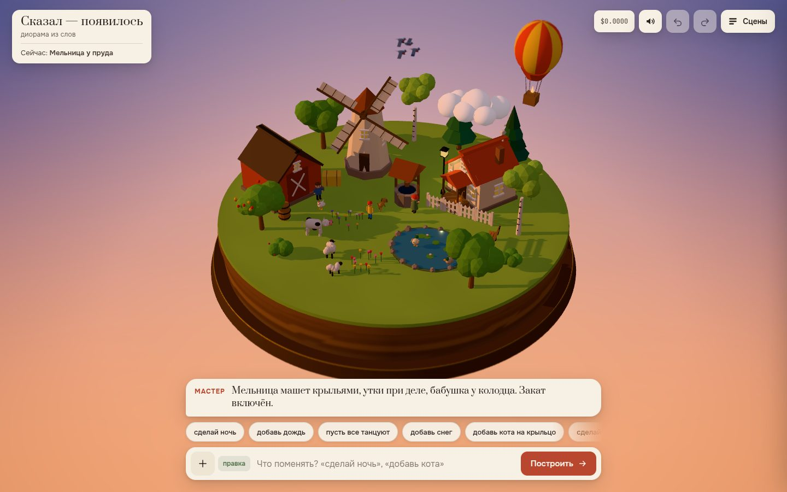

# 048 · Сказал — появилось

> Опишите сцену словами — нейросеть напишет её граф на строгом языке, а движок соберёт живую 3D-диораму: деревья вырастают, дома и звери падают с неба на свои места.

## Как запустить
Двойной клик по `index.html`. Нужен интернет: three.js загружается с CDN, а сцены по фразе и правки пишет DeepSeek через OpenRouter (по вашему ключу — BYOK: вход через OpenRouter или окно ввода ключа).

Без ключа или без сети включается демо-режим: пять заготовленных сцен и разбор простых правок по ключевым словам («ночь», «дождь», «добавь кота», «пусть все танцуют»). Если CDN недоступен, вместо белого экрана появится понятное сообщение.

## Что делать
- Напишите фразу — или скажите её в микрофон (кнопка появляется в браузерах с Web Speech). На пустом острове или с нажатым «+» фраза собирает новую сцену с нуля.
- Каждая следующая фраза — правка поверх текущей сцены: «сделай ночь», «добавь дождь и радугу над прудом», «пусть мельница крутится быстрее», «убери облака».
- Кнопки-подсказки под репликой Мастера: светлые — правки (часть предлагает сама нейросеть), тёмные с «+» — новые сцены.
- Тянуть мышью или пальцем — облёт, колесо или щипок — ближе. Без касаний камера сама медленно облетает остров.
- Ctrl+Z и Ctrl+Shift+Z — отмена и возврат. «Сцены» → «История» (вернуться к любому шагу), «Галерея» (сохранить сцену в браузере, открыть заготовки), «Чертёж» (граф сцены, который написала нейросеть).
- Счётчик вверху справа — сколько потрачено на нейросеть за сессию.

## Что внутри
- **Язык сцены** (`lang.js`): каталог из 42 типов с видами, поля объекта и окружения (время суток, погода, грунт, море, ветер, небо). Всё, что прислала модель, проходит нормализацию: синонимы («kitten» → кот), зажим чисел, цвета, опоры `on` без циклов, раздвигание объектов по «пятнам», лодки — в воду, дома — на сушу. Правка — операции `remove / update / add` по id; модель видит сжатый текущий граф.
- **Два запроса на новую сцену.** Быстрый, без рассуждения, за 1–2 с решает атмосферу и название — мир меняется сразу, старые объекты уходят со стола. Большой, с `think: true`, пишет граф. Пока он думает, над островом кружит вихрь искр, Мастер комментирует, тикает таймер. Если правка ничего не изменила, второй заход идёт уже с рассуждением.
- **Движок** (`engine.js`) сверяет новый граф с тем, что стоит на острове: новое вырастает с упругим перелётом (природа) или падает с неба, сплющивается и поднимает пыль; убранное съёживается; изменённое пересобирается с хлопком. Анимации объектов: крутится, качается, мигает, парит, летает кругами, гуляет, прыгает, машет, танцует, плавает, спит; рыбы выпрыгивают из воды.
- **Рецепты** (`recipes.js`, `props.js`, `beings.js`): каждый объект собран из параметрических примитивов. Неподвижные детали сливаются в один меш на материал, подвижные (крылья мельницы, ноги, луч маяка) висят на шарнирах. Чего нет в каталоге, модель собирает сама из деталей (`custom`).
- **Мир** (`world.js`): постамент со срезом почвы на деревянной подставке, студийный задник со звёздами и луной, вода кольцом с пеной, дождь и снег колонной над островом, гроза с молниями, туман, дым из труб. Свет по времени суток плавно перетекает; шесть точечных огней берут себе самые яркие фонари и костры, поэтому шейдеры не пересобираются. Постобработка — bloom и tilt-shift (размытие верха и низа кадра, как у фотографии миниатюры).
- **Звук** на Web Audio: деревянный «ток» при приземлении (крупное — ниже), шум дождя, ветер, гром. Включается только после первого жеста.

## Почему это про Opus 5.5
Opus 5.5 спроектировал язык, на котором маленькая быстрая модель надёжно описывает целый 3D-мир, и всю машинерию вокруг: схему, проверку и починку ответа, диффы по id и анимацию разницы. Ни одной картинки или модели из файла — только код.

## Ограничения
- Это игрушечная диорама из примитивов: модель выбирает из каталога и собирает своё из деталей, реалистичной геометрии нет.
- Новая сцена с рассуждением собирается 20–80 секунд (в проверке — 28 и 77 с), правки — 2–12 с. Сцена стоит около $0,003–0,006, правка — меньше $0,001.
- Координаты даёт модель, движок только раздвигает пересечения по кругам-«пятнам»: объекты сложной формы иногда задевают друг друга, а «гуляющие» ходят по кругу, не обходя препятствий.
- Демо-режим понимает только простые фразы по ключевым словам.
- Галерея хранится в `localStorage` этого браузера; при переполнении миниатюры удаляются.
- Голосовой ввод работает только там, где есть Web Speech API; распознавание выполняет сервис браузера.
