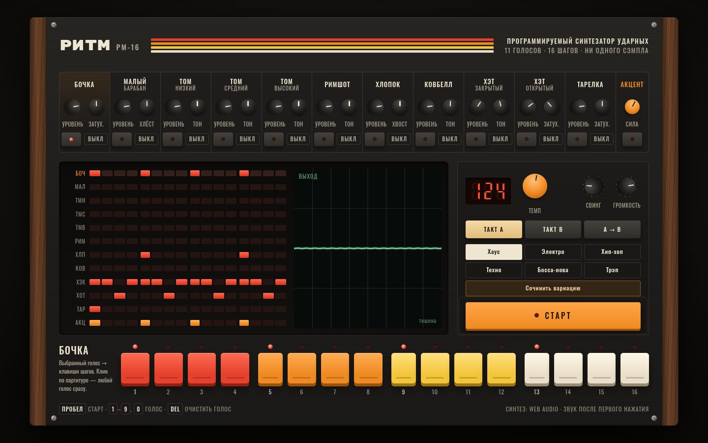

# 049 · Ритм-машина РМ-16

> Шестнадцатишаговая драм-машина: бочка, малый, три тома, римшот, хлопок, ковбелл, два хэта и тарелка синтезированы в Web Audio с нуля — как в аналоговых машинах 1980-х.

## Как запустить
Двойной клик по `index.html`, затем «Старт» или пробел. Интернет не нужен: без него только шрифты станут системными. Браузер включает звук после первого нажатия.

## Что делать
- «Старт» или пробел — играть и остановить.
- Выберите голос кнопкой под его ручками (или клавишами `1`–`9`, `0`), затем включайте шаги на шестнадцати цветных клавишах. Партитура на экране показывает все голоса сразу, её клетки тоже кликаются.
- Ручки: тянуть вверх-вниз (с `Shift` — точнее), колесо, стрелки; двойной клик возвращает значение по умолчанию. У каждого голоса «Уровень» и своя характерная ручка: затухание, хлёст, тон, хвост.
- «Акцент» — отдельный ряд: отмеченные шаги звучат громче, ручка «Сила» решает насколько.
- Ритмы: хаус, электро, хип-хоп, техно, босса-нова, трэп. «Сочинить вариацию» — новая вариация в том же жанре.
- «Такт A», «Такт B» и «A → B» — два такта (второй со сбивкой томов) и их чередование.
- `Del` очищает выбранный голос. Всё сохраняется между сессиями.

## Что внутри
- **Бочка** — синус со спадом высоты от ~160 до 49 Гц плюс щелчок отфильтрованного шума. **Малый** — два треугольных тона корпуса (182 и 330 Гц) и шум пружин. **Томы** — синусы со спадом высоты.
- **Хэты и тарелка** — шесть прямоугольных генераторов с несоразмерными частотами (205–800 Гц) через полосовой и верхнечастотный фильтры, как в классических аналоговых машинах. Закрытый хэт глушит открытый.
- **Хлопок** — четыре шумовых всплеска с интервалом около 10 мс и хвост; **ковбелл** — два прямоугольника 540 и 800 Гц.
- **Планировщик** с упреждением: ноты ставятся на аудиочасы на 120 мс вперёд, поэтому ритм не плывёт при нагрузке на страницу. Свинг сдвигает чётные шестнадцатые.
- Мастер-шина: мягкое насыщение `tanh`, компрессор, осциллограф с синхронизацией по переходу через ноль.
- **«Сочинить»**: синкопы бочки и «призрачные» удары малого по правилам жанра, хэты и перкуссия — по евклидову алгоритму E(k, 16): k ударов как можно равномернее на 16 шагах.

## Почему это про Opus 5.5
Здесь нужно знание цифровой обработки звука: как устроены аналоговые ударные и почему хэт — это шесть расстроенных генераторов, а не шум. Плюс вкус в работе с интерфейсом «железа» (тесты Every: визуальные и интерактивные проекты).

## Ограничения
- Это синтез «по мотивам»: схемы легендарных машин не эмулируются по компонентам, звук похож, но не идентичен.
- Максимум два такта по 16 шагов; тройных долей и 32-х нет.
- Названия жанров и ритмы — учебные заготовки, а не копии конкретных треков.
