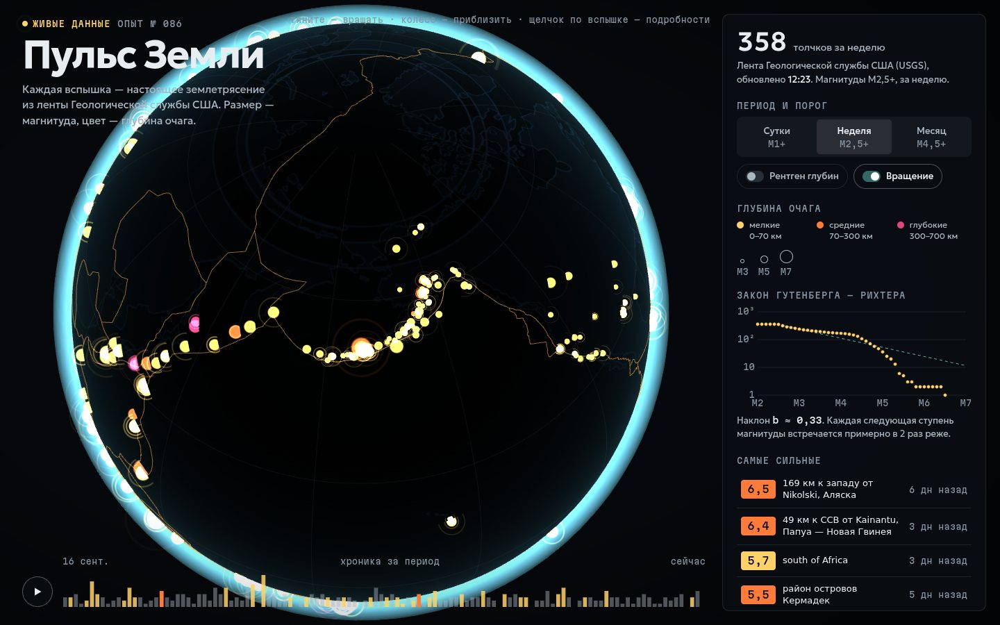

# 050 · Пульс Земли

> Живые землетрясения из ленты USGS на 3D-глобусе: вспышки пульсируют по магнитуде, цвет показывает глубину очага, границы плит светятся.

## Как запустить
Двойной клик по `index.html`. **Нужен интернет:** three.js и контуры суши грузятся с CDN jsDelivr, землетрясения — из ленты Геологической службы США. Если лента USGS недоступна, показывается встроенный архив крупнейших землетрясений с 1906 года (координаты приблизительные). Совсем без сети страница честно скажет, что ей нужен интернет.

## Что делать
- Тяните глобус, колесо — приблизить. Щелчок по вспышке — карточка толчка со ссылкой на страницу события USGS.
- «Сутки · M1+», «Неделя · M2,5+», «Месяц · M4,5+» — разные ленты USGS.
- «Рентген глубин» делает Землю полупрозрачной: видно, как очаги уходят вглубь — вдоль зон субдукции они выстраиваются в наклонные плоскости Вадати — Беньофа.
- Кнопка ▶ внизу проигрывает хронику периода за 24 секунды, щелчок по гистограмме — перемотка.
- «Самые сильные» — щелчок по строке поворачивает глобус к толчку.

## Что внутри
- three.js 0.170: глобус с текстурой суши, нарисованной из topojson (world-atlas), день и ночь по приближённому положению Солнца, атмосфера, сетка координат.
- Границы плит — модель PB2002 (Bird, 2003) из репозитория fraxen/tectonicplates.
- Вспышки — собственный шейдер точек: ядро, расходящееся кольцо, вспышка при появлении в хронике.
- Закон Гутенберга — Рихтера строится по живым данным, наклон b оценивается методом максимального правдоподобия (формула Аки).
- Названия мест из USGS переводятся на русский: направления («72 км к ВСВ от…») и около сотни регионов; имена населённых пунктов остаются как есть.

## Почему это про Opus 5.5
Работа с живыми данными и знаниями: реальная лента, геофизическая статистика, аккуратный запасной режим и переведённые подписи — всё в одном файле.

## Ограничения
- Положение Солнца для терминатора приближённое (без уравнения времени, погрешность до ~4°).
- Архив на случай отсутствия связи с USGS — 41 событие; координаты и глубины округлены.
- Глубины на «рентгене» показаны в реальном масштабе: очаг на 700 км — это всего 11 % радиуса Земли.
